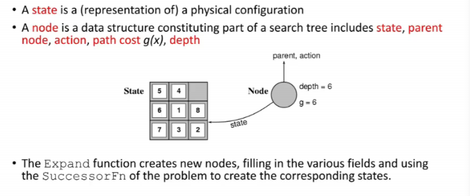

# Lecture 10

- [Lecture 10](#lecture-10)
  - [Video](#video)
  - [Performance](#performance)
  - [States vs Nodes](#states-vs-nodes)
  - [Informed Search](#informed-search)
    - [greedy BFS](#greedy-bfs)
    - [A* Search](#a-search)
  - [Admissible Heuristics](#admissible-heuristics)
  - [Consistent Heuristics](#consistent-heuristics)
  - [Optimality of A*](#optimality-of-a)
  - [Properties of A*](#properties-of-a)

## Video

[link](https://drive.google.com/file/d/1e3tkiEkJ5mZgQ_q8EBYApzGnVsdt3Lmo/view?usp=sharing)

## Performance

## States vs Nodes

- bfs me best case = 2nd level pe first node is my node
- dekhlio ki time me what r u considering, nodes generated or nodes expanded
  - generated me -b lunga, expanded me b

## Informed Search

### greedy BFS

- avoid repeating states

- optimal nahi bcz all path dekhe hi nahi na

### A* Search

- cost already spent + estimated cost further
- basically total estimated cost ko 2 me tod dia
- Romania ka straight line distance wale pe A*
  - 
  - Arad se start kia
  - initially fn = 366 = 0+366
  - 
  - I pick Sibiu
  - 
  - 
  - 

## Admissible Heuristics

## Consistent Heuristics

## Optimality of A*

## Properties of A*

