# Lecture 11

- [Lecture 11](#lecture-11)
  - [Video](#video)
  - [Depth-Limited Search](#depth-limited-search)
  - [Iterative Deepening DFS](#iterative-deepening-dfs)
  - [Comparison of Uniformed Search strategies](#comparison-of-uniformed-search-strategies)

## Video

[link](https://drive.google.com/file/d/1mN_FTMioclGD3laxLt9U0pmOMwh3B4Gg/view?usp=sharing)

## Depth-Limited Search

- DFS fails when search space is infinite

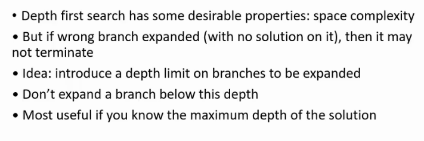

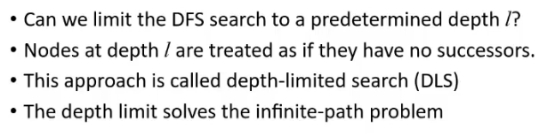

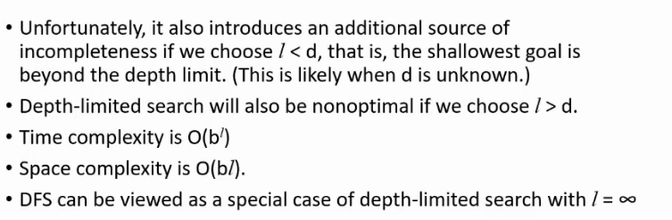

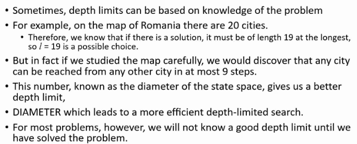

- DLS termination

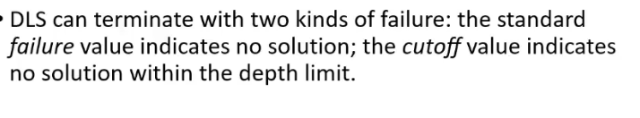

- Example

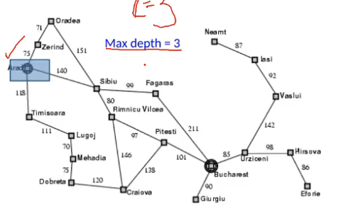

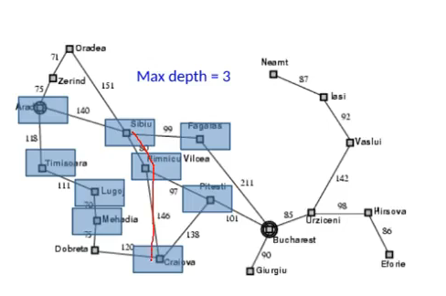

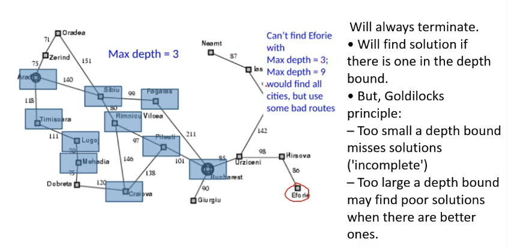

## Iterative Deepening DFS

- iteratively increase l

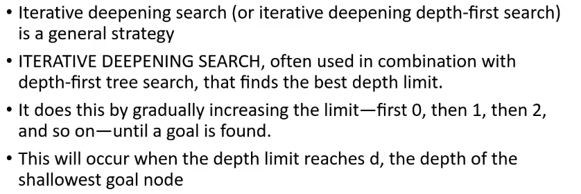

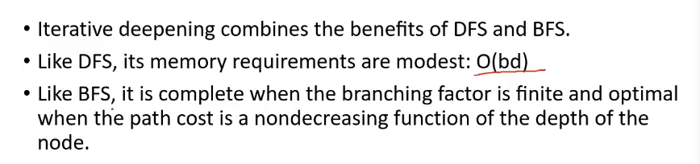

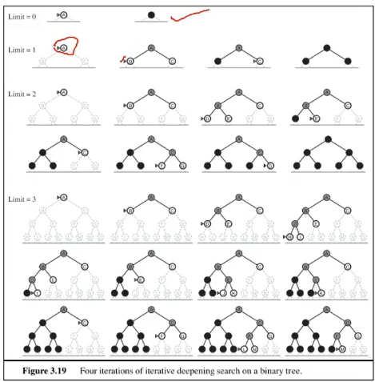

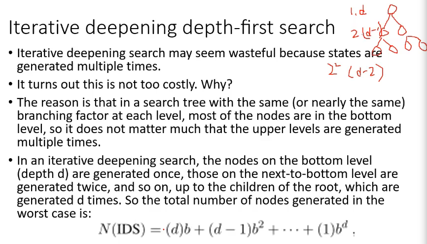

- complexity = O(b^d)
- compare with bfs?

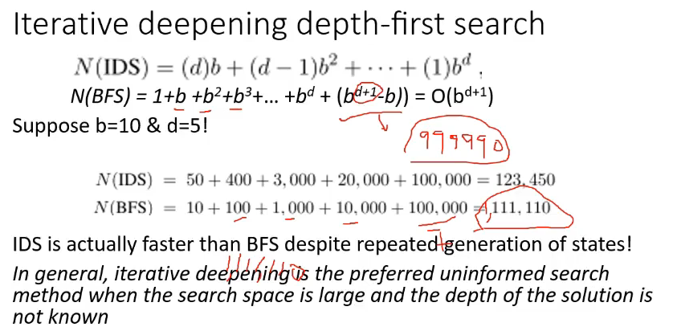

- bfs me 10^6-10 bhi add hoga

## Comparison of Uniformed Search strategies

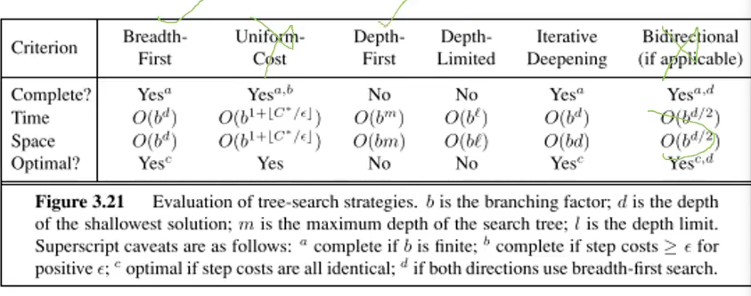
