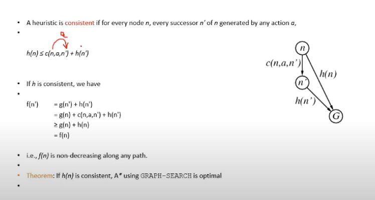

# Lecture 12

- [Lecture 12](#lecture-12)
  - [Video](#video)
  - [Greedy Best First Search](#greedy-best-first-search)
  - [Admissible Heuristics](#admissible-heuristics)
  - [Consistent Heuristics](#consistent-heuristics)

## Video

[link](https://drive.google.com/file/d/1lTOdmHlBgsf9gxqudlxdixK0_PRK4v7A/view)

## Greedy Best First Search

- Evaluation function f(n) = h(n) (heuristic)
  - = estimate of cost from n to goal
- eg hSLD(n) = straight-line distance from n to Bucharest
- Greedy best first search expands the node that appears to be closest to goal
- at the goal node, heuristic fn ki value is 0 (woh best node hai jaha se I can reach goal node)

## Admissible Heuristics

- any heuristics designed should be admissible
- for every node n, h(n) <= h*(n), h* is true cost to reach goal state from n
- it never overestimates the cost to reach the goal, i.e. it is optimistic
- eg: hsld(n) never overestimates the actual road distance
- thm: if h(n) is admissible, A* using TREE-SEARCH is optimal
- for romania example, SLD is admissible
- for 8-puzzle
  - h1 = number of misplaced pieces
  - h2 = manhattan distance
  - both are admissible
    - manhattan is admissible bcz u cannot move diagonally in the grid

## Consistent Heuristics

