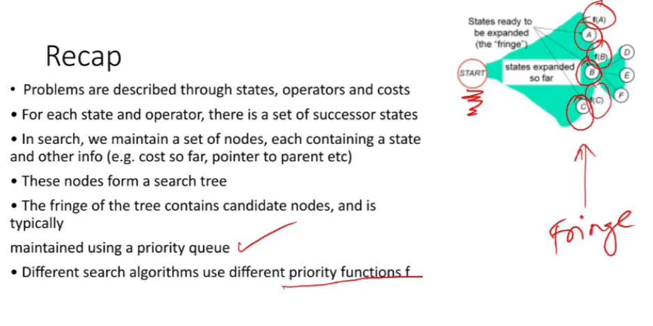
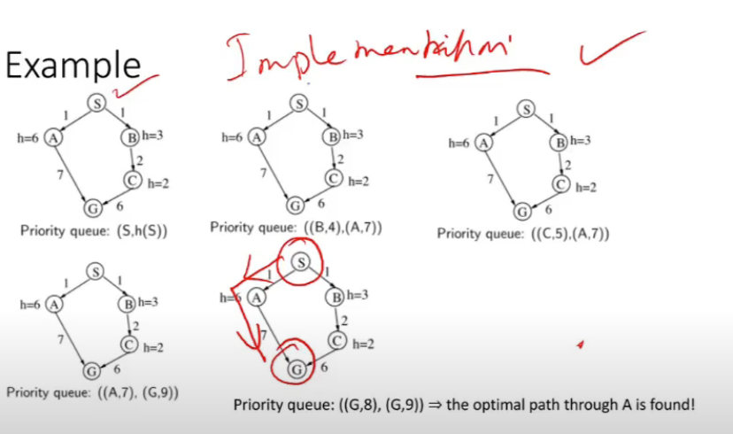
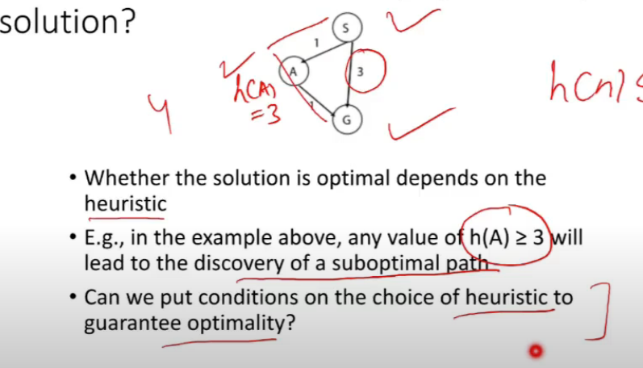
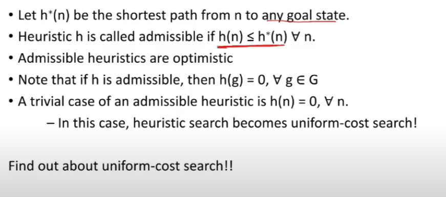
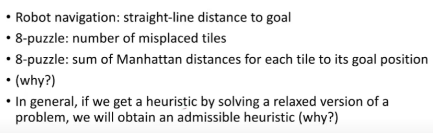
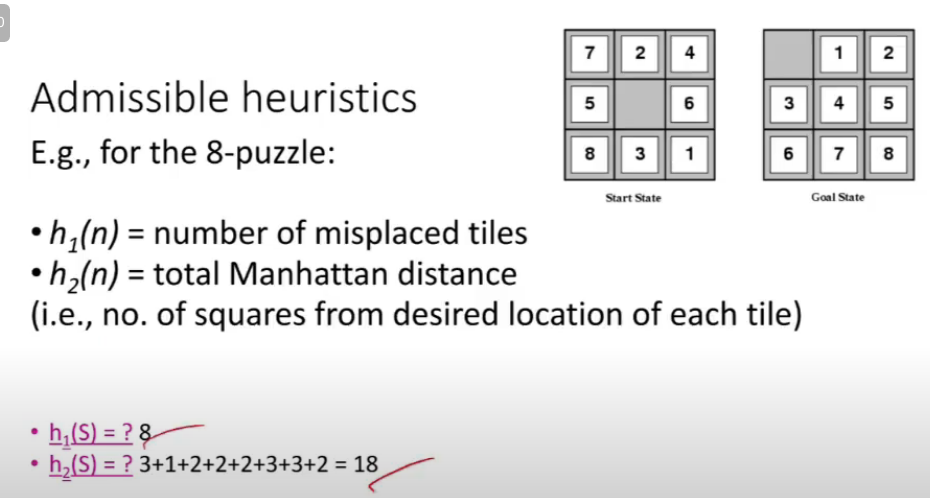
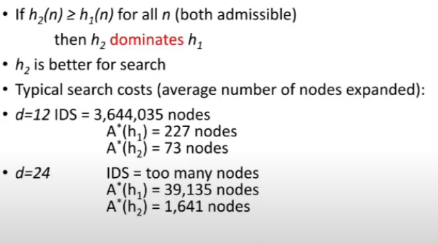
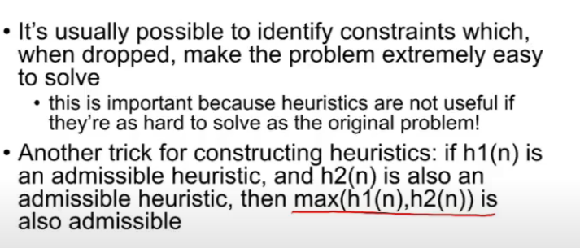

# Lecture 13

- [Lecture 13](#lecture-13)
  - [Video](#video)
  - [Heuristic Functions](#heuristic-functions)
  - [Uninformed vs Informed Search](#uninformed-vs-informed-search)
  - [Does heuristic search always give optimal solution](#does-heuristic-search-always-give-optimal-solution)
  - [Admissible Heuristic](#admissible-heuristic)
    - [Examples](#examples)
  - [Dominance](#dominance)
  - [Relaxed Problem](#relaxed-problem)
  - [Constructing a Heuristic Function](#constructing-a-heuristic-function)

## Video

[link](https://drive.google.com/file/d/1_4TpnAlGMORXXIzqrwW_naJNufEJjW0_/view)

## Heuristic Functions

- a technique for solving a prob more quickly when classic methoda re too slow, or for finding an approximate solution when classical methods fail to find any exact solutions
- achived by trading optimality, completenes, accuracy or precision for speed
- can be considered a shortcut
- heuristic function ranks alternatives in search algos at each branching step based on avaialble info to decide which branhc to follow
- it may approximate exact soln
- is a function used in informed search and it finds most promising path
- it takes current state of agent as its input and produces the estimation of how close agent is from the goal
- guaranteed to find a good soln in reasonable time, might not give best one
- estimates how close a state is to the goal
- represented by h(n) and calculates the cost of an optimal path b/w pair of states
- value is always positive
- estimate of cost of shortest path from node n to goal node
  - H can be extended to path: j(<n0,...nk>) = h(nk)
- h(n) uses only readily obtainable info (that is easy to compute) about a node
- admissible : h(n) is an underestimate if there's no path from n to a goal that has apth less than h(n)
- i.e. h(n) is a lower bound on the cost of getting from n to the nearest goal
- If nodes are points on a Euclidean plane/space and cost is diatance, we can use Straight line distance from n to the closest goal as the value of h(n)
  - makes sense if there are obstacles or for other reasons not all adjacent nodes share arc

- If nodes are cells in frid and cost is #steps, use Manhattan Distance (L1)
- in 8-puzzle, use number of moves b/w each tile's current position and its position in solution

## Uninformed vs Informed Search

- uninf expand nodes based on distance from start node
- inf use some estimate of distance to goal h(n), called heuristic
  - SLD b/w 2 points in a navigation problem(romnia wala)
  - #misplaced tiles in 9-puzzle
- heuristic is often result of thinking about a relaxed version of prob (romania me hamne sochlia ki stright road hai agar har 2 city ke beech me, then I won't pick the other 2 sides of triangle)

## Does heuristic search always give optimal solution

- depends upon heuristic

## Admissible Heuristic

- G = set of goal nodes

### Examples

## Dominance

## Relaxed Problem

- prob with fewer restrictions on actions
- cost of an optimal soln to relaxed is admissible heuristic for original prob
- if rules of 8-puzzle are relaxed so that tile can move anywhere, h1(n) gives shortest soln
- if rules are relaxed so that a tile can move to any adjacen square, then h2(n) gives shortest soln

## Constructing a Heuristic Function

- a cost minimizing serarch prob is a constrained optimizn prob
  - eg find a pth from A to B which minimizes distance traveled subject to constraint that robot cannot move through walls
- a relaxed version of prob is version of prob where one or more constraints have been dropped
  - eg: find path from a to b which minimizes dist traveled allowing agent to move through walls
  - a relaxed version will always return a value which is weakly smaller than origin : thus an admissible heuristic

