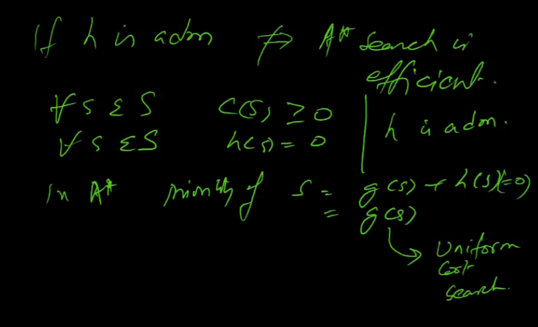
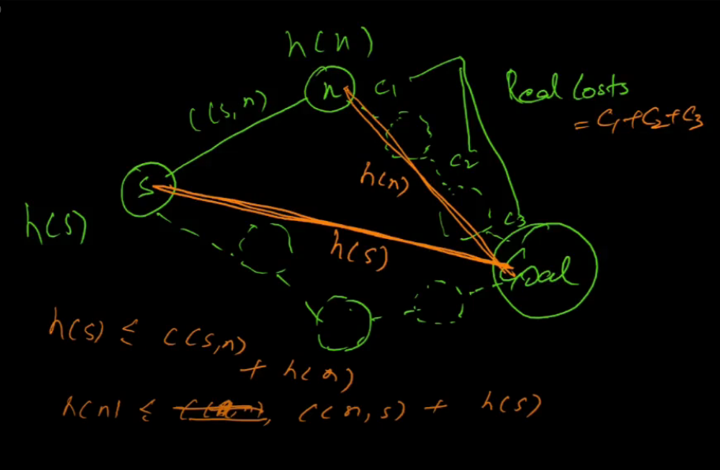
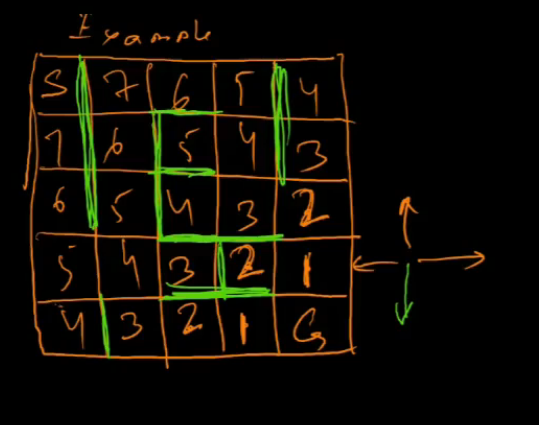
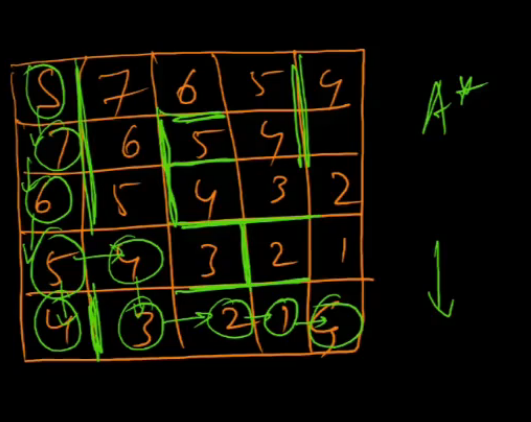
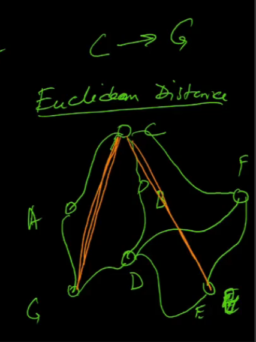

# Lecture 14

- [Lecture 14](#lecture-14)
  - [Video](#video)
  - [Restrictions on Heuristics](#restrictions-on-heuristics)
  - [Optimality of A*](#optimality-of-a)
  - [Consistent/Monotonic heuristic](#consistentmonotonic-heuristic)

## Video

[link](https://drive.google.com/file/d/1LYuhYSr4e3DOZT-FHJKtB_vI3ikmUdQf/view)

## Restrictions on Heuristics

## Optimality of A*

- H should be admissible
- H is admissible <=> H never overestimates the true cost to goal
- h(S) = heuistic estimate from S to Goal
- C(s) = optimal cost from S to goal
- if h(S) <= C(S) for every s in S, then h is admissible
- h is admissible does not mean A* search is efficient

- we want h to be as large as possible and still be admissible

## Consistent/Monotonic heuristic

- h is consistent iff
  - h(G) = 0
  - h(S) <= C(s,n) + h(n)
- meaning
  - h follows triangle inequality
- c(s,n) = step cost from s to n (one step to take from s to n)
- neighbors(s) = set of all states which are one step away from s

- h is consistent => h is admissible
  - yes, but inverse is not true necessarily

- optimal ke lie admissible bana, efficient ke lie consistent

- Example
  - green are walls

- heuristic costs hai yeh, for heuristic = manhattan distance

- A* on the above grid, seeing manhattan distance

- Now euclidean, network me C->G jaana

- we r not making a straight road exactly there, heuristic man rahe isko
- actual cost roads ke through hi ayegi
- heuristics never overestimates actual cost bhai (triangle ineq)
- worst case me equal hoga h(C) = c(S)
- road n/w me euclidean makes sense, upar neeche wale me manhattan
- diagonal allowed toh euclidean