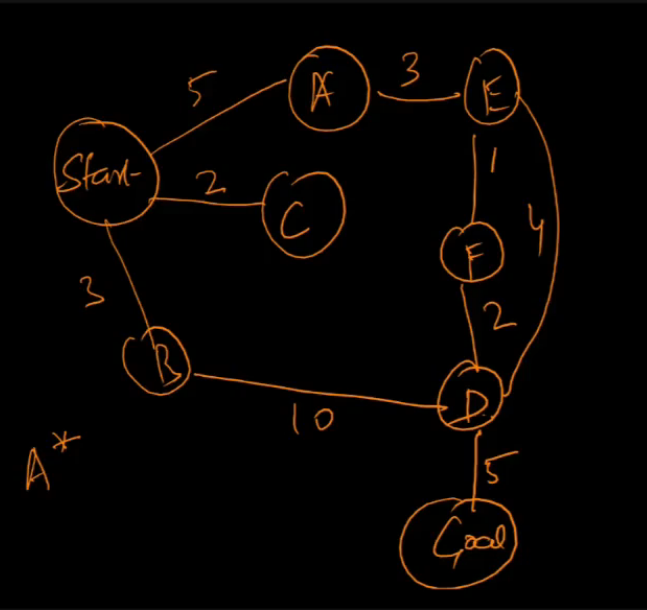
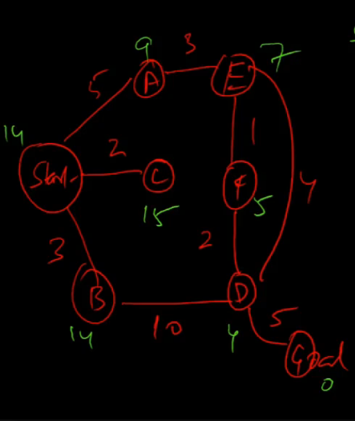
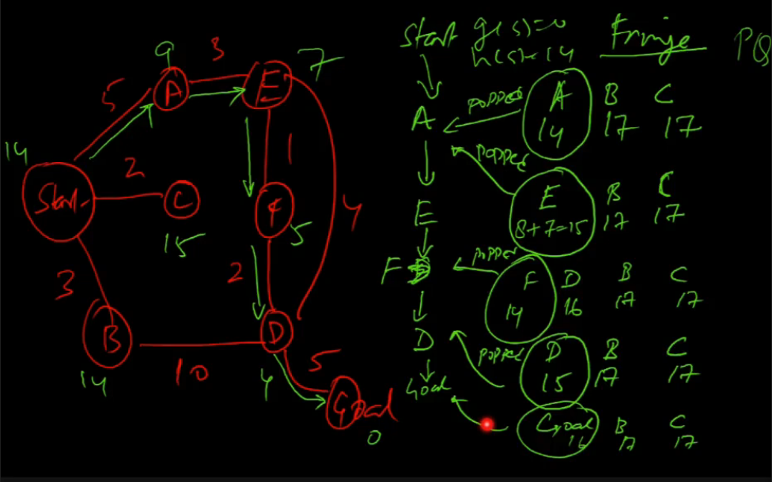
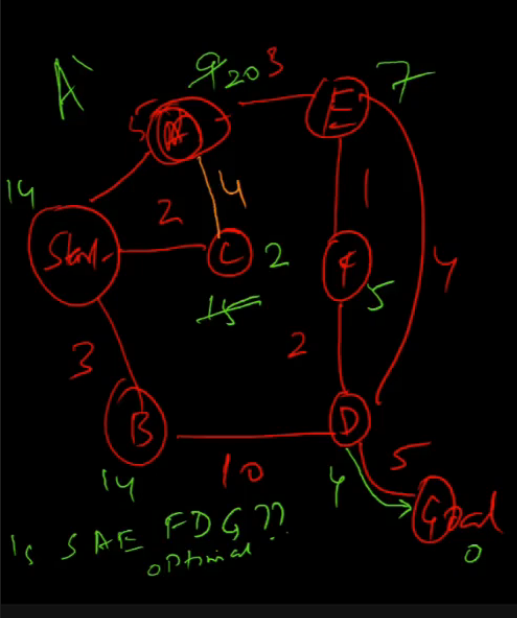
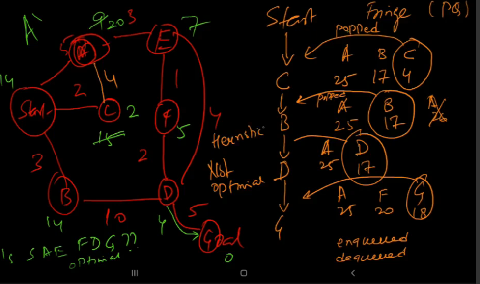

# Lecture 15

- [Lecture 15](#lecture-15)
  - [Video](#video)
  - [Problem](#problem)

## Video

[link](https://drive.google.com/file/d/1L-Y02IX1i4O7zjYttm_Nu_dqqWs0vWXR/view)

## Problem

- go from start to goal node using A*

- heuristic?
  - man le kuch hai jiski values green se likhi hai

- prioority of node = h(s) +g(s)
- g(s) = dist from start

- SOlution = path through A* on this graph

- Is this optimal path?
  - yes
  - by looking at graph
  - but do not look at graph bruh, it is cheating 😉
  - heuristic is admissible, and if it is, A* is guaranteed to be optimal
  - so, is h admissible?
    - check if h(s) <= c(s) for all s

- Example is made as such ki A* mast dikhe, agar heuristic thoda change kia to

- this is not optimal, bca heuristic is not admissible
- why>?
  - bcz of A
  - heuristic at A = 20, is not less than actual path
  - A->E->D->G ka cost kam, so heuristic overestimates actual cost
  - and since not admissible so A* hagg dega

- So, heuristic ko admissible rakh, and efficiency ke lie consistent bhi rakh
- trivial heuristics like h(S) = 0, are admissible but not helpful (inefficient), so keep it as large as possible keeping it consistent
- A ke lie agar heuristic ki value is <= 11, it is admissible, uske aage barbaadi
