# Lecture 16

- [Lecture 16](#lecture-16)
  - [video](#video)
  - [Uniform Cost search](#uniform-cost-search)
    - [Example](#example)
  - [Local Search Algos](#local-search-algos)
    - [Systematic vs Unsystematic Search](#systematic-vs-unsystematic-search)
    - [State-Space landscape](#state-space-landscape)

## video

[link](https://drive.google.com/file/d/1kn0Dg6QdHIzb8DIzaVkeJaxMq96env25/view)

## Uniform Cost search

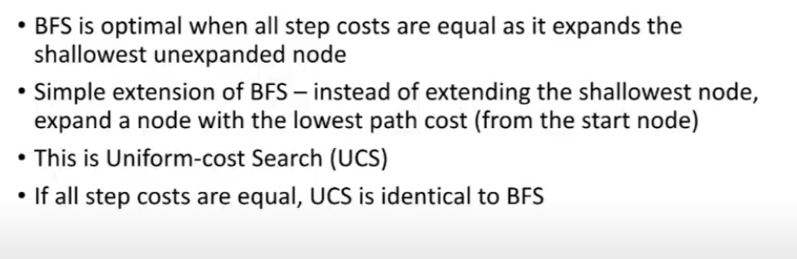

### Example

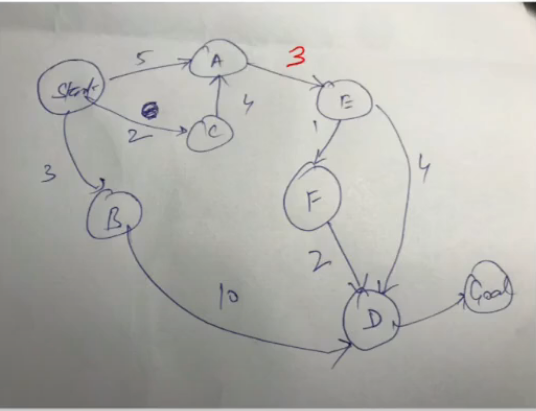

- priority queuee rakhenge
- cost = distance form start node

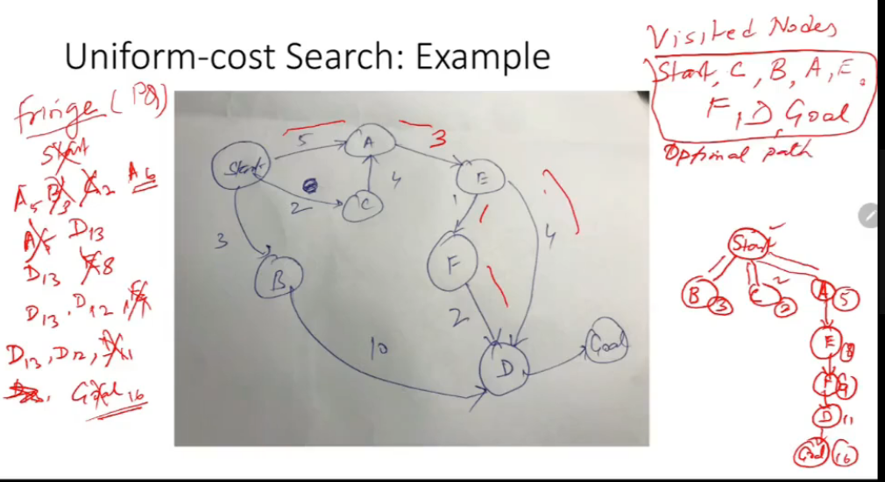

- Optimal Path = Start -> A -> E -> F -> D -> Goal

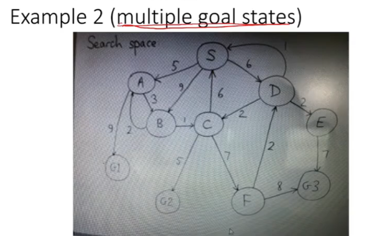

- we can have multiple start states as well
- here, we have to reach one of the goal state
- If I get a tie (same cost ke multiple nodes), then how to break the tie?
  - arbitrarily pick
  - alphabetical order
  - anyth u want

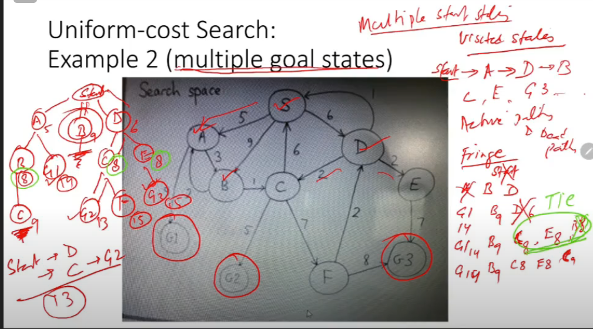

- so ans is Start->d->C->G2 with cost = 13

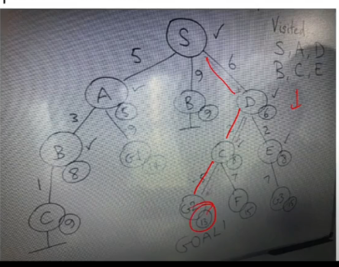

## Local Search Algos

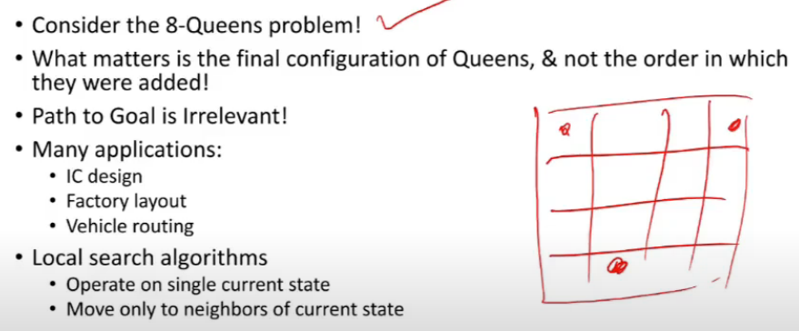

- path to goal is irrelevant

### Systematic vs Unsystematic Search

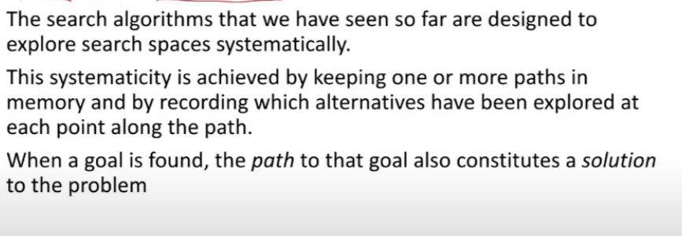

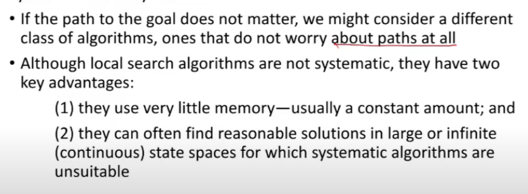

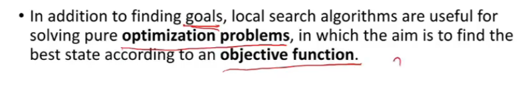

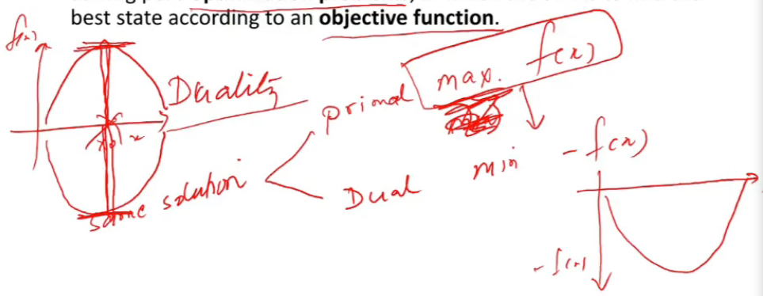

- dual is easier to solve than primal

### State-Space landscape

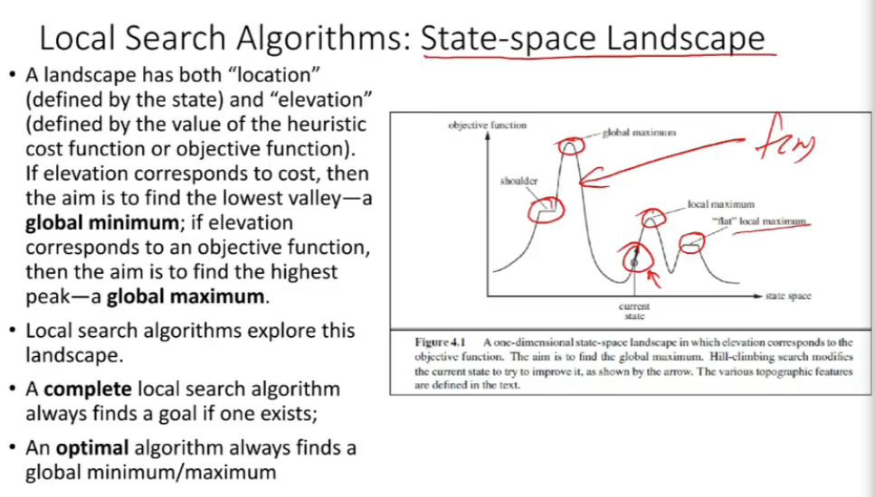
