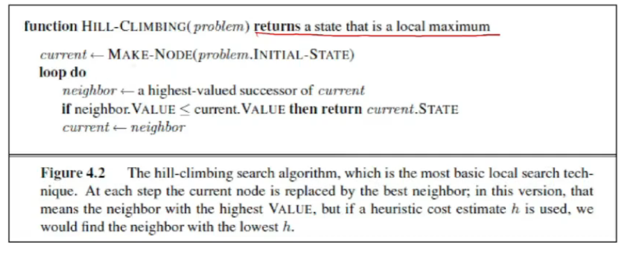

# Lecture 17

- [Lecture 17](#lecture-17)
  - [video](#video)
  - [Convex Curve](#convex-curve)
  - [Hill-Climbing algo (steepest-ascent/descent)](#hill-climbing-algo-steepest-ascentdescent)
  - [Random Restart Hill-Climbing algo](#random-restart-hill-climbing-algo)
  - [Simulated Annealing](#simulated-annealing)

## video

[link](https://drive.google.com/file/d/1B_zIhusscT0_rAKyqhs3Vt89W3ZKL1JW/view)

## Convex Curve

- take any 2 points within region under curve, join them by straight line, if that remains within region, function is convex

- are good bcz have single max/minima

## Hill-Climbing algo (steepest-ascent/descent)

- steepest-ascent version
- is is simply a loop that continually moves in dirn of increasing value that is uphill
- terminates when it reaches a peak where no neighbor has higher value
- algo does not match a search tree so that data structure fort current node need only record state and value of objective fn
- hill climbing does not look ahead beyond immediate neighbors of current state

- gets stuck at local max/min (saddle point)

## Random Restart Hill-Climbing algo

- once I get stack (idk local pe ho ya global pe)
  - choose another random value
  - after some number of tries, I might reach global max
  - tho tab bhi i will not know ki I have reached or not global max/min
- for a convex curve, always we will reach same global maximum

- prob ki initialization left wale region me aaye = 5/100, so .95 prob ki I get stuckj with local max

## Simulated Annealing

- ball hai slope hai
- shake the table, taki ball bounces on some side
- depending upon temp, some barriers I can cross, some I cannot
- depends upon ball me kitni energy hai
- t->0 is hill finding
- T->infinity = random walk

