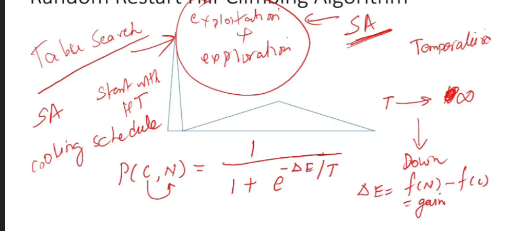
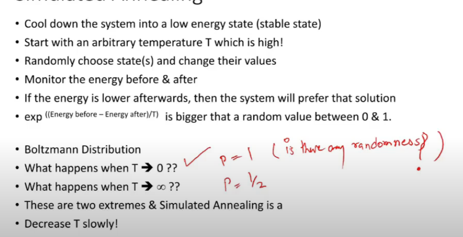
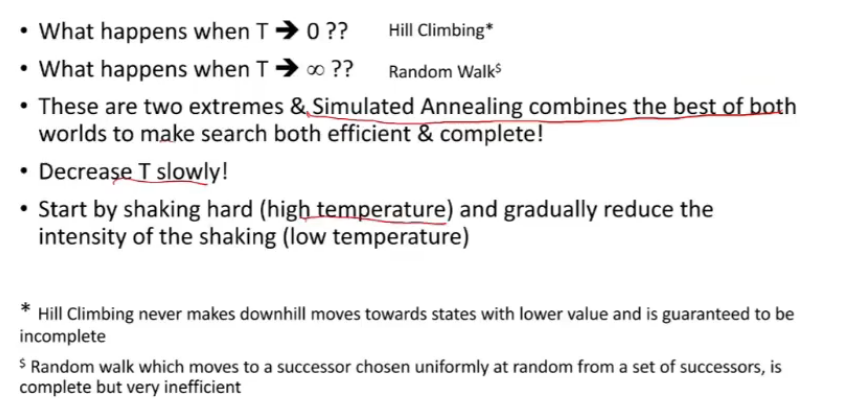
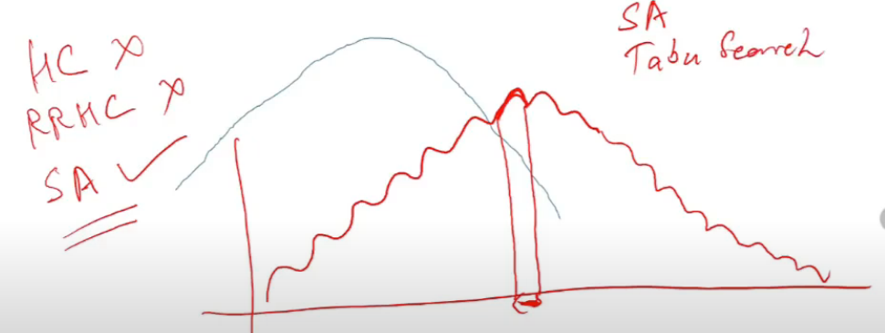

# Lecture 18

- [Lecture 18](#lecture-18)
  - [Video](#video)
  - [Random Walk](#random-walk)
  - [Exploitation and Exploration](#exploitation-and-exploration)
  - [Simulated Annealing](#simulated-annealing)

## Video

[link](https://drive.google.com/file/d/1XFxMxJuR_N8pQZT51rdf3UXG3Ha6LRhB/view)

- hill climbing, random restart hill climbing, iterative hill climbing
  - search moves are deterministic
  - steepest wle ki taraf hi jaunga

## Random Walk

- randomly picks a neighbor and move towards it
- hill climbing with same starting point will always take me to same point
- but random walk might take at diff places in diff iterations
- these 2 are extremes

## Exploitation and Exploration

- hill climbing me I am doing is exploitation
- I am only relying on gradient

- Random walk me no concept of gradient
- I am doing exploration there

## Simulated Annealing

- whwen temp is very high, molecules move very fast, when very down, they move slowly
- start with high temp, then follow a cooling schedule
- done by a probabilistic methid
- c is current state , n is next state, delta e is energy part = gain

- sigmoidal function (value b/w 0 and 1), S shaped
- t -> infinity, P(c,N) = 1/2
- if t-> 0 value = 1

- if P = 1, there is no randomness, puri certainity hai na bhai
- P = 0, again no randomness
- when I move towards 1/2 from both side, randomness increases
- so t->infinity = total randomness = random walk = total exploration
- t->0 = explotation = no randomness
- in sa, I start with exploration, slowly introduce exploitation, or vice versa?

- random restart hill climbing achi nahi bcz basis of attraction (range of points near global max) is bahut chotu sa
- yaha simulated annealing hi best hai
