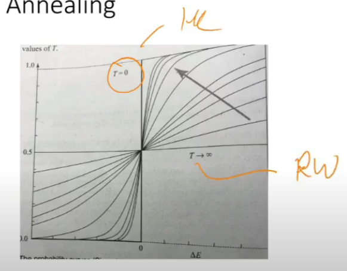
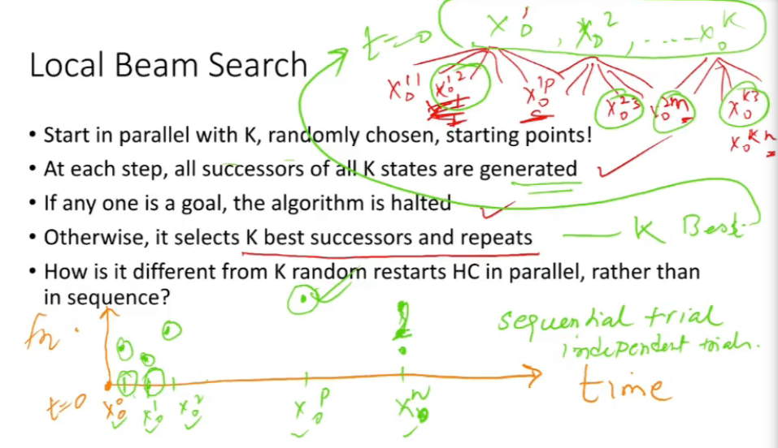
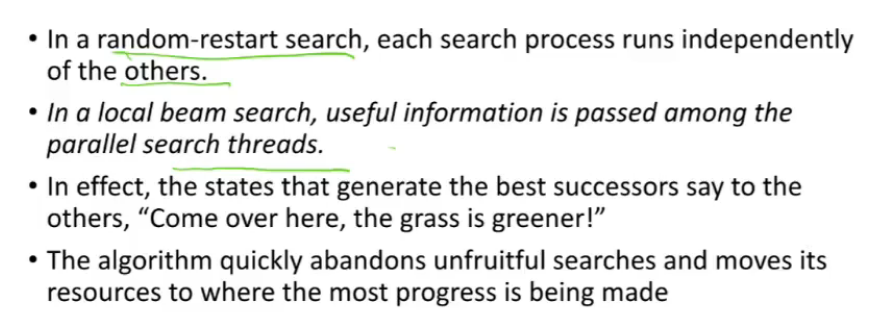
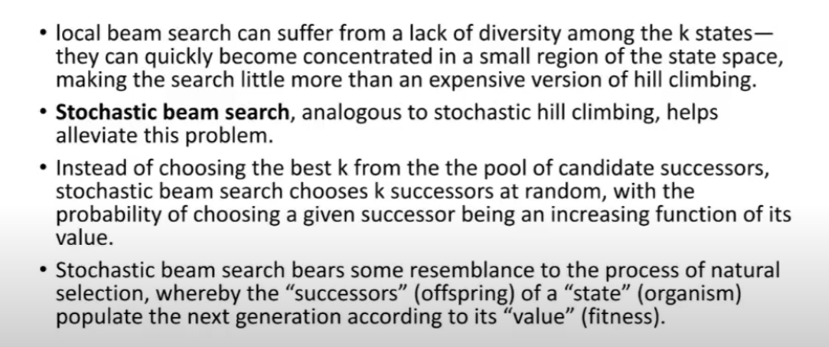
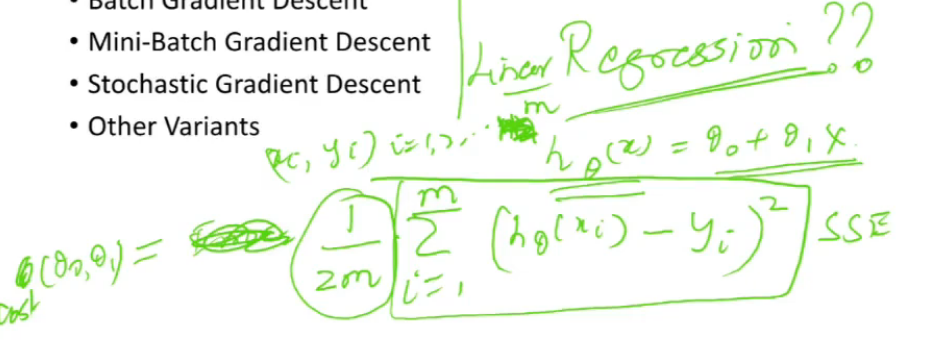
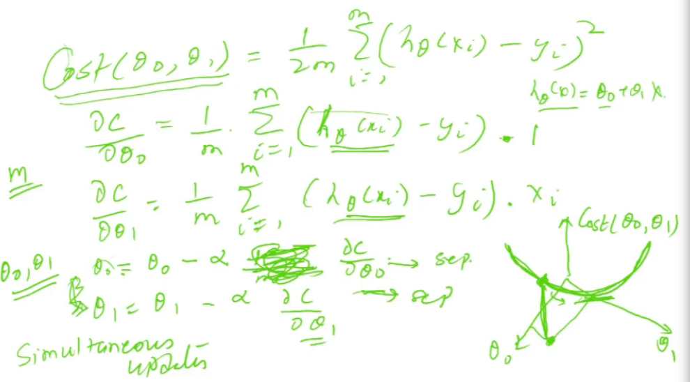

# Lecture 19

- [Lecture 19](#lecture-19)
  - [Video](#video)
  - [Entropy](#entropy)
  - [Local Beam Search](#local-beam-search)
  - [Stochastic Beam Search](#stochastic-beam-search)
  - [Gradient Descent Algorithm](#gradient-descent-algorithm)
  - [Linear Regression](#linear-regression)

## Video

[link](https://drive.google.com/file/d/1jVp6EfkYsDftgGSEOF-Z-5uG-6fVsqt7/view)

## Entropy

- measure of uncertainity

## Local Beam Search

- sequential and independent trials = random restarts
- start with k initial seeds x01, x02, .., x0k
- look at neighbors/successors of all these
- if someone is goal, algo is stopped. else select k best successor and repeat

- how diff from k random restarts?
  - independent nahi

## Stochastic Beam Search

- local beam search me no randomness
- instead of picking k best from kp, pick k succ at random, with prob of choosing a given succ being increasing fn of its values

## Gradient Descent Algorithm

- batch GD
- mini-batch GD
- stochastic GD
- other variants

## Linear Regression

- h theta is heuristic fn whihch is approximating fn
- cost is sum of squared erros
- find thetas such that cost is minimized
- updte thetas st you move to minima/maxima
  - the updation is done using following eqns

- these are **simultaneous updates**
- if m is very large, I need to make many updates to change value, vs when m is smaller
