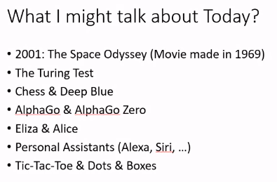
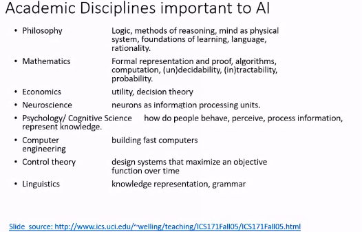
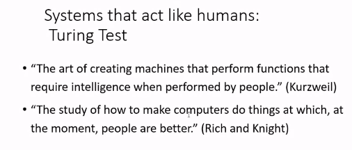
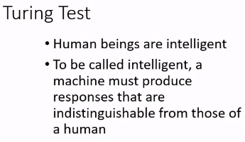
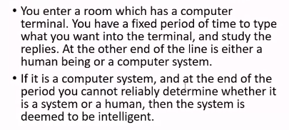
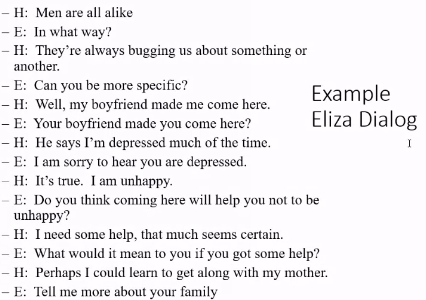
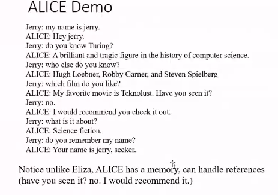
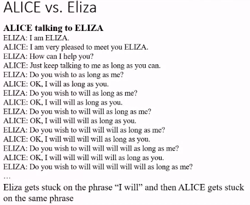
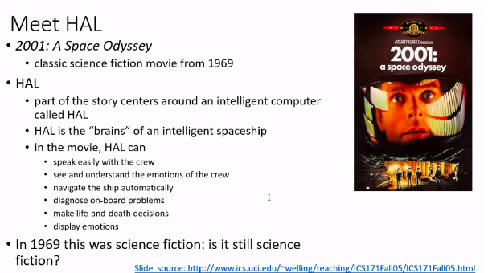

# Lecture 1

- [Lecture 1](#lecture-1)
  - [Video](#video)
  - [Topics](#topics)
  - [2001: The space odyessey](#2001-the-space-odyessey)
  - [The Turing test](#the-turing-test)
  - [Chatbots](#chatbots)
  - [Games](#games)
  - [What is Intelligence](#what-is-intelligence)
  - [What is Artificial Intelligence](#what-is-artificial-intelligence)
  - [Other Disciplines](#other-disciplines)
  - [Building Systems that act like humans : Turing Test](#building-systems-that-act-like-humans--turing-test)
  - [Systems that act like humans](#systems-that-act-like-humans)
  - [Solving the Turing Test : Eliza](#solving-the-turing-test--eliza)
  - [HAL](#hal)
  - [Components reqd to build a smart cmputer](#components-reqd-to-build-a-smart-cmputer)
  - [Evaluatives](#evaluatives)
  - [Textbook](#textbook)

## Video

[link](https://drive.google.com/file/d/18Si6X7bXK9-O9GVVbI_pnY0MA3fYDDIg/view?usp=sharing)

## Topics

- Introductory Concepts
- Intelligence definition
  - Artificial Intelligence
- History of AI
- Core Concepts
  - Search  
    - algos
    - search capacity
    - tool for prob solving
    - Heuristics search
      - heuristic = rule
      - allows to follow rule blindly
      - and if u follow it, most of times, u will achieve goal u set
      - eg: if I am lost, I will always move North
  - Representation
  - Uncertainity
    - concept of probability - Bayes thm, conditional prob, etc
    - Markov Decision process
- Success Stories
- Where are we headed?
  - Private AI - privacy concerns
  - Edge AI - doing AI using edge devices (Smartphones, etc)

## 2001: The space odyessey

- Science fiction movie

## The Turing test

- machine made by IBM which defeated then Chess Champion
- machine = deep blue

## Chatbots

- Alexa, Siri, Cortona

## Games

- Tic-Tac-Toe
- Dots & Boxes
- Adverserial Game playing

## What is Intelligence

- The capacity to learn and solve problems (**Websters Dictionary**)
- the ability to solve novel problems
- act rationally
- act like humans
- ***Ability to generalize***
  - There is a test on some topics
  - and some practice probs are given
  - Solving those, u learn some tricks/ways to solve the probs
  - and if u solve all these, u r likely to solve probs coming in exams

## What is Artificial Intelligence

- making computers that think
- the automation of activities we associate with human thinking like **decision making, learning**
- art of creating machines that perform functions that require intelligence when performed by ppl
- the study of mental faculties through the use of computational models

## Other Disciplines

## Building Systems that act like humans : Turing Test

- Deep Blue has been trained to play chess
- we r building systems which are specialized : can do one particular thing

## Systems that act like humans

- Turing test scenario

- Subtle point is what questions you asked

## Solving the Turing Test : Eliza

- ALICE

- alice has memory

- Alice vs Eliza

## HAL

## Components reqd to build a smart cmputer

- Fast hardware
  - as fast as human brain
- Foolproof Software
  - bug-free s/w
- can it play chess at grandmaster level
- speech interaction?
  - speech synthesis
  - recognition
  - understanding
- image recognition and understanding
- learning?
- planning and decision-making?

## Evaluatives

- 3 tests
- an assignment or quiz
- compre

## Textbook

- Norwig