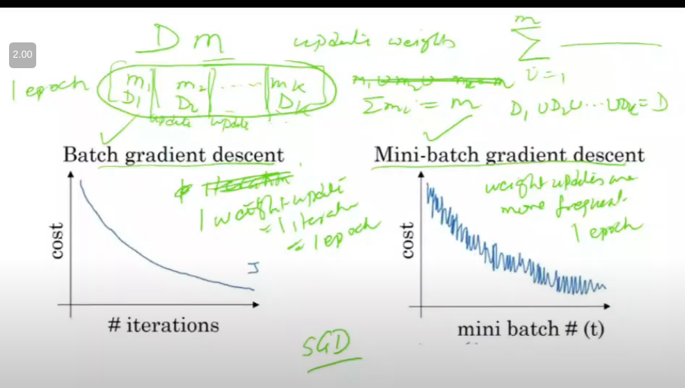

# Lecture 20

- [Lecture 20](#lecture-20)
  - [Video](#video)
  - [Qualitative Comparison b/w various Gradient Descent versions](#qualitative-comparison-bw-various-gradient-descent-versions)
  - [Size of mini batch](#size-of-mini-batch)
  - [Momentum Gradient Descent](#momentum-gradient-descent)
  - [Parallelization persepectivE?](#parallelization-persepective)

## Video

[link](https://drive.google.com/file/d/1mU-hNsIiyAJqMgaG79MW8YDZ4MWLBjeC/view)

## Qualitative Comparison b/w various Gradient Descent versions

- batch
- mini-batch
- stochastic

- heat map hai
- peaks are hotter, valleys are cooler
- simulated annealing ki tarah dekh toh we want to stabilize valye
- this helps inderstand how stochastic gradient works
- different initializatons can give diff maxima/minimas
- this is not a convex fn na

- this is a convex function so always globally

- in batch, if I have m training examples, I take all and do one iteration
- and then update weights after looking at all taining examples bcz summation hai na sabpe
- mini batch me, split it into k batches
  - start with one batch
  - and then second batch
  - ...
  - after every batch, update weights
  - m = m1 U m2 U m3 .. mk
  - these batches are randomly made with no overlaps
- epoch = 1 runthrough over all training examples
- in batch grad descent, 1 weight update = done in 1 iteration = 1 epoch
- in mini batch, weight updates are more frequent, update is done multiple times, 1 epoch is when done through all batches

- batch me, har iteration ke baad, I am moving in same dirn everytime.. (provided learning rate is not very large), it is very unlikely I take wrong dirn
- in mini batch, updates are frequent but are done using very small amount of data (m1 << m)
  - since bahut kam data pe karra, toh error chances jyaada

- Stochastic?
  - doing weight update with every point
  - next point picked randomly tabhi stochatic boltey
  - doing update using single point...
    - isse enough info thodi mil rahi bhai
    - so likely to make more mistakes
  - loose my dirn more often

- batch me path to minimum is very very small, kaafi smooth curve, I do not wander here and there at all (max info)
- mini batch me thoda idhar udhar ghum raha (less info)
- stochastic me, pura zig zaggg ( min info)

- batch
  - converge faster than sgd, and mbgd
  - then why use stochastic gradient (aka sequential gd, online gradient descent)
  - **bcz gd can get stuck in local minima**
  - **sgd is les slikely to get stuck in local minima**
  - **mini batch is in between**
- leep epoch same (say 10 epochs), who does more work?
  - bgd < mbgd < sgd

## Size of mini batch

- mini batch size is m
  - batch gradient descent
- size = 1
  - stochastic
- extremes the yeh
- inke beech me mini batch
- what is good size?  
  - typically.. 2^6, 2^7,. 2^8 etc are considered
  - what factors to consider?
    - dekh batch size should be such that it fits in memory completely

## Momentum Gradient Descent

- gathers kind of momentum to escape when gets stuck

## Parallelization persepectivE?

- mini batch is btr usme