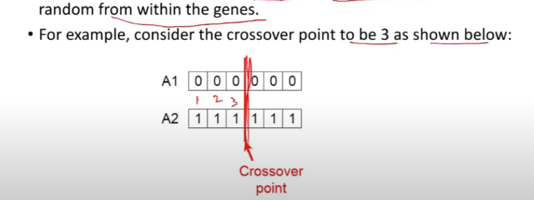
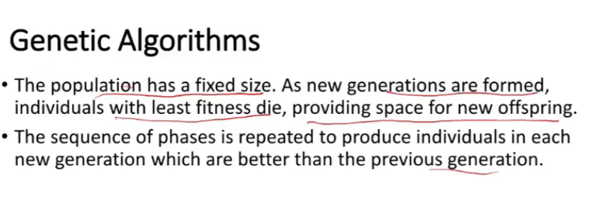
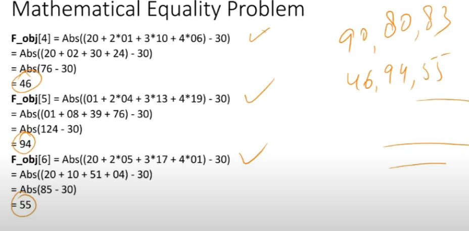

# Lecture 21

- [Lecture 21](#lecture-21)
  - [Video](#video)
  - [Genetic Algos](#genetic-algos)
  - [Phases](#phases)
    - [Initial population](#initial-population)
    - [Fitness function](#fitness-function)
    - [Naturak Selection - Select the best, discard the rest](#naturak-selection---select-the-best-discard-the-rest)
    - [Crossover](#crossover)
    - [Mutation](#mutation)
  - [Temination](#temination)
  - [Flow Chart](#flow-chart)
  - [The algorithm](#the-algorithm)
  - [Mathematical Equality Problem](#mathematical-equality-problem)

## Video

[link](https://drive.google.com/file/d/14UQOY-LDKH8fhwccS-aIMa-uTtYoyhqJ/view)

## Genetic Algos

- fittest among population..?
- search heuristic
- reflects process of natural selection where fittest individuals are selected for reproduction in order to produce offspring of next generation
- steps?
  - crossover
  - offsprings
  - mutation
- concepts?
  - population
  - attributes
  - fitness

## Phases

- initial population
- fitness function
- selection
- crossover
- mutation

### Initial population

- set of individuals = population
- each individ is soln to prob u wanna solve
- indiv is characterized by set of parameters(variables) known as geens
- genes are joined into a string to form chromosome(soln)

### Fitness function

- detemines how fit an individual is (ability of an individ to compete with other individuals)
- softmax fn aayega
- gives a fitness score to each individual
- probability that an individual will be selected for reproduction is based on its fitness score

### Naturak Selection - Select the best, discard the rest

- population size is fixed
- idea is to select fittest indiv and let them pass their genes to next gen
- population size is fixed always
  - 2 bacche banaye, toh 2 weakest hata bhi die

### Crossover

- most significant phase in genetic algo
- for each pair of parents to be mated, a crossover point is chosen at random from within the genes

- offspring are created by exchanging genes of parent among themselves until the crossover point is reached

- popu size is fixed, so remove 2 literalls which are weakest

### Mutation

- some of genes can be subjecte to mutation with low random prob
- implies that some bits in bit string can be flipped
- mutation occurs to maintain diversity within population and prevent premature convergence (converging to local maxima)

## Temination

- algo terminates if populn converged
- i.e. does not produce offspring which are significantly diff from prev generation
- then we say it has provided set of solns to our prob

## Flow Chart

## The algorithm

## Mathematical Equality Problem

- max one problem
  - 10 length string
  - n = 6 = individuals
  - 10 = attributes
  - how to generate population?
    - take a fair coin, toss it 60 times
    - f(s1) = number of 1s in s1, f(s2) = ...
  - now selection?
    - on basis of f(i) i = 1..6
    - if sabki same f hai, would it matter kaunsa select kia? naah

- Our Problem

- Step 1

- Step 2

- Step 3

- now find probabilities = fitness[i] / sum (fitness i)

- c4 is highest prob wala

- Step 4

- pick 2 best and crossover kara de
- c4 and c6 hai best
- get 2 offspring, remove 2 weakest ones (c5, c1)
- and unme mutation

- after 1 iteration, 2 chromosomes (c1, and c5) ki values changed ho jayengi and baaki sab same rahenge