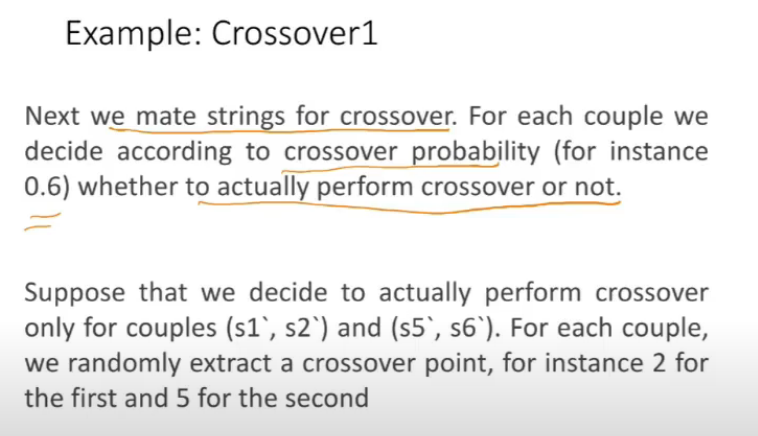

# Lecture 22

- [Lecture 22](#lecture-22)
  - [Video](#video)
  - [Genetic Algos](#genetic-algos)
  - [Stochastic Operators](#stochastic-operators)
  - [Metaphor](#metaphor)
  - [Algorithm](#algorithm)
  - [MAXONE Problem](#maxone-problem)
  - [Methods of selection](#methods-of-selection)
  - [Methods of reproduction](#methods-of-reproduction)
  - [Crossover strategies](#crossover-strategies)

## Video

[link](https://drive.google.com/file/d/1vByQTY3efxF4oCuW88RvzbVYe1k5KQ1T/view)

## Genetic Algos

## Stochastic Operators

- stochastic bolre bcz probabilistic hai saare yeh

## Metaphor

- computer model introduces simplifications(relative to real biological mechanisms) but surprisingly complex and interesting structures have emerged out of evolutionary algos

## Algorithm

- trying to create a population which is more fitter

## MAXONE Problem

- maxmize # of ones in a string of L binary digits

- we also decide what kind of crossover
  - single point crossover

- probabilistic nature of crossover

- calculate fitness agin, increased

- what is stopping criteria?
  - fitness reached itni value?
  - itna percentage improvement a gaya..

## Methods of selection

- roulette-wheel
  - each individual gets a slice of wheel but mroe fits get larger slices than lesser fit ones
  - 
- etilist
  - choose only most fit memebers of each generation (top 5/6)
- fitness-proportionate
  - select only those that are above ceratin cutoff of target fn (fitness > 6 say)
- scaling
- rank

## Methods of reproduction

- crossover
- mutation

## Crossover strategies

- randomly select a single point for crossover
- multi point crossover
- uniform crossover

