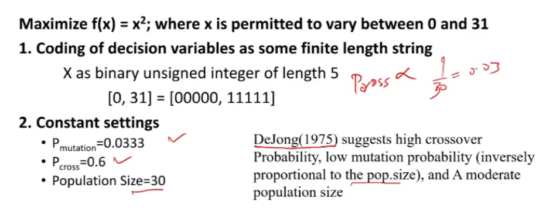

# Lecture 23

- [Lecture 23](#lecture-23)
  - [Video](#video)
  - [Crossover strategies](#crossover-strategies)
  - [Example Problem](#example-problem)
  - [Exmaple 2](#exmaple-2)
  - [Permutation representation: TSP Example](#permutation-representation-tsp-example)

## Video

[link](https://drive.google.com/file/d/12gTdYFhF6hDeSsFKwKs8CRxGiE5iggSm/view)

## Crossover strategies

- uniform crossover?

## Example Problem

- even numbered thing is arbitrary
- expected count? = Fi/f bar = actual f / average f
- average count is found by actually spinning the routelle and getting ki 4 me se kitni bar 1st me gaya, kitni bar 2nd me etc etc

## Exmaple 2

- length of chromosome = 30

- now pair and find crossover point, get new valkues, get fs, etc etc

## Permutation representation: TSP Example

- moidel it as genetic algo prob?
- dekh n cities hai
- uska 1 permutation = 123...n
- number of permuations possible? = n!
- say n  = 30,  = 10^32
- I have to find min cost from all these possibilities, so bruteforce toh bhulja
- population?
  - n length sequence
- f?
  - pairwise distance nikal le sabki
  - now sum of distance of cities in sequence

