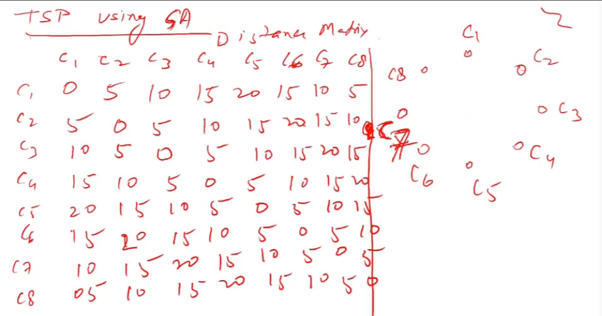

# Lecture 24

- [Lecture 24](#lecture-24)
  - [Video](#video)
  - [TSP - Genetic Algo contd](#tsp---genetic-algo-contd)
  - [Issue for GA Practitioners](#issue-for-ga-practitioners)
  - [Benefits for GAs](#benefits-for-gas)
  - [When to Use a GA](#when-to-use-a-ga)
  - [GA Types](#ga-types)

## Video

[link](https://drive.google.com/file/d/1nceP9WaQKst-LVv0jpQTiT1Klsdnyn64/view)

## TSP - Genetic Algo contd

- crossover kaise kare?
  - city repeat nahi karni..
  - say t1 and t3 ke beech me crossover karre
  - say 2 adjacent city swap kardi ek tour me?
  - har ke lie I defined ki kitne swap karunga isme... hmmmm
  - check this after swaps

- What is optimal solution?
  - x1->c2->c3->...c8 cost = 5+5+5+..+5 = 35

## Issue for GA Practitioners

## Benefits for GAs

## When to Use a GA

## GA Types

