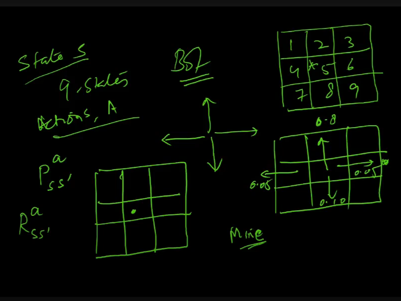
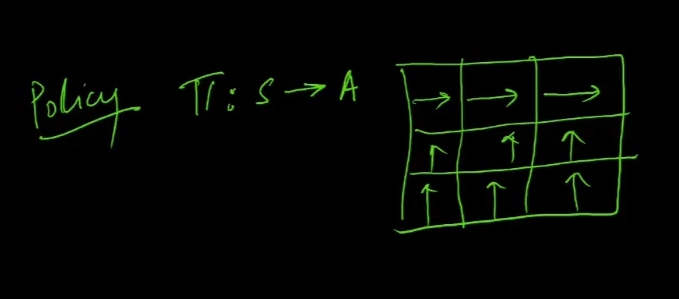
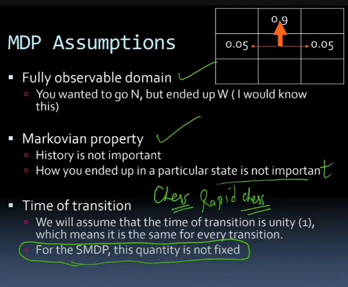
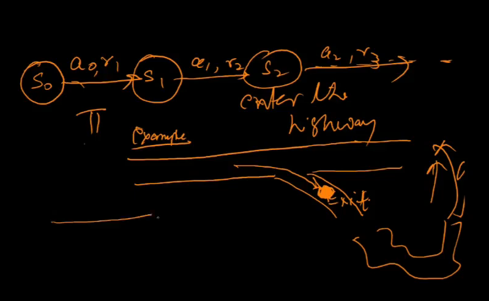
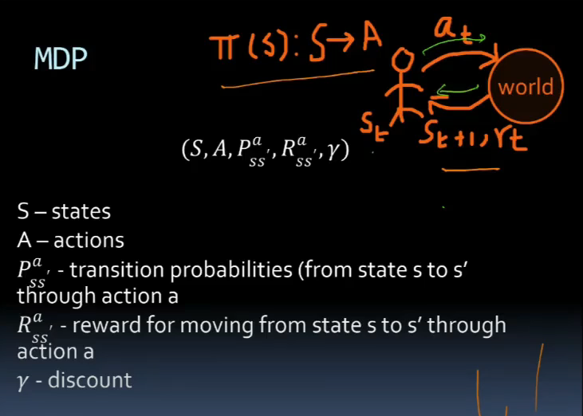
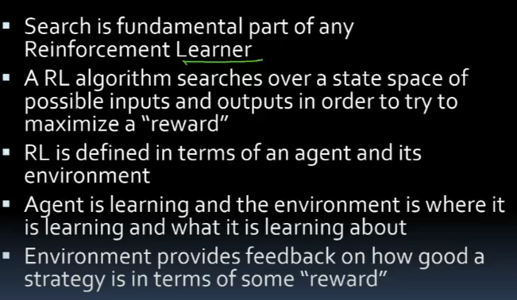
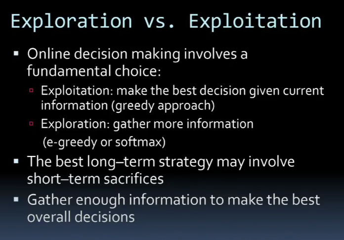

# Lecture 25

- [Lecture 25](#lecture-25)
  - [Learning types](#learning-types)
  - [Sequence decision making problems](#sequence-decision-making-problems)
  - [Noisy movement](#noisy-movement)
  - [MDP](#mdp)
  - [Assumptions of MDP](#assumptions-of-mdp)
  - [Examples of RL](#examples-of-rl)
  - [MDP - contd](#mdp---contd)
  - [Elements of MDP](#elements-of-mdp)
  - [MDP and Reinforcement](#mdp-and-reinforcement)
  - [Reinforcement Learning](#reinforcement-learning)
  - [Exploration vs Exploitation](#exploration-vs-exploitation)

- Shattering
- 3 kinds of classifiers
  - threshold = decision stump
  - interval classifier
- reinforcement learning

- MDP = MArkov decision process
- Exploration  vs exploitation
- learning through interaction with environment
  - eg chjild learning to walk
  - do smth
  - get feedback form env
    - u r doing right or wrong
  - take action
  - action is given reward/penality
- state and action spaces
  - how many states possible
  - what actions
- episodic and continual tasks
  - maze me hai, niukal aaya bahar = episodic task
  - learning to walk = continual task
    - continuous hai
- reward and delayed reward
  - delayed
    - immediately nahi pata ki if a move taken will take u closer to goal or not
    - i will get as resp is if a move was good or not jab opponent now takes move
- policy
- mdp and smdp
- q-learning algo

## Learning types

- supervised
  - sample i/o pairs of fn to be learned r given
  - teacher hai
    - training data dia
    - predict output minimizing some loss
  - eg: regression, classiffication
- unsupervised
  - only data points given(features only)
  - find similar Xs
  - clustering
- reinforcement
  - agent acts on its environment
  - rcvs evaluation of its action
  - not told which one is correct to achieve goal
  - training data: S,A,R
  - develop an optimal policy(sequence of decision rules) for learner so as to maximize it s long-term reward
  - eg robotics, board-games,etc

## Sequence decision making problems

- i do not have to take single decision, but a sequence of decision
- like game play
  - moves form a sequence of decisions
- that is what reinforcement learning is all about

## Noisy movement

- say grid me hu
- can move in some dirns
- i assign probabilities of moving in some dirns
- dirns jaha movement prob is less, is noisy movement
- seq decision making is modelled as **markov decision process**

## MDP

- Set of states, S
- set of Actions A
- transition prob Pss(a)
  - state s me hu,take action a, move to s;, what is prob of this
- Reward Rss(a)
- **discount** (Y)

- 9 elements ki grid hai
- bot could be in any one
- so 9 states
- Pss'(a)

- **discount** factor
  - 1 dollar hai aaj
  - time ke saath iski value goes down
  - this is concept of discount
  - a dollar today is btr than tmrw

- **policy**
  - what action u should take when u r in state s

- agar top 3 me hu, i will  move right, bakio me move top
- this is policy
- achi uya buri idk

## Assumptions of MDP

- fully observable domain
  - although u want to  move in one dirn(high prob), u move in some other, ik that, it is fully observable
- markovian property
  - history is not important
  - idc how u reached a state, imp is what u do next
- time of transition
  - time take to decide is fixed
  - for smdp, not fixed
  - Rapid chess(fixed time to take a move) ke lie MDP use kar, normal chess ke lie SMDP

## Examples of RL

- robotics
  - how should robot behave to optimize its performance
- control theory
  - how to automate the motion of a helicopter

## MDP - contd

## Elements of MDP

- state
  - parameters describing system
  - eg: coordinates of robot moving in room
- actions
  - which dirn robot moves
- transition prob
  - prob of going from state s to s' under influence of ationm a
  - 3 states and 2 actions => 9 probabilities
- immediate rewards
  - +ve/-ve when system makes transition
- policy
  - actions to be chosen

- Value function
  - value of state or state-action pair is totl expected award starting form that state

## MDP and Reinforcement

- RL is much more generic prob
- usme P and R are not known
- P and R can also change

## Reinforcement Learning

## Exploration vs Exploitation

- epsilon greedy and softmax in Exploration
