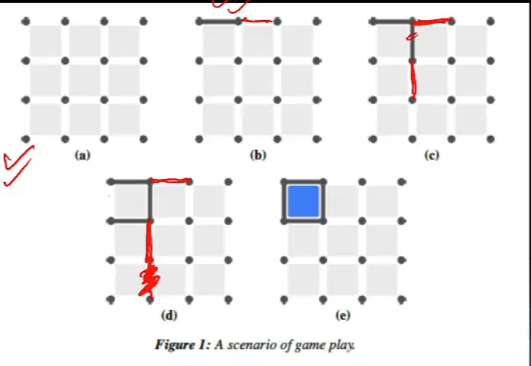
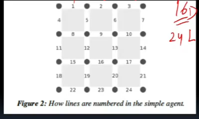
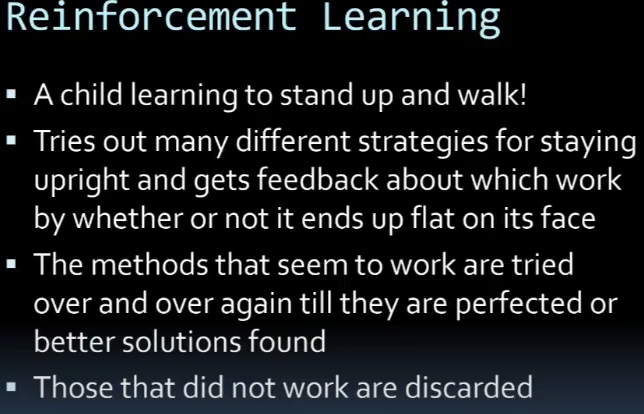
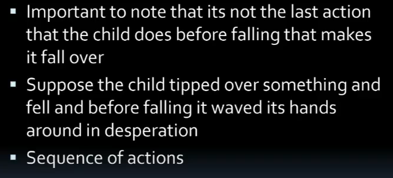
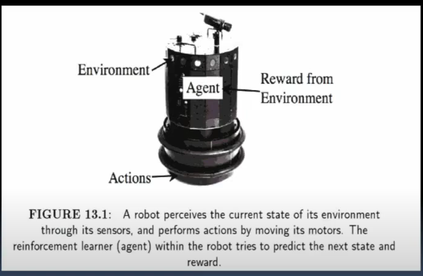
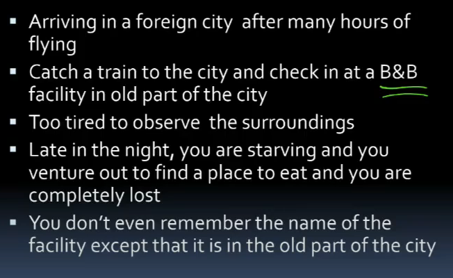
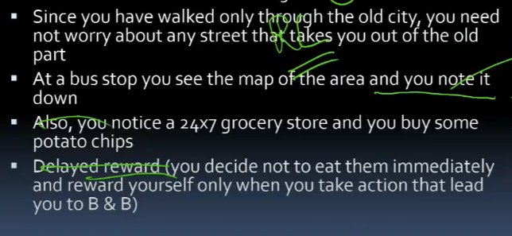
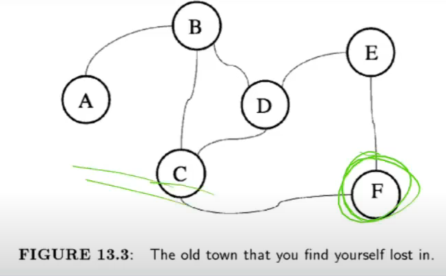
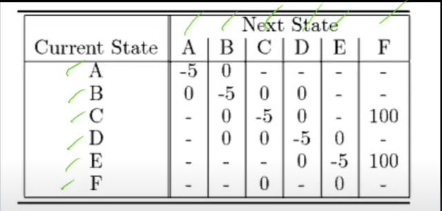

# Lecture 26

- [Lecture 26](#lecture-26)
  - [State and action space](#state-and-action-space)
  - [Strategies for action selection](#strategies-for-action-selection)
  - [Reinforcement LEarning](#reinforcement-learning)
  - [Getting Lost](#getting-lost)

## State and action space

- dots and lines game

- Simple agent
  - always makes same move independent of opponent
    - Policy is: chooses min numbered line possible, 
  - pupose of this agent is to give Q-learning algo an easy and predicatable opponent to play aginst

- state space size
  - each line is unique and can be drawn or not
  - 16 dots, 24 lines
  - #states = 2^24
  - game can be in any one of these states

- **State action pairs**
  - mean #lines possible to draw in each state = 12
  - #state action pairs = 2^24*12 = 200mn

- **reward**
  - +ve or -ve reward only when game ends and also when a box is completed
  - reward for winning must be far greater than that for completing a box
  - likewise punishment for losing a game needs to be more sever than losing a box

## Strategies for action selection

- greedy approach
  - go with best one
- epsilon greedy
  - exploiration part comes in
  - pick greedy most of times
- softmax
  - mostly max but with prob proportional to values u pick others

## Reinforcement LEarning

- sequence of actions == sequence of decisions taken

## Getting Lost

- deciding ur policy

- RL can help in this situation

- policy is eat chips only when u take action that lead to BnB
  - bad policy?
    - risk dkehne pe hai
    - if I eat, i will be sleepy
    - if i do not, then strength nahi

- actions, rewards?
- do not stay still (reward of -5 which means u pinch urself if u stay sleepy)
- F is called absorbing state (reward urself by eating all chips)
- moving b/w 2 squares could b good as it might be taking u closer to F, buyt u wouldn't know unless u refer to map
- so u deciode to reqard only after reaching F
- all other actionos r neutral
- when no direct road b/w 2 squares - no reward as it is not a viable action
- reward matrix

- As a **reinforcement learner**, u don't know **reqward matrix**
- this is what u r trying to discover

- State and action spaces
