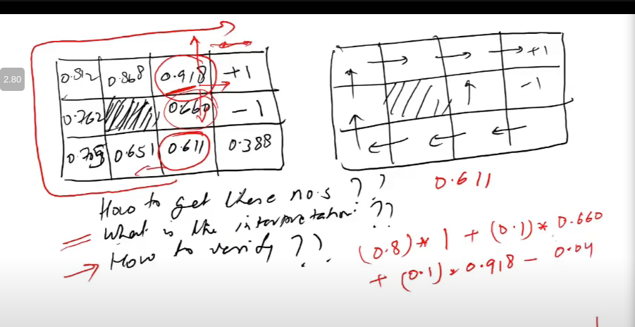

# Lecture 27

- [Lecture 27](#lecture-27)
  - [Action Selection Strategies](#action-selection-strategies)
  - [Expected Value](#expected-value)

## Action Selection Strategies

- greedy
- epsilon-greedy
- softmax

## Expected Value

- Fair dice = 1/6(1+2+3+4+5+6) = 21/6 = 3.5
- Loaded P(6) = 1/3, rest same
  - 1/3*6+2/15(1+2+3+4+5)

- Lay a bet head = +10, tail = -5
- Expected Value = 1/2\*10+1/2\*(-5) = 2.5
- what does this expected value mean?
  - if I place bet some times, then avg of it will be close to 2.5

- right denotes desired dirns
- left denotes, reward if move in desired dirn
- for .918 box, 1 is reward i get if move right, and 80% time right jaata
- aise hi karke average value nikal/expected reward
- 0.04 is cost of movement

- here, I needed expected values of neighbors and khud ki to get expected value of khud ki, dafuq

- for each state action pair (har state ke lie 4 hai in our eg), write expected value
- all the values, if i fill the grid, i get Q-values
- depend on neighboring cell's value, and likelihoods of reaching those cells
- how to learn these values?
  - next class
  - temporal learning algo
