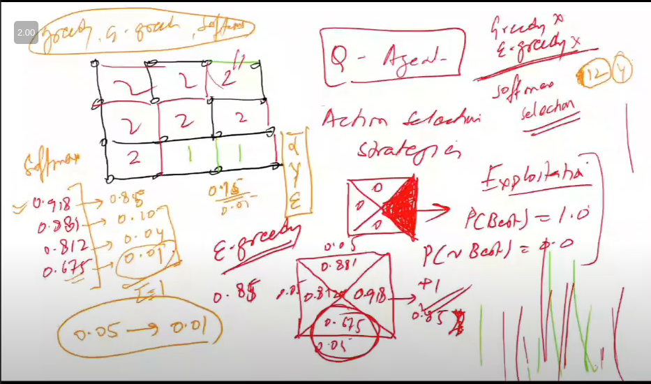
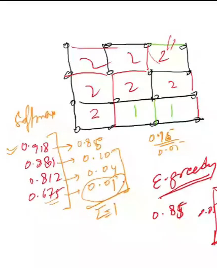
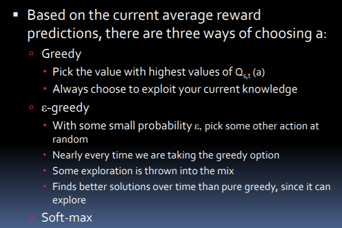
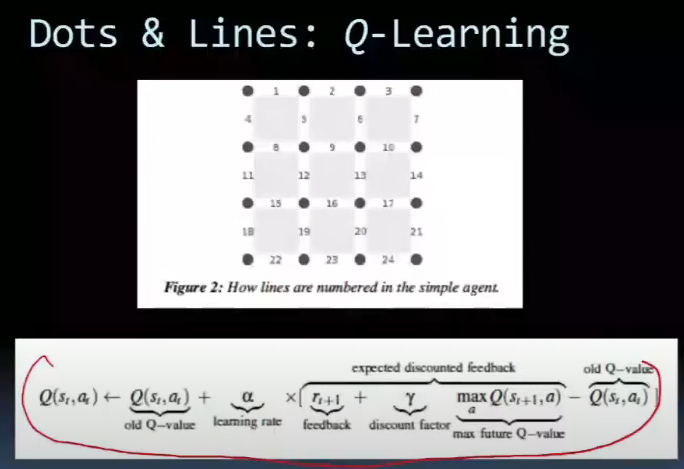

# Lecture 28

- [Lecture 28](#lecture-28)
  - [Action Selection Techniques](#action-selection-techniques)
  - [Soft-Max](#soft-max)

- exploit kehta ki best wala hi lo
- greedy me exploration nahi
- exploration me worst a sakta
- so do softmax selection

- best wale ko achi prob di
- next best ko remaining ka good chunk de dia and so on
- so basically rest of options ko prob di based on their values

- this is softmax aspect of our q-learning algo
- mix of exploitation and exploration
- 12 cells, 4 actions => 48 q-values

## Action Selection Techniques

- RLA looks at the actions that can be performed in a given state and computes the “value” of each action
- Value = avg. reward that is expected for carrying out that action in the current state
- Simplest way: compute the average reward that has been recd. each time in the past, Qs,t (a), where t is the number of times the action has been taken before in this state
- Qs,t (a) will eventually converge to the true prediction of the reward for that action

## Soft-Max

- Soft-max P(Qs,t (a)) = exp(Qs,t (a)/τ)/{∑bexp(Qs,t (a)/τ)} where τ is the temperature (simulated annealing)
- When τ is large, all actions have similar probabilities
- When τ is small, selection probabilities matter more
- Current best (greedy) action will be chosen most of the time, but others will be chosen proportional to their estimated reward, which is updated every time they are used

- in q-learning role of gamma is more imp than alpha (discount factor than learning rate)

