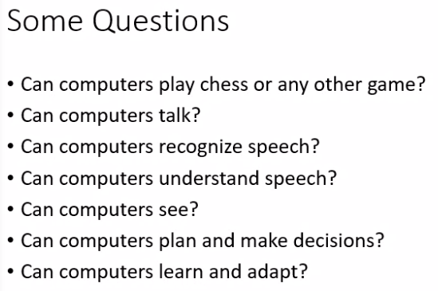
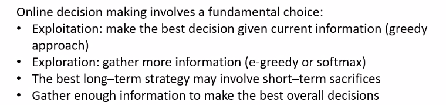

# Lecture 2

## Can we build hardware as complex as the brain

- We would like AI to have brain of human as well as animal
  - ant colony optimization
    - how ants locate a food source and how they communicate it to fellow ants in neighbor
  - swarm intelligence
    - swarm = collection of animals/birds/fishes
    - how they communicate and do a task is swarm intelligence
- How complicated is our brain?
  - a neuron is basic info processing unit
  - ~10^12 neurons in a human brain
  - many more synapses (10^14)  connecting these neurons
  - cycle time = 10^-3 seconds (1ms)
- How complex we can make computers
  - 10^8 or more transistors per CPU
  - supercomputer hundreds of CPUs, 10^9 bits of RAM
  - cycle times = order of 10^-8 seconds
- Conclusion

## Must an intelligent System be Foolproof

## Some questions

## Approaches to AI

## Planning

- planning a policy = considering the future consequences of actions to choose the best one

- At evry step, I will try to take greedy approach(pick the best option available)
  - greedy approach will give me suboptimal solutions in most cases
  - why we approach greedy?
    - bcz search space is so large, that we cannot enumerate everything
    - so I decide a ***heuristic***

## Exploration vs Exploitation

- exploitation - exploiting ur knowledge to make the best decision
- do not worry about short term gains but overall
- Real life example

## Action selection strategies

- dotted lines are the best options
- greedy  me I will use this only
  - prob of picking this in greedy = 1.0
  - baki options ki prob = 0
- eps-greedy
  - eps = 0.1 => 90% of time I will take best option
  - and with remaining prob, I will take remaining options
- Soft-max

## What is search

## Problems solving through search

