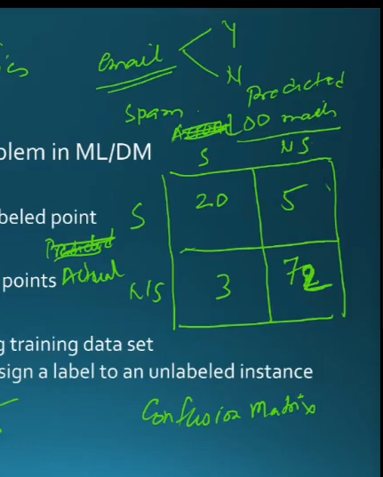
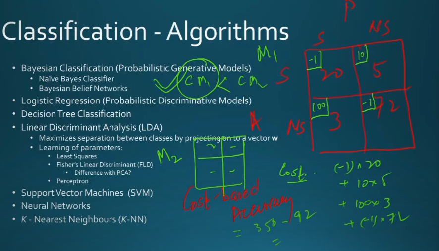
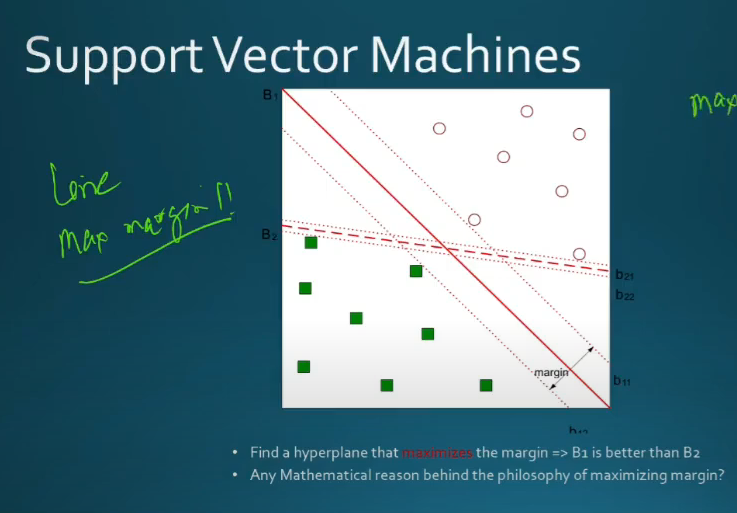

# Lecture 30

- [Lecture 30](#lecture-30)
  - [Classification](#classification)
  - [Support Vector Machine](#support-vector-machine)
  - [Decision Trees](#decision-trees)

## Classification

- find linearly separable line (2D data me)
- line->plane->hyperplane
- curve->surface->hypersurfaces
- function fx nikalna bas mainly
- training phase
  - model built
- testing phase
  - kitna bdia model checked

- email spam
- confusion matrix
- rows: actually spam/non-spam
- cols: model says spam/non-spam

- how many times classified correctly = 72+20 = 92 = 92%

- top-right, spam, marked as non-spam
- bottom-left, non-spam (genuine mail) but marked as spam, hmm gandaa

- here, confusion matrix just store numbers, no severity/number

- so create a new matrix store that cost as well, which would affect final accuracy

## Support Vector Machine

- is data linearly separable, say yes
- how many lines possible?
- infinite
- which one to pick
- pick best one.. waaah

- pick line maximizing margin

## Decision Trees

- leaf nodes tell result
- baki nodes tell criteria/decision