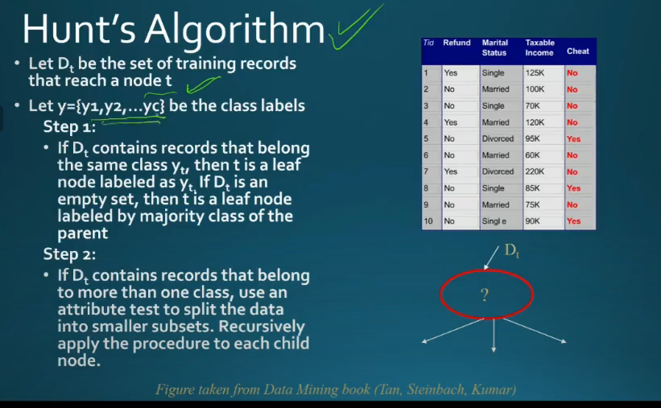
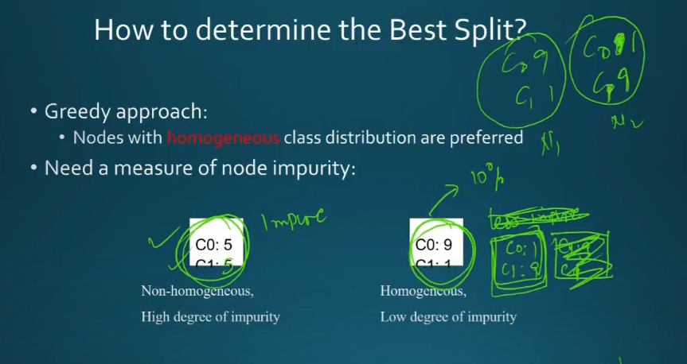
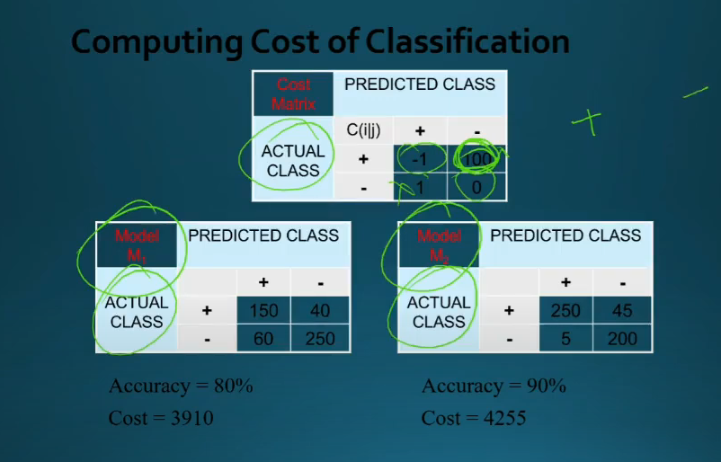

# Lecture 31

## Hunt's Algorithm

## Measuring purity/impurity of nodes

- Entropy se

- from impurity perspective c0:9, c1:1 and c0:1,c1:9 are same
- but it might not be actually depending upon appln
  - doodh me paani, paani me dudh

