# Lecture 32

## Measures of impurity

- Entropy
  - -summation p(j \| t)log p(j \| t)
- gini
- misclassification error

- all are symmetric about t = 0.5
- max at t = 0.5

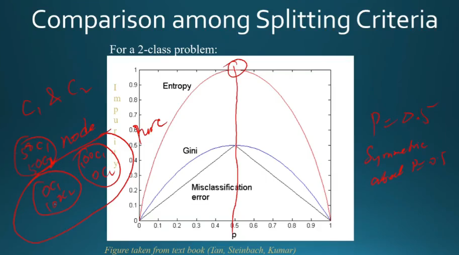

## How to find best split

- maanle 3 nodes hai = 3 type ke distribution kardie class wise
- teeno ki entropy nikal le
- jaha max => max info idhar se
- so issi ke acc split karle

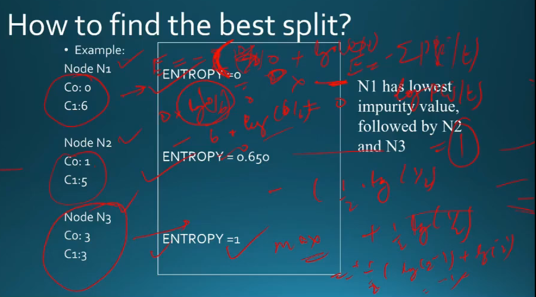

- so kya kiya?
  - had highly impure dataset at root(mixture of classes)
  - pick up a node based on entropy value
  - split it
  - keep going on until u reach leaf node = 1 class only

## Decision boundary - geometric meaning

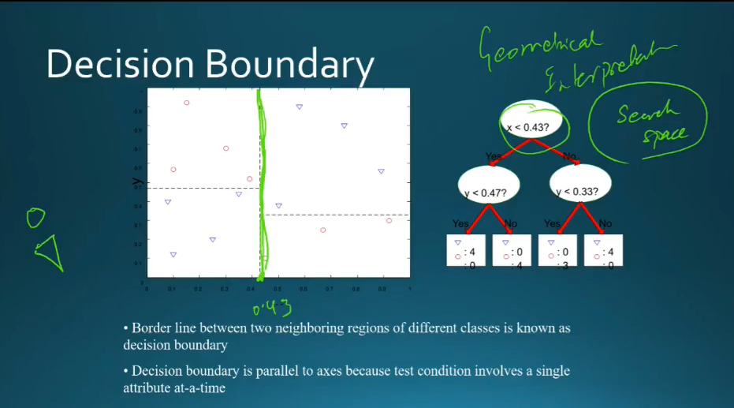

## Oblique Decision Trees

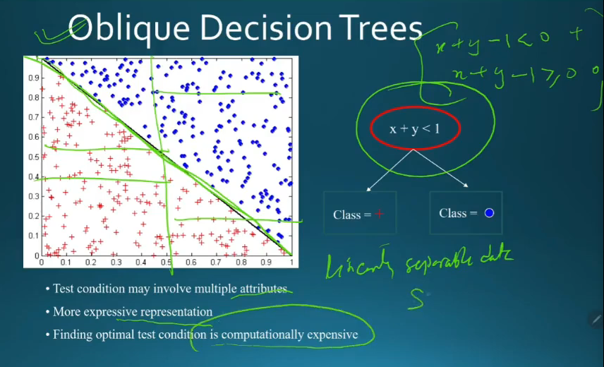

## Perceptrons

- I have set of inputs x1,..x4
- put in a node where I do weighted summation
- then I filter acc to values

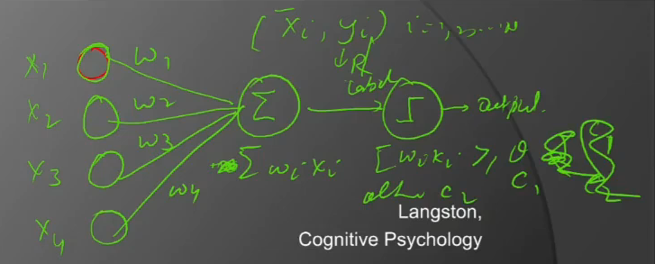

- update weights if galat output de for some point

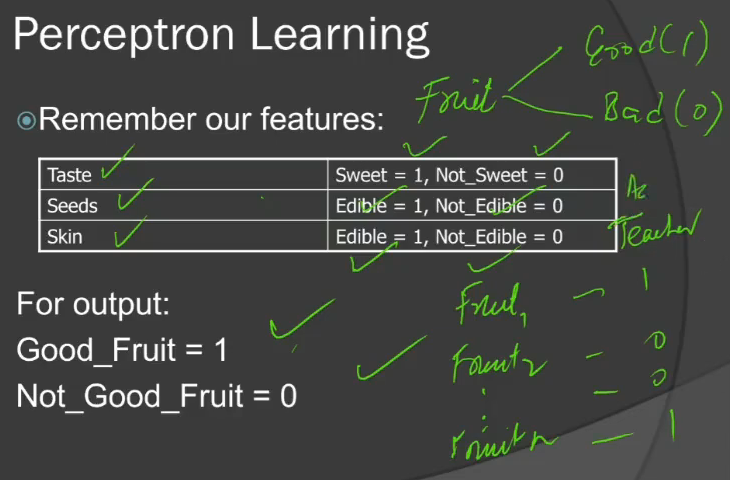

- Start with no knowledge by starting with 0 weights
- filter = step function
- show it examples and train

### Perceptronm Learning

- weight change, delta(w) = learning rate x (overall teacher - overall output) x node output

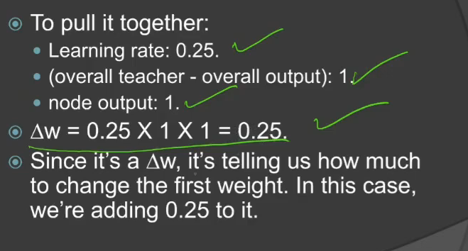

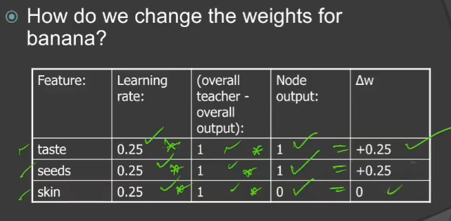

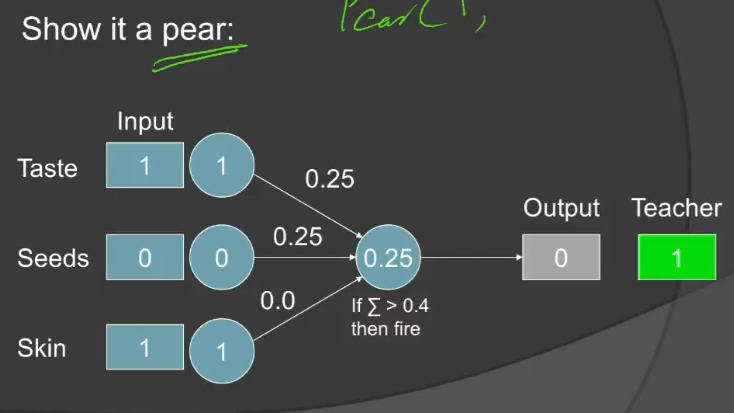

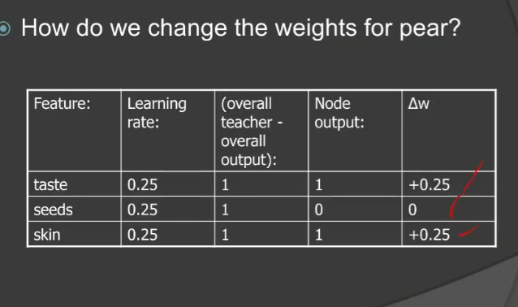

## Example

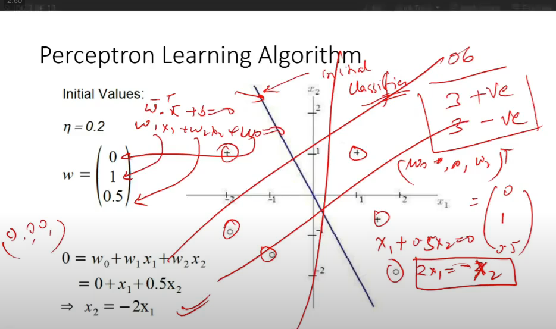

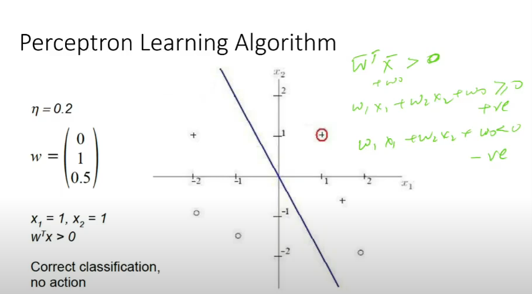

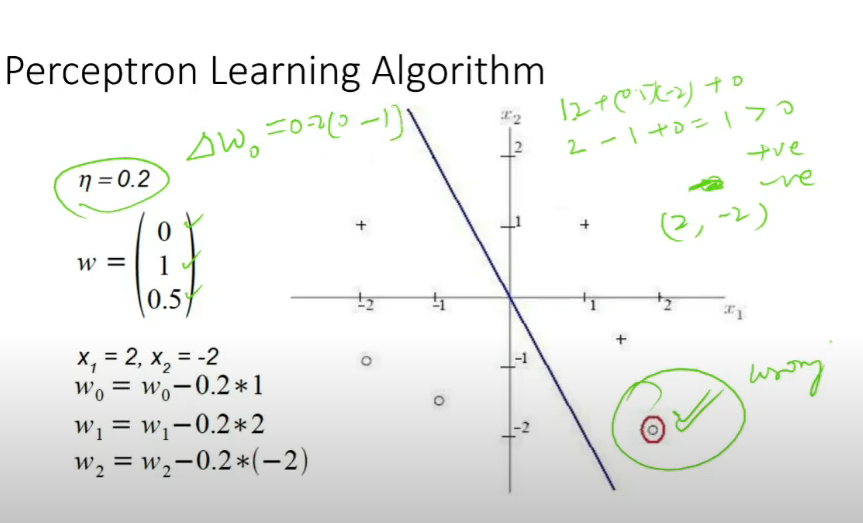

- **Stop only when all the points are classified correctly**
- **For linearly separable data, guaranteed to converge**
