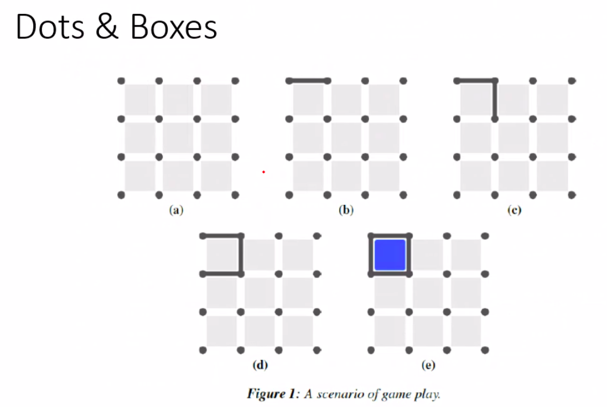
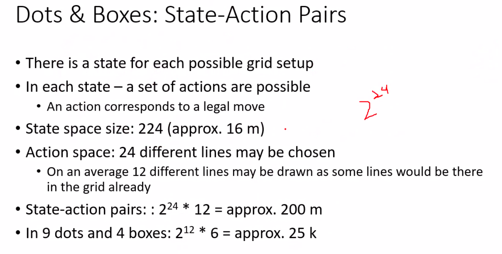
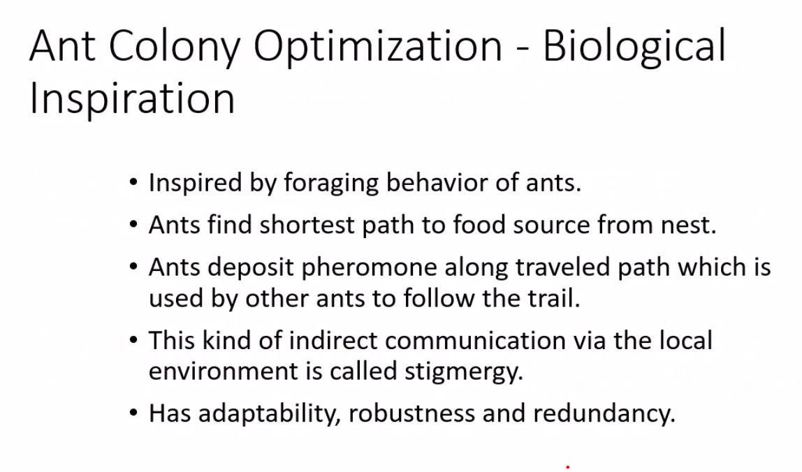
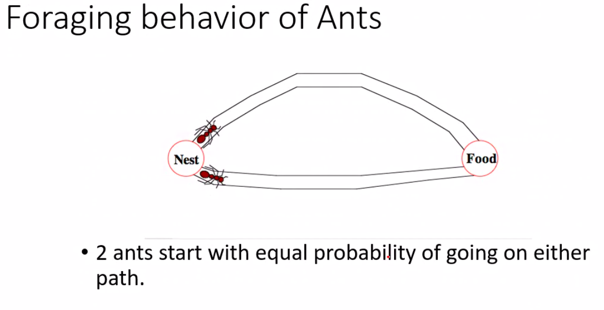
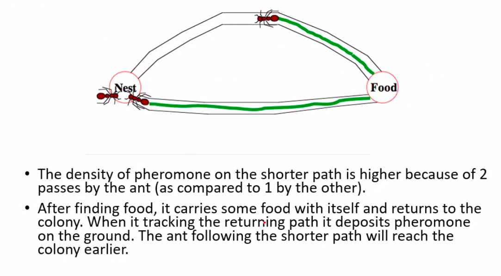
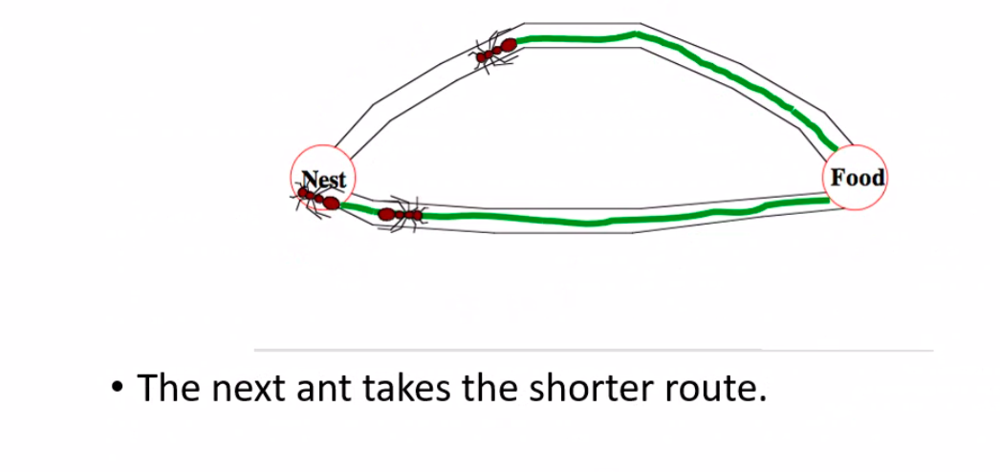
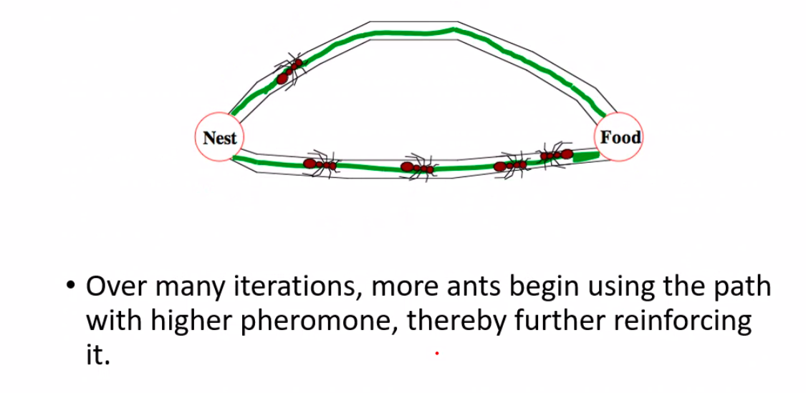
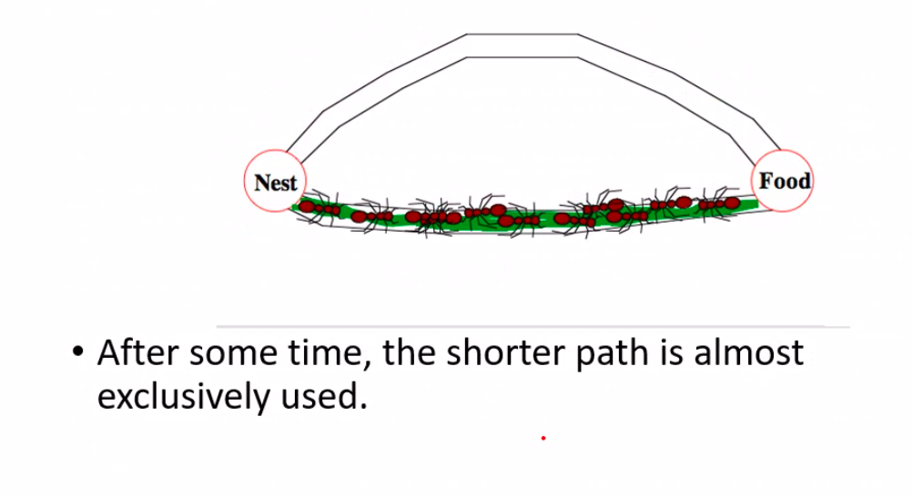
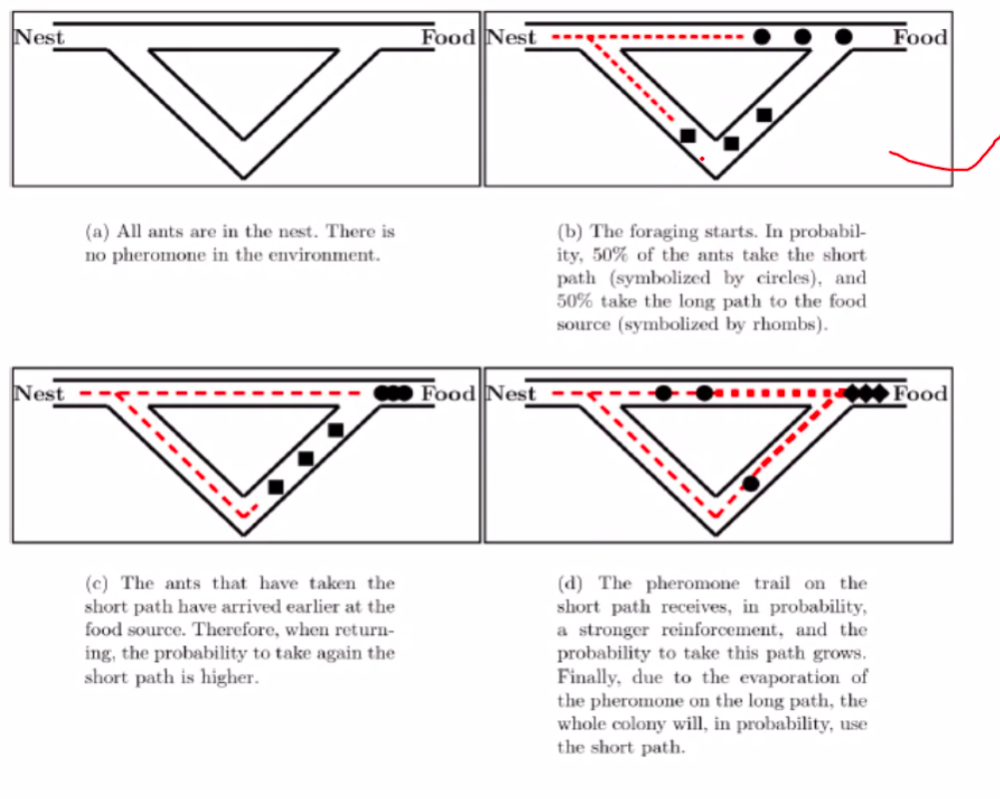
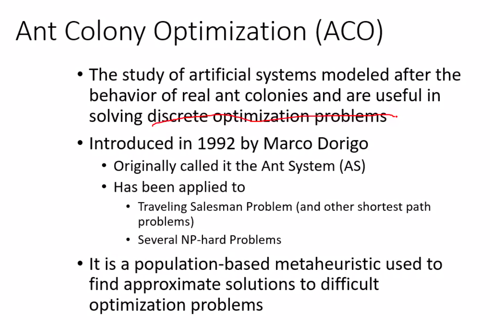

# Lecture 3

## Problem Solving through search

- enumerate all the options and choose the best(greedy)
- follow a set of rules (heuristic)

- How to *reduce* search space

- a is initial state
- 2 player game it is
- starting can be from anywhere in the grid
- first player can draw a line anywhere
  - 12 horizontal
  - 12 vertical
- the person with more number of boxes wins

## ANT Colony Optimization

### Foraging behavior

