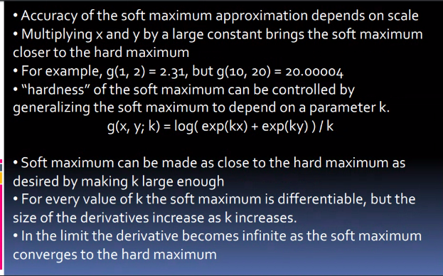
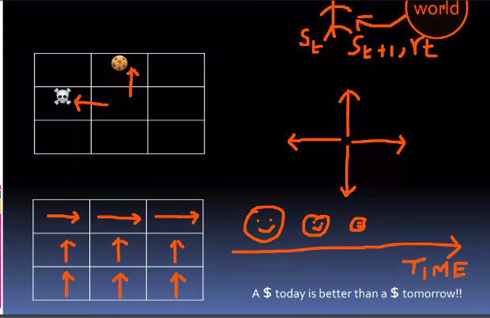

# Lecture 4

## Swarm Intelligence

### Why do animals swarm

- to forage better
- to migrate
- as a defense against predators
  - social insects have survived for millions of years
- swarms can achieve things that an individual cannot 

### Swarming examples

- Bird Flocking
- *Boids* model was proposed by Reynolds
  - bird - like (bird oids)
- Three rules while swarming
  - avoid collision with neighboring birds 
  - match the velocity of neighboring birds 
  - stay near neighboring birds 

### Swarming Characteristics

## What is a swarm

- A loosely structured collection of interacting agents
  - Agents
    - individuals that belong to a group(but are not necessarily identical)
    - theyy contribute to and benefit from the group
    - they can recognize, communicate, and/or interact with each other
- The instinctive perception of swarms is a group of agents in motion - but that does not always have to be the case
- A swarm is better understood if thought of as agents exhibiting a collective behavior

### Swarms examples in nature

- classic example
  - swarm of bees
- can be extended to other similar systems
  - ant colony
    - agents = ants
  - flock of birds
    - agents = birds
  - traffic
    - agents = cars
  - crowd
    - agents = humans
  - immune system
    - agents = cells and molecules

## Homework

## Topics for today

- softmax function
- introducton to Markov Decision Process

## Softmax Function

- all values will be between 0 and 1
- I can apply them to prob where events are mutually exclusive and exhaustive

## MDP

- most of times ( 90% ) I will move North
- this is what noisy env means

- I am also introducing some policies
  - policy means I have decided ki if I am in bottom 6 cells, I will move up and top 3 me I will move right

- with time, the reqard decreases
  - dollar today is btr than dollar tmrw

- here, all transitions have same time
  - chess ki tarah nahi hai ki kitna b time lo
  - but SMDP hota semi-mdp, usme time can also vary

## To Read

- IBM Watson
- Softmax and sigmoidal
- read MDP