# Lecture 5

## Video

[link](https://drive.google.com/file/d/1GLfqBsmFigWpReFhRNOQ84hYkTSPho5O/view?usp=sharing)

## Summary

- MDP technique
- used in uncertain environments

## MDP

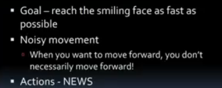

- if I want to move north, I won't always move north, there is a prob that I also go in other directions but it is obeservable domain, ik ki woh ja sakta hai kaha kaha

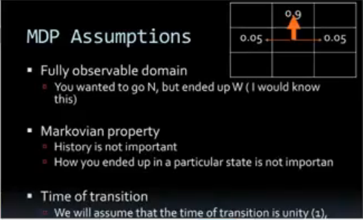

- how u ended up in a particular situation is not imp, imp is what u do when there

## Topics of the day

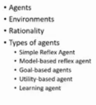

## Agents - what it is

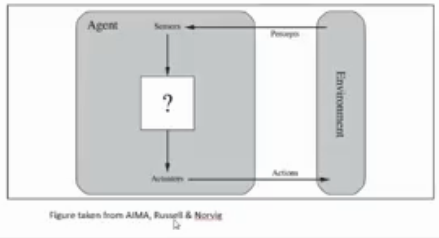

- agents has sensors(**percepts**) from which it senses environments
- and then it takes some actions using **actuators**
- MDP me reward was r, substrate me s and s', s se s' gaya, this is what agent looks like

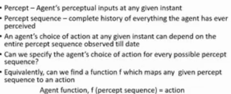

- can we specify?
  - maanle chess khelra, I will have to observe all moves mera opponent le ra

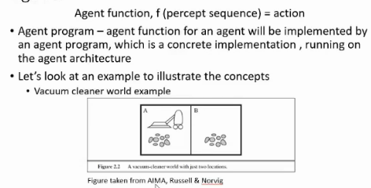

- agent architecture = hardware of the robot?

- vaccum cleaner world 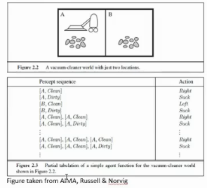

## Rationality

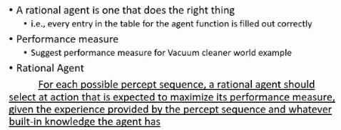

- an agent which does right things at a time
- it looks given input percept seq in table and decides action
- performance measure for vaccum cleaner?
  - amount of dirt it collected
  - how many tiles in the room it cleaned
  - how much time it took to clean entire room
- given the experience, maximize performance measure = rational agent

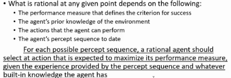

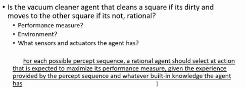

- sensors
- actuators
- perf measure

## Quiz Time

- are we humans agents?
  - yes
- are we rational?
  - we can always **try** to improve perf, try to be rational
- sensors and actuators for humans?
  - sensors
    - sensory organs
    - eye
    - ear
    - tongue
    - skin - we can feel by touch
  - actuators
    - we speak = tongue se action, hand se actions

- what are sensors and actuators a self-driving car has
  - sensor = camera, laser sensors, speedometer, gps, voice sensors
  - actuators

## Types of agents

### Simple Reflex Agent

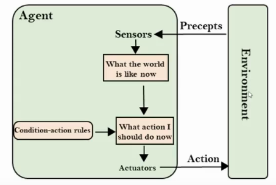

