# Lecture 6

## Video

[link](https://drive.google.com/file/d/12YmUQE6GPXQCPbPs-ftRs7sxLcpLyyD2/view?usp=sharing)

## Agents

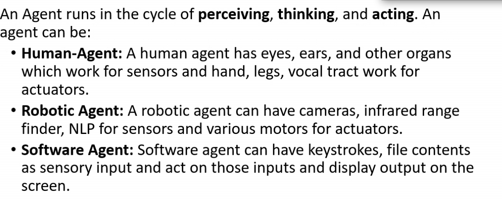

## Simple reflex Agent

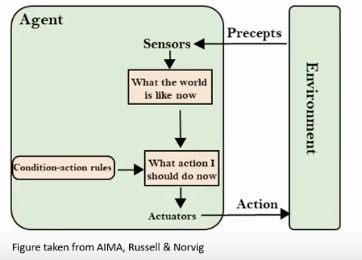

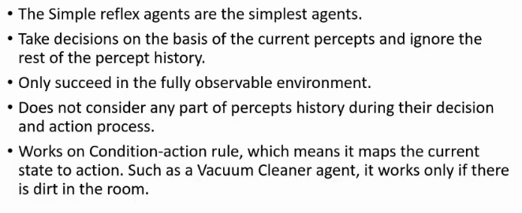

- non-perceptual part = data that cannot be obtained from sensor?
  - if vaccum cleaner me temp sensor nahi hai, it can't find temp, and agar temp high ho, then it might not be able to work

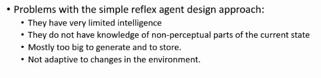

## Model Based Reflex Agent

- partially observable?
  - eg vaccum cleaner me I only know about current cell ki dirty hai ya nahi, neighbors ka idk

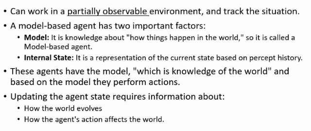

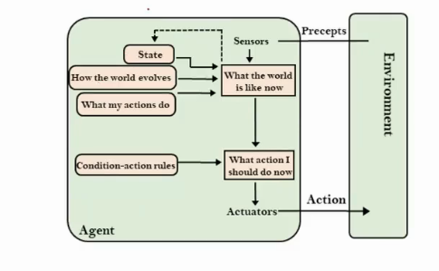

- it has better understanding of the world

## Goal Based agent

- goal = clean all the tiles

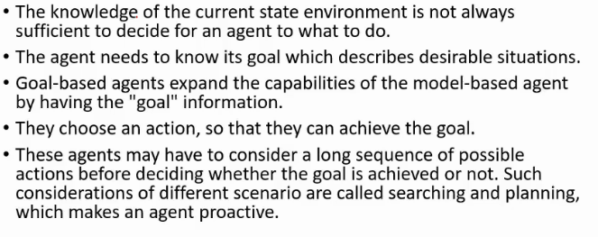

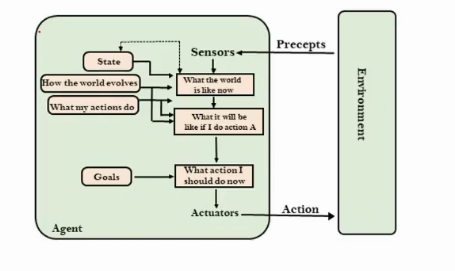

- there are no rules now
- we check if taking an action takes me closer to goal or not

## Utility Based Agent

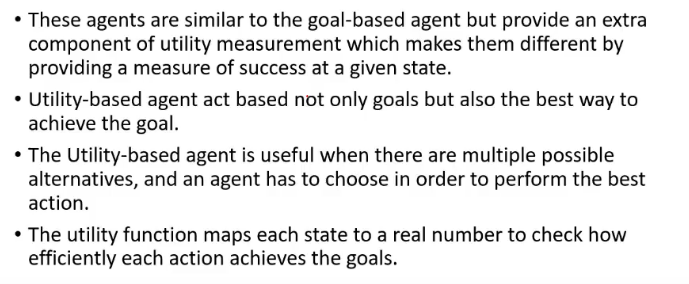

- main diff is in terms of optimization
- like what is shortest path to reach the destination
- goal based, onnly focused on goal, did not care about the time it took

- dekh 3 selectio strategies thi na
  - greedy
  - epsilon-greedy
  - softmax
    - so this will check ki kaunsa lu

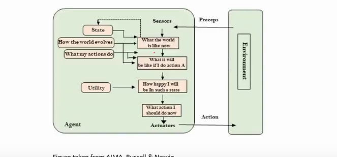

## Learning Agent

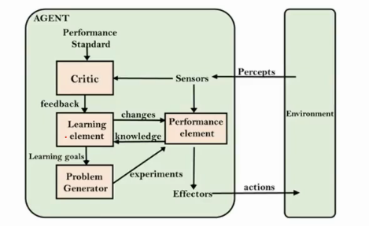

- Can it generalize
- if it has learnt to recognize obj a, can it generalize to recognize obj b
- neural n/w me bhi mistake se learn

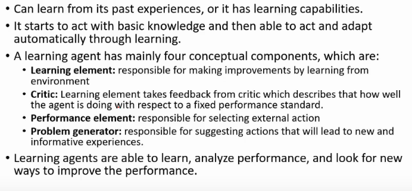

- it is like supervised learning

## PEAS Representaiton model

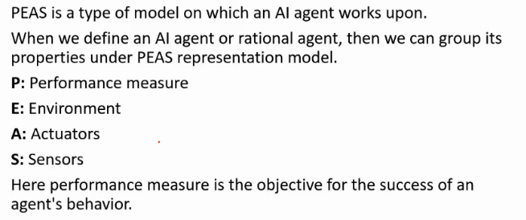

### Self Driving Car

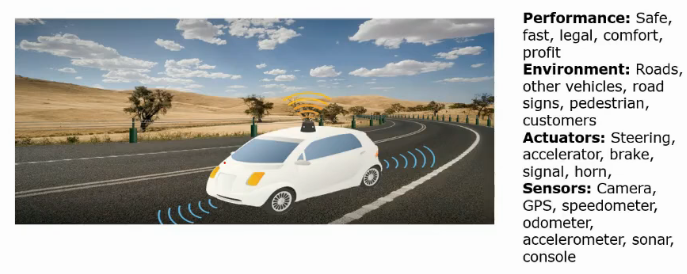
