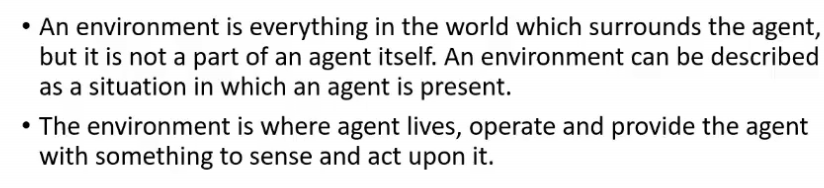
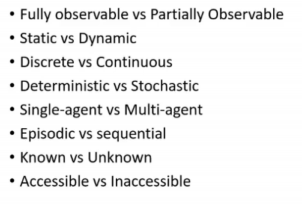
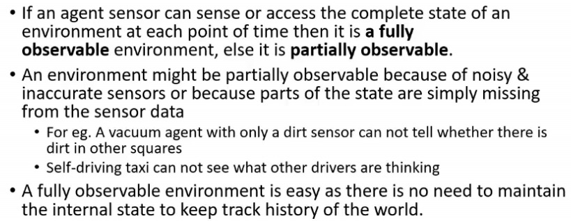
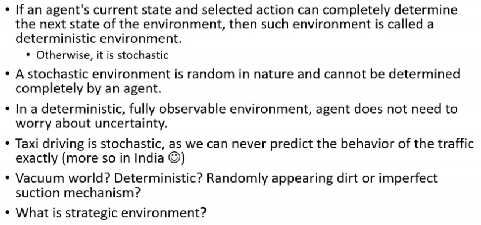
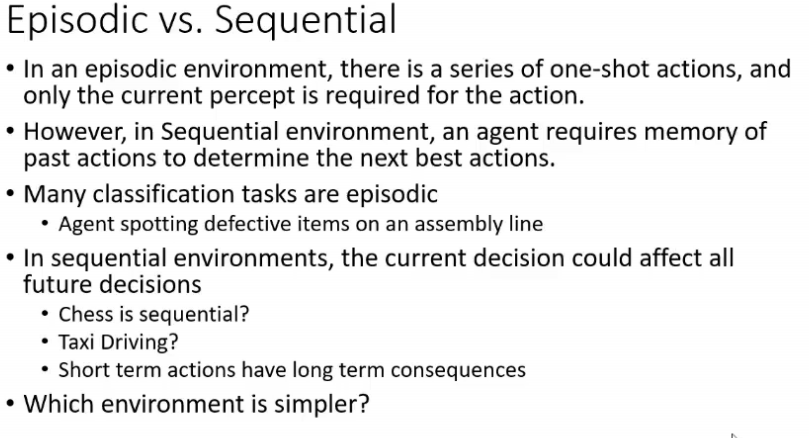
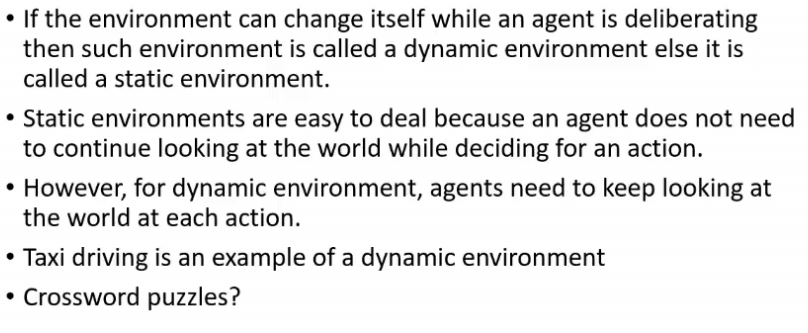
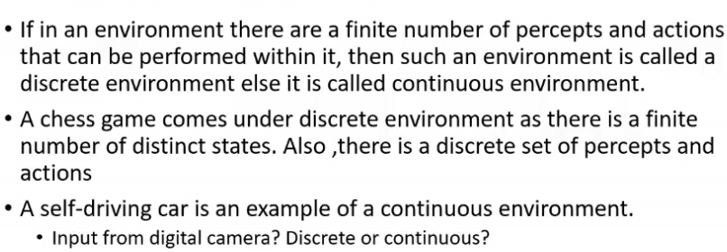
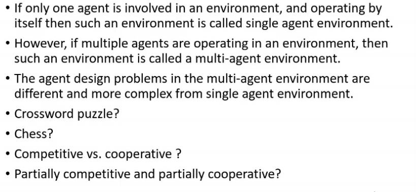

# Lecture 7

- [Lecture 7](#lecture-7)
  - [Video](#video)
  - [Summary](#summary)
  - [Environment](#environment)
    - [Types](#types)
      - [Fully Observable vs Partially](#fully-observable-vs-partially)
      - [Deterministic vs Stochastic](#deterministic-vs-stochastic)
      - [Episodic vs Sequential](#episodic-vs-sequential)
      - [Static vs Dynamic](#static-vs-dynamic)
      - [Discrete vs Continuous](#discrete-vs-continuous)
      - [Single vs Multi Agent](#single-vs-multi-agent)

## Video

[link](https://drive.google.com/file/d/16lb7OrGblMvohf3O2C-HEVwV-TGHVVD8/view?usp=sharing)

## Summary

- PEAS model
  - Performance
  - Environment
  - Actuators
  - Sensors

- define a performance measure

## Environment

- a workplace where agent works

### Types

#### Fully Observable vs Partially

- which tiles are dirty vaccum cleaner knows say, then it is fully
- single storey parking lot me ek agent hai
- 2 ppl playing chess can see complete state of the game at anytime
- self driving taxi cannot see what others are thinking
- poker is partially observable
  - idk what cards opponent holds

#### Deterministic vs Stochastic

- deterministic mtlb current state + action can determine next state
- agar deterministic hai and fully observable toh mast, no worry abt uncertainity
- vaccum world is vaise toh deterministic. but it might become stochastic agar dirt randomly appear ho
- strategic environment
  - completely deterministic except actions of other agents
  - agent ne clean kia maanle and other agent(adversary) ne aake dirt patak di

#### Episodic vs Sequential

- assembly line moving, I see every part and say defective or not, is episodic
  - if I detected one defective, it does not affect decision on further parts
  - Tic tac toe, chess all are sequential
  - taxi driving?
    - dekh episodic me ek action does not affect other actions
    - taxi me whatever actions I take, consequences could be there.. it might not be also (I might get ticket)
      - so sequential
- Which Env is simpler?
  - episodic
    - it does not require memory
    - I do not need ot think abt what will happen after 5-10 minutes and so on

#### Static vs Dynamic

- taxi driving is dynamic env
  - dekh while turning, I mi8 have checked ki peeche car nahi but does not mean ki turant turn le lo w/o seeing anyth else, I will still have to look ki koi car toh nahi
- crossword puzzle
  - static
    - the words I fill will not change later
    - while I am filling a word, others are not changing
- **READ ABOUT SEMIDYNAMIC ENVIRONMENTS**

#### Discrete vs Continuous

- chess game is discrete
  - finite number of states hi hai na bhai
- self driving car is continuous env
  - dekh continuously videos sense kar rahe honge cameras
  - videos are discrete na = camera speed is defined by frames per second, so fixed #frames hai na bhai
  - but can be treated as continuous since regular hai type ka

#### Single vs Multi Agent

- chess multi agent
- crossword - single agent
- competitive vs cooperative environments
  - dots and boxes me good move mtlb meri perf improved but agle ki ghati
  - chess is competitive
  - many self driving cars competing to get parking slot
  - cooperative
    - self driving cars avoiding collision
