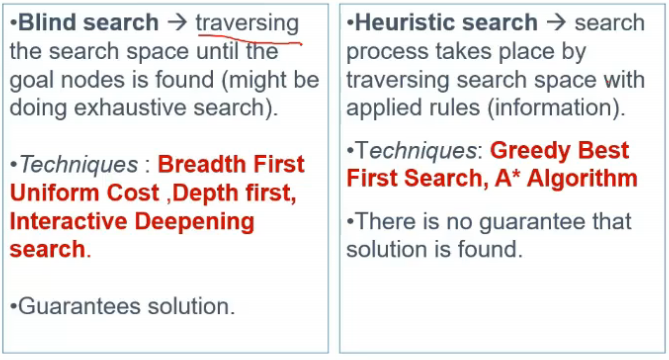

# Lecture 8

- [Lecture 8](#lecture-8)
  - [Video](#video)
  - [Problem Solving through searching](#problem-solving-through-searching)
  - [Searching](#searching)
  - [Canonical Problem Formulation](#canonical-problem-formulation)
    - [Route Finding](#route-finding)
  - [Search Space](#search-space)
  - [Basic Search Algorighm](#basic-search-algorighm)
  - [General Search Algo](#general-search-algo)
  - [Expanding nodes](#expanding-nodes)
  - [Adding to Fringe](#adding-to-fringe)
  - [Managing the Fringe](#managing-the-fringe)
  - [Modeling of Problems](#modeling-of-problems)
  - [Tree Search eg - Romania](#tree-search-eg---romania)
  - [Example - the 8-puzzle](#example---the-8-puzzle)
  - [Searching Strategies](#searching-strategies)
    - [Uninformed search strategies](#uninformed-search-strategies)
      - [BFS](#bfs)
        - [Properties](#properties)

## Video

[link](https://drive.google.com/file/d/1IglL3gSMJ9K1s9B3-wGvIAY7Md-Hk7oq/view?usp=sharing)

## Problem Solving through searching

- The bridges of konigsberg problem

- 4 parts of city
- red part = bridge
- walk around city going each bridge exactly once
- can u do it?

- A,B,C,D are parts of city
- edge represent bridge
- modelled problem as graph

- Travelling salesman problem

- edge represent node n/w
- weight is distance

- Romania
  - I am at Arad
  - network is road network
  - I have to reach Bucharest to take flight
  - so arad se bucharest kaise pahunchu time pe

## Searching

## Canonical Problem Formulation

### Route Finding

## Search Space

## Basic Search Algorighm

## General Search Algo

## Expanding nodes

## Adding to Fringe

## Managing the Fringe

## Modeling of Problems

## Tree Search eg - Romania

- fringe me kya hoga
- only arad ke neighbors abhi
- I go at sibiu

## Example - the 8-puzzle

## Searching Strategies

### Uninformed search strategies

- blind search

#### BFS

- for 8 puzzle

- we are enumerating all paths, not in random manner but in BFS manner

##### Properties

