# Lecture 9

- [Lecture 9](#lecture-9)
  - [Video](#video)
  - [Terminology - Search trees](#terminology---search-trees)
  - [Measuring Performance](#measuring-performance)
  - [BFS - Contd](#bfs---contd)
  - [DFS](#dfs)
  - [Informed Search for Romania problem](#informed-search-for-romania-problem)
    - [Greedy best first search](#greedy-best-first-search)

## Video

[link](https://drive.google.com/file/d/1Nu5VjOGotiGh-92Wjj0R10tREb01uTir/view?usp=sharing)

## Terminology - Search trees

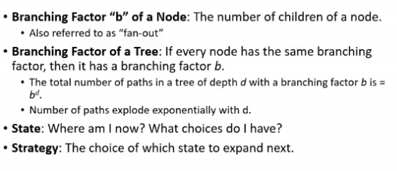

## Measuring Performance

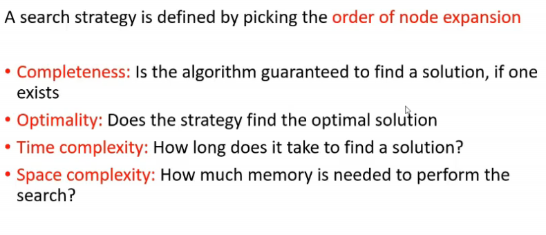

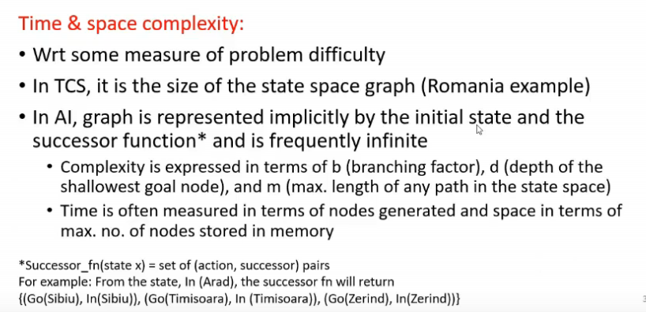

## BFS - Contd

- it is complete
- complexity?
- say b is brnaching factor and depth is d
  - I will travers number of nodes
    - 1 + b + b^2 + b^3 + .. + b^(d)

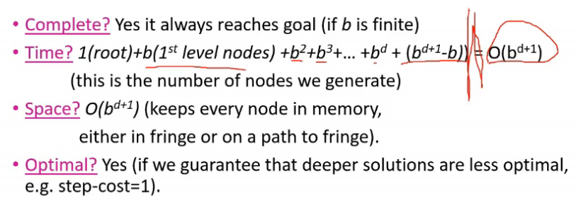

## DFS

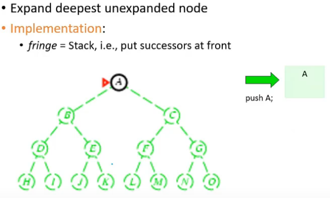

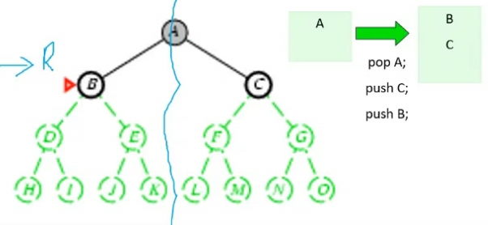

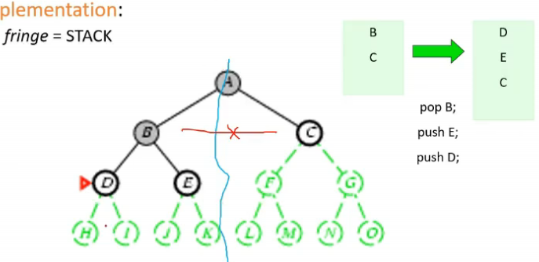

## Informed Search for Romania problem

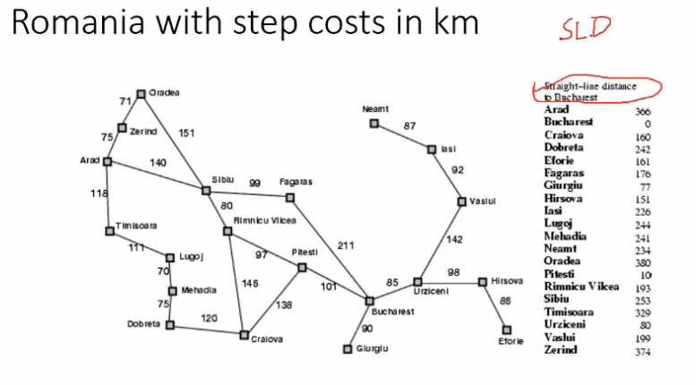

- straight line distance di hai meko

### Greedy best first search

- check neighbors, unme se pick greedily, the one with lease sld

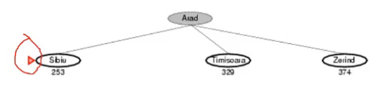

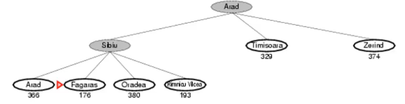

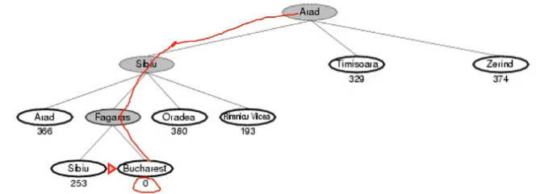
