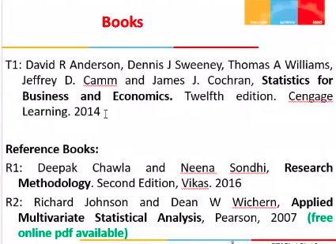
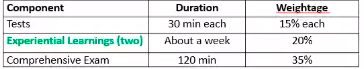
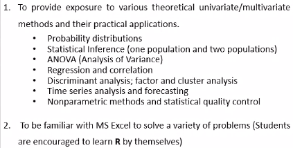
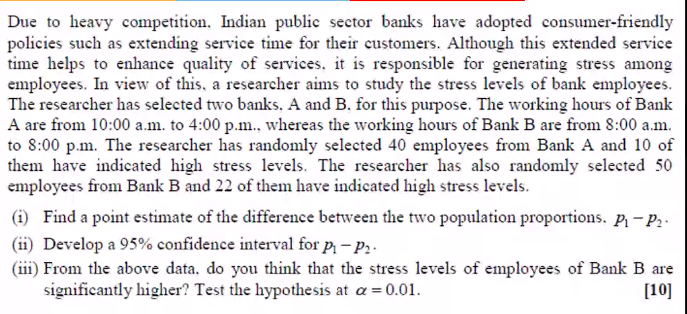
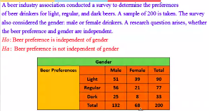
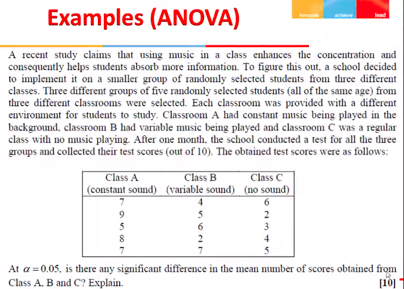

# Lecture 1

## Tectbooks

## Evaluation

## Course Objectives

## Pillars of the course

- 6 pillars
  - Recall from ***MATH F113***
    - statistical inference for 2 or more populations
  - ANOVA (Analysis of Variance)
  - Regression Analysis - (***MATH F113 - SLRMs - Simple Linear Regression Models***)
  - Factor analysis and Cluster analysis
  - Time Series Analysis and Forecasting
  - SQC (Statistical Quality Control)

## What to revisit

- MATH F113
- Parameter Estimation
- Max Likelihood Estimation
- MOM
- Hypothesis testing
  - for one population
  - whether null hypothesis can be rejected or accepted

## Examples

- observed population proportion
  - from bank 1 p1_ 10/40
  - from bank 2 p2_ 22/50
- Hypothesis, are these proportions same

H0: p1 = p2
H1: p1 != p2

or

H0: p1 >= p2
H1: p1 < p2

- in both cases, it is for 2 sample proportion

- While collecting data make sure sample data are ***IID = Independent, Identically Distributed***
- In gem, I feel female community prefers light drink and male gen prefer regular or dark, but not light
- As a manager of beer industry, I would like to know if preferences are dependent on Gender of person
- for such analysis, we will use this course

- ANOVA = A collection/set of statistical test to analyze whether there is a difference between population means of three or more groups