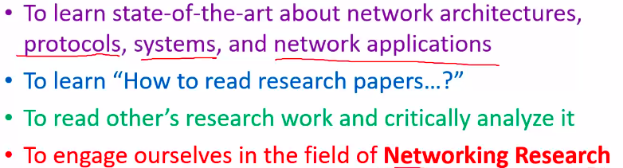
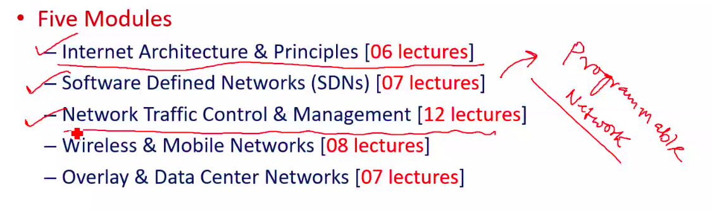
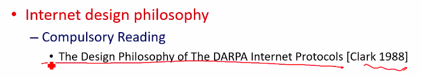

# Lecture 1

- [Lecture 1](#lecture-1)
  - [Video](#video)
  - [Course Objective](#course-objective)
  - [Research papers](#research-papers)
  - [Course Strcture](#course-strcture)
  - [For Next Class](#for-next-class)
  - [SLides and Paper link](#slides-and-paper-link)

## Video

[link](https://web.microsoftstream.com/video/71e5972b-e028-45ea-b9bb-97177f35d70b)

## Course Objective

## Research papers

- read paper ***How to read a research paper*** by *S Keshav*

## Course Strcture

## For Next Class

## SLides and Paper link

- [slides](slides.pdf)
- [paper](paper1.pdf)