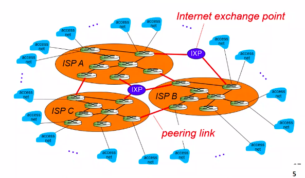
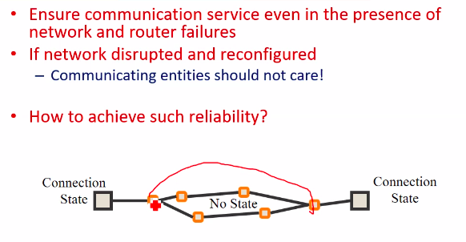
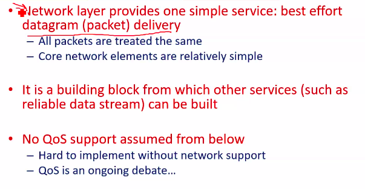
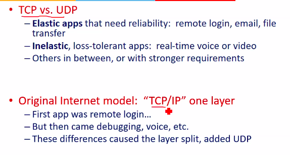
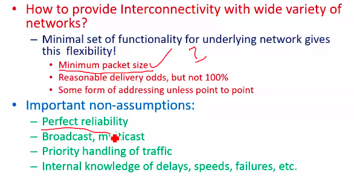
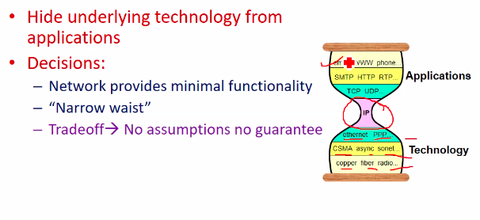
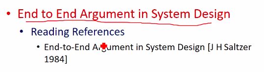

# Lecture 2

- [Lecture 2](#lecture-2)
  - [Video](#video)
  - [Agenda](#agenda)
  - [Background](#background)
  - [Today's Internet](#todays-internet)
  - [Goals for Internet Architecture when it was designed](#goals-for-internet-architecture-when-it-was-designed)
    - [Connecting Networks](#connecting-networks)
    - [Survivability](#survivability)
      - [Fate Sharing](#fate-sharing)
    - [Types of service : speed, latency, reliablity](#types-of-service--speed-latency-reliablity)
      - [Two types of service](#two-types-of-service)
    - [Standardization: Support Multiple types of networks](#standardization-support-multiple-types-of-networks)
      - [IP Hourglass](#ip-hourglass)
  - [Next Class](#next-class)
  - [Paper and Slides](#paper-and-slides)

## Video

[link](https://web.microsoftstream.com/video/b36adbdd-c451-4557-a514-a4e216453900)

## Agenda

- Internet Design Philosophy

## Background

- Why do we need networking
  - we want to communicate
- Telephone network vs Internet
  - difference is usage
  - telephone is for audio communication
  - internet has many purposes, text, audio/video commu.
- Why packet switching was considered for the Internet Architecture

## Today's Internet

- There are diff ISPs
- Some are globally available ISPs
- how these connect?
  - *Internet Exchange Point*
- All ISPs need not connect to each other
- Whether one will connect to another or not depends on mutual agreement between them
- Large ISPs - Tier 1 ISPs
- then there are Tier2, Tier3
- this tier classification is according to the area they cover
- End user approaches to a distributor of an ISP for connection
- He provides me IP address and I connect
- The picture was not like this from beginning

## Goals for Internet Architecture when it was designed

- Connect Existing networks
  - Initially **ARPANET** and **ARPA** packet radio network
- Survivability
  - if an intermediate node fails, connectivity must not be lost
- Support for multiple types of services
  - differ in speed, latency, and reliability
  - Ethernet is one tech, then satellite networks, then wireless, etc
- Must accodomate a variety of networks
- Allow distributed management
- Allow host attachment with a low level of effort
- Be cost affective
- Allow resource accountability
  - who used how much
- Priority decreases as we go down

### Connecting Networks

- **ARPANET, x.25 networks, LANs, satelliute networks, packet networks, serial links..**
- Many differences between networks
  - Address formats, performance - bandwidth/latency , packet size, loss rate/pattern/ handling and routing
- Challenge
  - how to connect these

### Survivability

- Ensure communication service even in the presence of network and router failures
- If both entities are ok and want to communicate, they should be able to, no other thing should be able to stop them
- If communication fails, I should store the state of communication to be able to restart
- Where to store?
  - within network?
    - in intermediate devices
    - nah, what if they lose it
  - at end points only
    - until end points are up, I will be able to communicate
      - ***FATE SHARING PRINCIPLE***
        - A failure where the nodes which want to communicate get divided into 2 halves, one with first node, and other with second node, if does not happen
    - if they fail, I will anyway be not able to communicate

#### Fate Sharing

- Lose state info for an entity iff the entity itself is lost
  - Why this?
  - easy to debug problems
  - appln developer will know ki prob client ya server side pe hai, not in intermediary devices
- Examples
  - OK to lose TCP state if one endpoint crashes
- Putting firewalls and proxies is against internet design
  - if both parties are up, still they might not be able to communicate if such devices are there
- Survivability compromise
  - weak provisions for getting n/w failure information

### Types of service : speed, latency, reliablity

#### Two types of service

### Standardization: Support Multiple types of networks

#### IP Hourglass

## Next Class

## Paper and Slides

- [paper - END-TO-END ARGUMENTS IN SYSTEM DESIGN](https://drive.google.com/file/d/1-kKDjBp_LJCr8EGgrdSt4XOX3-pIjo9m/view?usp=sharing)
- [slides](https://drive.google.com/file/d/1gFMNTjK_NjxZLTYBAVbXAbbNl73Bjtcv/view?usp=sharing)
