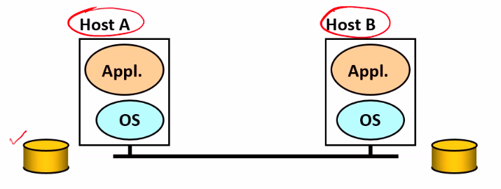

# Lecture 3

- [Lecture 3](#lecture-3)
  - [Video](#video)
  - [Slides](#slides)
  - [Agenda](#agenda)
  - [Background](#background)
  - [Network Functionalities : Implementation](#network-functionalities--implementation)
  - [Secure Transmission of Data](#secure-transmission-of-data)
  - [NExt Lecture](#next-lecture)

## Video

[link](https://web.microsoftstream.com/video/e9d34d4f-66ba-48c0-aee0-4a6e5d09d90a)

## Slides

[link](https://drive.google.com/file/d/1cwhxhEwI8oh7Ed4P6Xm34VPJ5TG44pPk/view?usp=sharing)

## Agenda

- End to End Arguement in System Design [paper](https://drive.google.com/file/d/1-kKDjBp_LJCr8EGgrdSt4XOX3-pIjo9m/view?usp=sharing)

## Background

- Network functions
  - Reliable and sequenced delivery
  - addressing and routing
  - security
  - ethernet collision detection
  - multicast
  - real-time guarantees
  - error recovery
  - duplicate message supression
  - congestion and flow control
- How to decompose the functions?
  - Monolithic approach vs
    - implement as single module
    - maintenance and mgmt will be difficult
  - Modular approach
    - Internet me different layers hai na

## Network Functionalities : Implementation

- Key behind layered architecture
  - How this layered architecture works
  - 5 layers
    - Application
    - Transport
    - Network
    - Data Link
    - Physical
  - Communication happens between adjacent layers only
  - Communication happens with well defined interfaces
    - changing implementation of some functionality ( changing internals of some layer) should not result to change in interface change
    - eg: Routing algorithm might be changed but it should not affect interface of any layer

- Where to place a functionality?
  - Inside the network (in switching elements)
    - Routers
  - At the edges(i.e. hosts)
    - Hosts (higher layers of system - app and transport)
  - As a joint venture
    - some part of functionality at edges
    - some inside network
  - Redundantly at both places

- What is the right approach?
  - take the example of reliable file transfer
  - 
  - What are the requirements?
    - initially file is at A, at the end it is at B  also
    - reliable => file at B is same as file at A
  - What are basic components
    - Os se system call karke file read kari = FILE System program in OS
    - then appln me File Transfer program
    - appln will ask os to transfer that contents
    - host b = client reveives it
    - os transfers to appln
    - appln stores in disk with help of os
  - Threats involved in File Transfer
    - File read may contain incorrect data due to h/w faults in the disk storage system
    - the file system, file transfer program, data communiation system might make mistake in buffering and copying the data of the file, either at A or B (writing correct program can avoid this!!)
    - Processor or its memory might have transient erorr while doing buffering and copying
    - communication system might drop/flip some bits in a packet or drop a packet
    - Either of the host may ceash at any point of time
    - *When I want to make my program reliable, I need to consider all these threats*
  - How to cope up with the threats
    - Solution1
      - make each step reliable, and then concatenate them
        - by duplicate copies, timeout entry, redundancy
        - when u read data from disk, check checksum's validity
    - Solution2
      - do not verify each individual step
  - E2E : File transfer
    - Even if network guaranteed reliable delivery
      - need to provide end-to-end checks
        - buffering errors, h/w fault in disk storage system, network card may malfunction
      - Ther eceiver has to do the check anyway!
    - ***Reliability can only be implemented at application layer; no need for reliability from lower layers***
    - Arguement
      - There are functions that can only be correctly implementerd at end hosts, and should not be completely implemented somewhere else
- Questions
  - Does FTP look like E2E file transfer
    - no
    - even though it uses TCP
    - but TCP is OS to Os communication
    - but transfer from disk to os at source, and from os to disk in destination can cause buffering errors and all
    - so, here we need to make sure ki jo A me tha and jo B me tha should be same
    - so destn me likhne ke bad it should read data again and calculate checksum, and send to A, and A checks if that checksum matches with the checksum which was already written to it, then send yes, *DONE*

## Secure Transmission of Data

- If **data transmission system** performs encryption and decryption
- Responsibilities of the system
  - key management
- My data transmission happens between data communication systems
- data is in decrypted format when in appln of destn, and disk of source
- but other applications can steal the data
- if the process is happening between application to application, then it is fine
- So,
  - **the lower level implementation of functionality does not give completeness, I will need to implement it end-to-end**
- How to decide the end points?
  - vary from app to app
    - eg real time voice transmission vs non-real time voice transmission
      - real time me I don't need too much reliability, person will say ki repeat if he does not understands it but non-real time me I require it ( and end point is disk )
    - RISC chips vs CISC chips
    - feature implementation at OS level vs application level

## NExt Lecture

- Tussle in Cyber space : Defining tomorrow's internet
  - [paper link](https://drive.google.com/file/d/1Ji5W7hJ3ZDygL4GEIgkofprPeOKwgrbT/view?usp=sharing)
