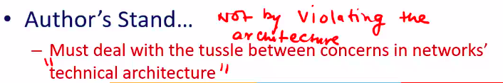
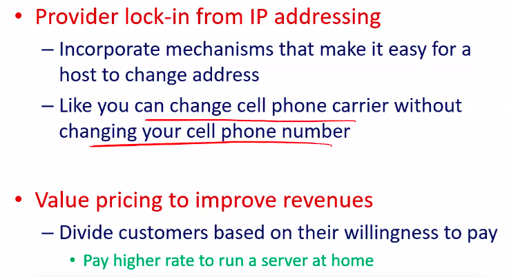
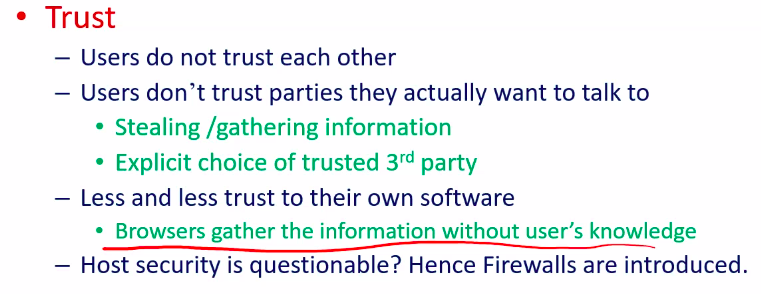
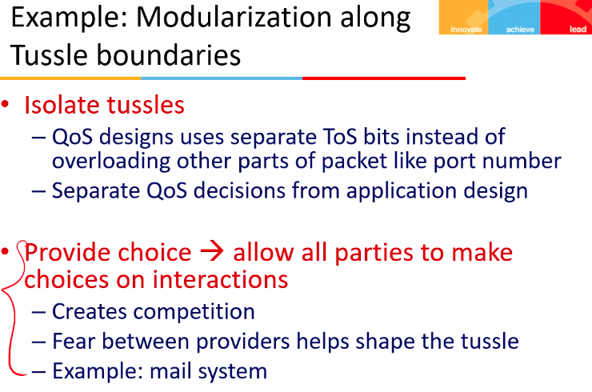
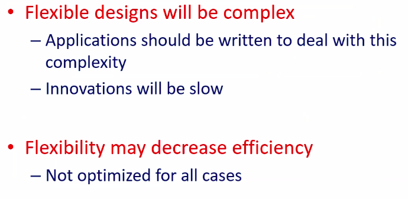
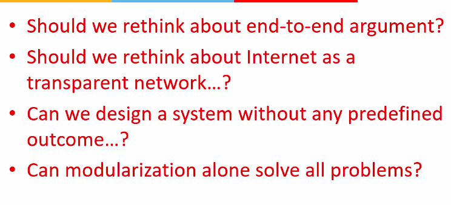

# Lecture 4

- [Lecture 4](#lecture-4)
  - [Video](#video)
  - [Slides](#slides)
  - [Topic](#topic)
  - [Tussle](#tussle)
  - [Requirement in today's communication](#requirement-in-todays-communication)
  - [Where are we moving](#where-are-we-moving)
  - [Changes over the time](#changes-over-the-time)
  - [Tussle spaces](#tussle-spaces)
    - [economics](#economics)
    - [Trust](#trust)
    - [Openness](#openness)
  - [New Design Principles](#new-design-principles)
  - [Challenges](#challenges)
  - [Summary](#summary)
  - [Next class](#next-class)

## Video

[link](https://web.microsoftstream.com/video/91498769-cb87-4302-8b54-052cd052a480)

## Slides

[link](https://drive.google.com/file/d/1nJHI7xPKWyKauq54T-CT71foKzhx88vs/view?usp=sharing)

## Topic

- Tussle in Cyber space, [paper link](https://drive.google.com/file/d/1Ji5W7hJ3ZDygL4GEIgkofprPeOKwgrbT/view?usp=sharing)

## Tussle

- among different stakeholders
- tussle is in form of conflict of interests
- one type of stakeholders want some things in one way, others in a different way
- paper also talks about what is solution to avoid this tussle

## Requirement in today's communication

- how people want to communicate now
- users communicate but do not trust
  - trust is not on softwares
  - users desire anonymity
- end-parties distrust software and hardware
  - eg. cookies, collect consumer details for marketing goals
- Third party asserts its right to interpose communication
  - private ISPs and govt agencies want to monitor traffic
  - put some devices in-between end parties
- one party forces interaction on another
  - eg: email spam
- multi-way communication
  - internet has been designed for one to one communication only.. **end to end arguement**
  - eg teleconfrencing, broadcasting

## Where are we moving

- operation in untrustworthy world
- demanding applications
  - audio/video streaming
    - require large bandwidth
    - uses intermediate nodes: violates end to end arguement
      - 2 parties should communicate directly
      - CDN (content distribution networks) hote hai na
      - **ques:** *why this design was considered? end-to-end one*
- ISP service differentiation
  - application specific services are offered by some ISPs
- Third party incolvement
  - eg govt agencies want to monitor traffic

## Changes over the time

- internet developed in simpler times
  - common goals, consistent vision
  - research curiosity -> component of mainstream society
    - now not only researchers are using this, but others as well - buisnesses, common ppl, etc
- With success came multiple goals
  - ISPs must talk to provide connectivity but are fierce competitors
  - privacy of users vs govt's need to monitor
  - music/movie lovers want to exchange recordings with each other but the rights holder wants to stop them
- Author's stand
  - these tussels must be dealt not by violating the architecture 
  - adding firewall in network violates design, for eg

## Tussle spaces

### economics
  
- providers tussles as they compete to get more customers
- customers tussle with providers to get the service at a low price

- Solution
  - **principle of design for choice** into mechanism is the building block to deal with the competition
    - customers myst have the ability to choose ( switch ) providers freely

- examples - 

### Trust

- design for choice
  - privacy vs security
  - users should be able to choose
    - with whom they interact (identify...?)
    - what level of transparency they offer to other users

- examples
  - how to prevent DoS attacks
  - How to deal with the tussle about **Firewalls**

### Openness

- the openness to innovation that permits a new application to be deployed
- but economical motivations are against openness
  - proprietary interfaces give market power
- unix OS me more innovation than Windows
- Solution
  - separate the tussle of vertical integration and sustaining innovation

## New Design Principles

- design for variation in outcome
  - allow design to be flexible to different uses/results
  - tussle in design, not by violating the design

- modularize along conflict boundary
  - wherever there is conflict, give choices and modularize

- ToS = type of service

## Challenges

## Summary

## Next class

- future internet architecture design projects, [paper](https://drive.google.com/file/d/1SY5de80LUxTK2sAs72RZCzB89LFYnOr5/view?usp=sharing)
