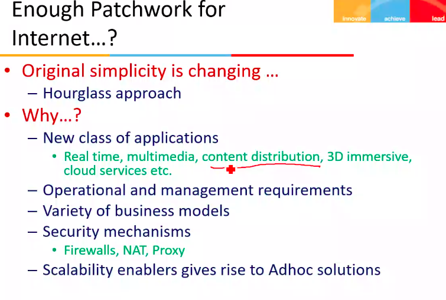
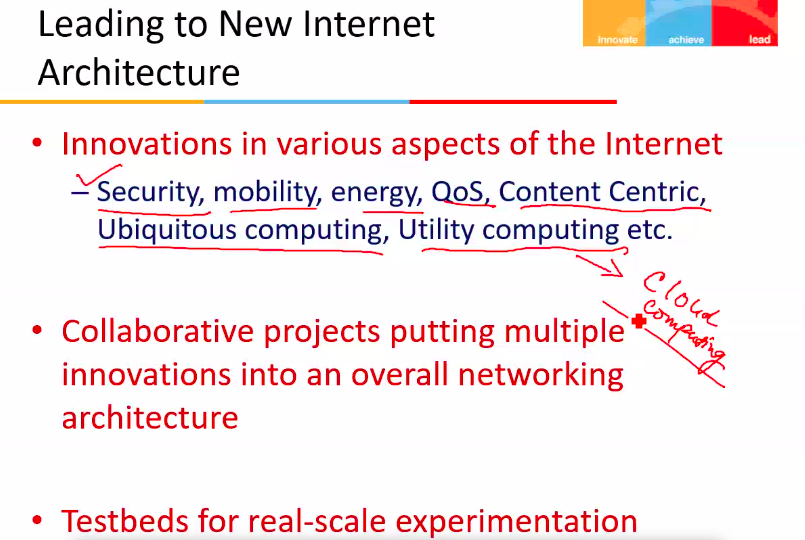
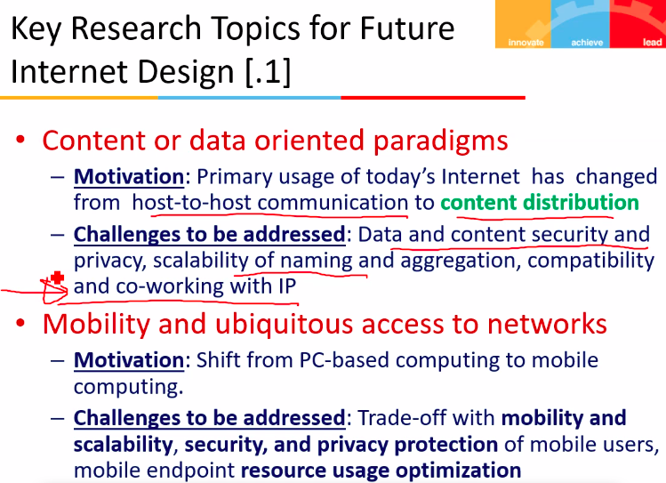
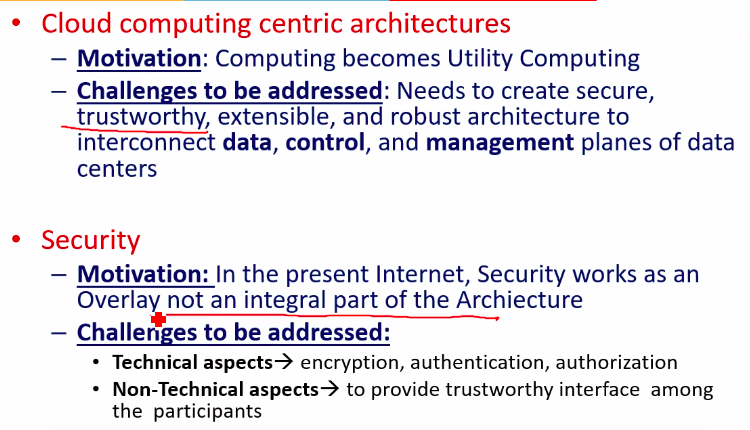
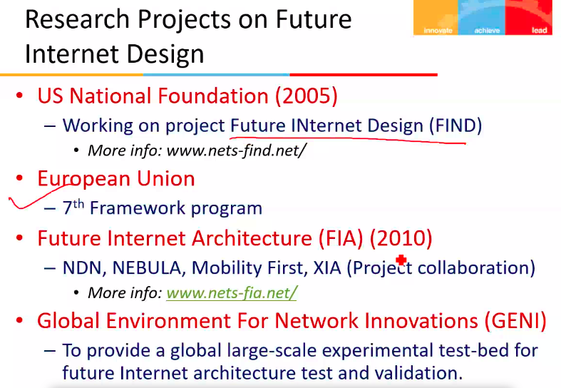
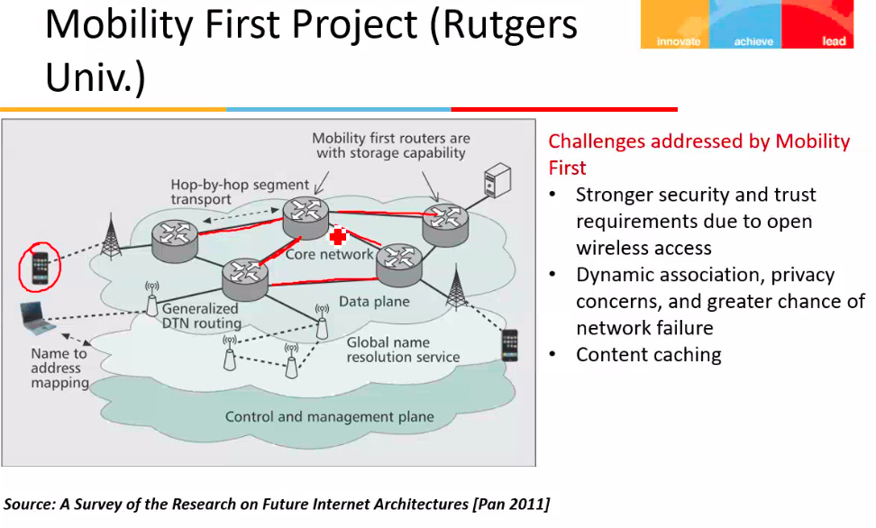
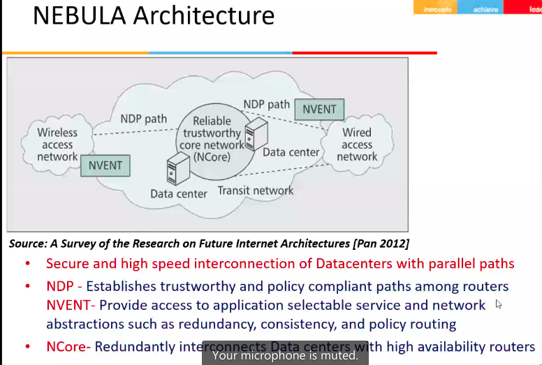

# Lecture 5

- [Lecture 5](#lecture-5)
  - [Video](#video)
  - [Agenda](#agenda)
  - [What is done so far](#what-is-done-so-far)
  - [Problems with current internet](#problems-with-current-internet)
  - [NEw Internet arch](#new-internet-arch)
  - [Key Research Topics for Future Internet Design](#key-research-topics-for-future-internet-design)
  - [Research projects on this](#research-projects-on-this)
  - [Mobility First Architecture](#mobility-first-architecture)
  - [Nebula](#nebula)

## Video

[link](https://web.microsoftstream.com/video/f49a0426-b383-40b5-ba76-f07ab1c8d0fb)

## Agenda

- Future Internet Architecture Design Projects, [Paper link](https://drive.google.com/file/d/1SY5de80LUxTK2sAs72RZCzB89LFYnOr5/view?usp=sharing)

## What is done so far

## Problems with current internet

- security
  - control, mgmt and data planes are intermixed
  - control msgs are piggybacked with data packets
- mobility
  - identity and location in one (IP address) makes mobility complex
- energy
  - assumes live and awake end systems
  - communication can happen only when both ends are awake
- no explicit support for client-server traffic and distributed services
  - eg connecting to google

## NEw Internet arch

## Key Research Topics for Future Internet Design

## Research projects on this

## Mobility First Architecture

## Nebula

