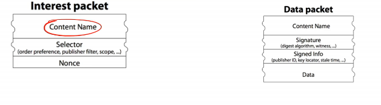
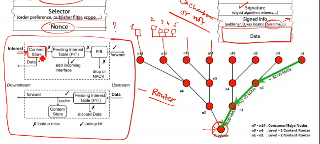
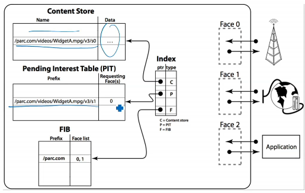
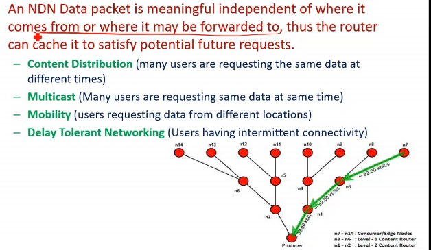
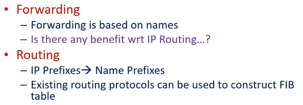
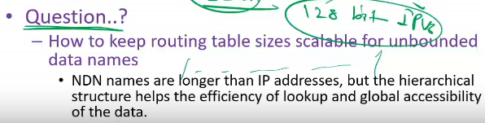
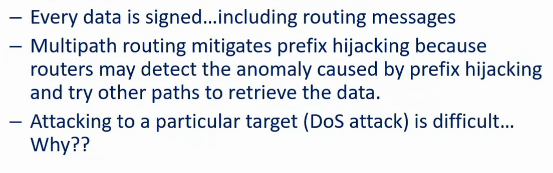
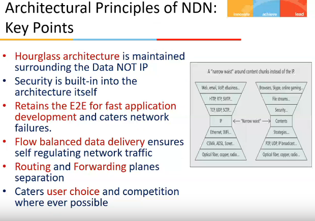
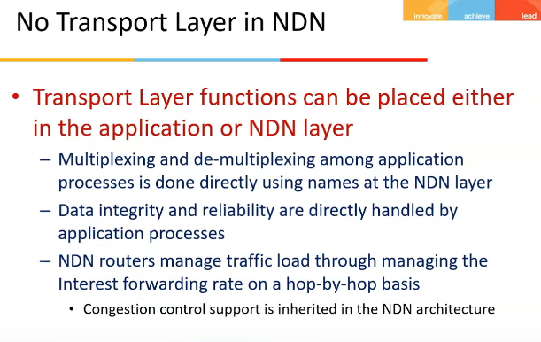

# Lecture 6

## Video

[link](https://web.microsoftstream.com/video/e137f318-1c58-4785-a2dd-a1d92d60a9b4)

## Slides

[link](https://drive.google.com/file/d/12T1gMfKgssgaRPnyYJZTrU8ZC-ibLXUI/view?usp=sharing)

## Paper

- [Named Data Networking (NDN) Project](https://drive.google.com/file/d/1HZeaXdReOL0t3EvRBm57iVUg_hegco65/view?usp=sharing)

## Agenda

- NDN Architecture

## NDN Architecture

- communication is driven by the receiver(consumer)
  - sends interest packet
  - eg `/pilani/computerscience/courses/acn/lectures/lec1.pdf`
- focus is on **what** instead of **where**
- Router forwards **Interest packet** by looking up the name in its **FIB(Forwarding Informaiton Base)** (name based routing protocol)
  - FIB is similar to routing table
- **Data packet** travels on the same path followed by **Interest packet** in reverse direction
  - it carries both the name and the content of the data, together with a signature by the producer's key

- Packets formats 
  - nonce = randomly generated fields
  - signature = data is authorized by producer
  - in signed info, I can also specify if data is cacheable or not, or give some TTL value for caching
- Request and response
  - 
  - on left is a complete router u can say
  - PIT table = store interest references
    - interest = query, what user wants to access
  - when a req comes, if the request is already in the PIT table, I just add into PT table a new interface (incoming interface), bcz request already ja chuki hai
  - else, if not present, I add a new entry and interface and send request to FIB
  - FIB checks ki next interface kya hai jaha it should send request, and accordingly it forwards to an interface
  - similar actions happen at other routers
  - now req reaches producer, it sends response
  - router ne kaha resp aya mtlb pit e entry toh hogi hi, so Pit me dekha and interface nikala and removed entry from its table and us interface(s) pe bhej di file
  - so same path is being followed in reverse direction
  - if pit me entry nahi hai, then it will discard the data
    - when it is possible?
      - maybe malfunctioning ho gayi ho kuch
  - all nodes(routers) in path act as content store, and hence store the file
  - if a new request comes to one of the store, It sees ki bhai data already available hai iske pas, so yehi return kardega, producer ke pas nahi jayegi request
  - so if smth is more popular and being used, it will be replicated in the n/w automatically, CDN nahi use karna pad raha jo internet me karta
  - baki kab delete karunga is evicting policies, TTL and all

## Data Names

- how to find the data, or how the data are named and organized to ensure fast lookup and delivery
  - hierarchally structured names
    - `/pilani/computerscience/courses/acn/lectures/lec1.mp4/1/2`
    - names are appln specific and opaque to the n/w
    - dynamic data can be retieved by common agreement b/w consumer nd producer
    - not all the names need to be **globally unique**
    - name space mgmt is not part of the NDN arch, just as IP address mgmt in IP n/w

## Data Centric Security

- secures data dirctly instead of securing the data containers such as files, hosts and nw connections
- each pice of data is signed (mandatory) together with its name, securely binding them
- NDN's data-centric security can be extended to content access control and infra security

## Routing and Forwarding

- in IP arch, routing and f/wing planes are coupled
- they say, routing can independently work
- routing provides multiple paths, and f/wing decides what to pick
- but IP me, routing plane provides single shortest path, (shortest depends upon how u define cost, min hops, min b/w etc)
- main same idea use kar sakta, prefix vs interface mapping, bas prefix will be acc to name
- but yaha pe name length pe toh koi limit nahi, IP me toh thi
- so how to scale? how to store and search efficiently

- ndn supports multipath routing
  - no chance of looping like IP routing
- it improves routing security as well 
  - particular machine cannot be targeted bcz there is no concept of address
  - so this type of DOS attack is not possible
  - but we can do content based attack, target some content, but bahut content-distributor ban chuke hongey, so severe nahi yeh

- Privacy protection
  - no info about who requested what data

1[resareas](resareas.png)

## Resources

- [ndn project url](https://named-data.net/)
- simulatioon tool used for NDN related dev and research work, [link](https://named-data.net/techreport/TR005-ndnsim.pdf)
