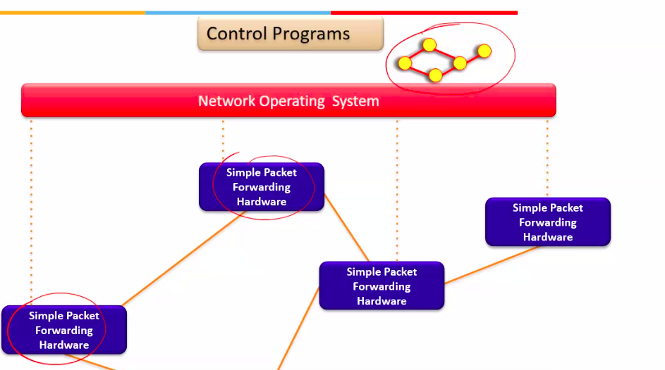

# Lecture 7

- [Lecture 7](#lecture-7)
  - [Agenda](#agenda)
  - [Slides](#slides)
  - [Video](#video)
  - [How does a network function](#how-does-a-network-function)
  - [Networking planes](#networking-planes)
  - [Switch Hardware](#switch-hardware)
  - [Network Switch Complexity](#network-switch-complexity)
  - [Limitations of Legacy Networks](#limitations-of-legacy-networks)
  - [Idea: an OS for Networks](#idea-an-os-for-networks)
  - [Network OS](#network-os)
  - [What is SDN](#what-is-sdn)
  - [Three layered SDN Architecture](#three-layered-sdn-architecture)
  - [OpenFlow](#openflow)
    - [Switching](#switching)
    - [Flow Rules](#flow-rules)
  - [Next Class](#next-class)

## Agenda

## Slides

## Video

[link](https://web.microsoftstream.com/video/efb8eb5f-ff0f-4208-8892-3726408ce192)

## How does a network function

- 2 parts to n/w
  - core
    - switching devices
    - layer 2/3 switches
    - gateways
    - facilitates communication b/w end hosts
  - edges
  - 

- each switch has some s/w and h/w part
- forwarding happens hop by hop

- Routing 
- 
- calculated thing is now stored in h/w 
- same thing is done by other switches 
- A creates a packet for B
- switch match packet's Ip in routing table and forwards 

- Software part is **control plane**
- Hardware part is **Data plane / Forwarding plane**
- software part is basically divided into 2 parts
  - one for functionalities =  routin, pkt filtering etc = **control plane**
  - second for = link wts dekhna and all **management plane**

- this is for **legacy n/w**
  - each switch has its own control, data and mgmt plane

## Networking planes

- 
  - f/wing state = routing entry, etc

- 

- 
  - ACL = Acces Control List

## Switch Hardware

- ingress
  - checks if the pkt  should be discarded and all
- translation
  - attach some tags or priority
  - used to internally process, within that n/w
  - once the pkt goes out of the n/w, the tags and all r removed

## Network Switch Complexity

## Limitations of Legacy Networks

- Research stagnation due to close interfaces for n/wing devices
  - only n/wing vendors themselves can write the s/w for their own n/wing devices
  - data plane is remaining same, for changing functionalities, vendors released new switches
- Control plane abstraction for the whole n/w is missing
  - each n/w has its own control and data plane
  - centralized view helps in btr resource mgmt
- uncoordinated control
  - cannot control which router updates first
- interacting protocols and mechanisms
  - routing, addressing, access control, QoS

## Idea: an OS for Networks

- so we removed both, OS, and apps from the routers, routers just do forwarding

- now control program has a global view of the n/w
- so it can give btr decisions
- program passes to os, and os enters rules in switches
- initially switches talked to each other and did a horizontal communication

## Network OS

## What is SDN

## Three layered SDN Architecture

## OpenFlow

### Switching

### Flow Rules

## Next Class