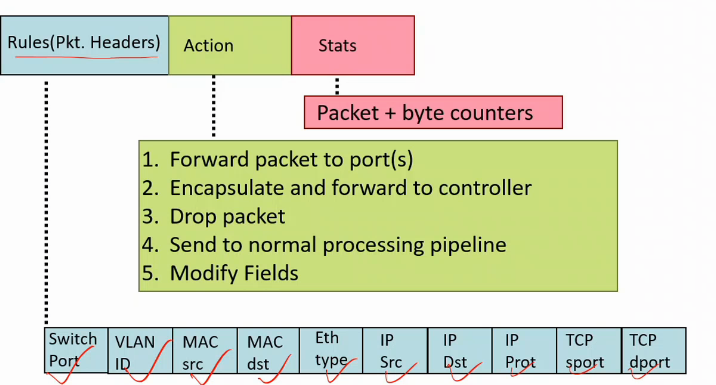

# Lecture 8

- [Lecture 8](#lecture-8)
  - [Video](#video)
  - [Slides](#slides)
  - [Reference](#reference)
  - [Agenda](#agenda)
  - [SDN: Network Virtualization](#sdn-network-virtualization)
  - [Abstractions in Computer Systems](#abstractions-in-computer-systems)
  - [Does SDN Simplify the network](#does-sdn-simplify-the-network)
  - [Centralized vs Distributed Control](#centralized-vs-distributed-control)
  - [OpenFlow v.1.0 switch](#openflow-v10-switch)
  - [Openflow Controller](#openflow-controller)
  - [Openflow specs](#openflow-specs)
  - [Openflow ports](#openflow-ports)
    - [Rserved ports](#rserved-ports)
  - [Flow Table](#flow-table)

## Video

[link](https://web.microsoftstream.com/video/b377bb53-0b34-4383-b53a-5cdf6922a4da)

## Slides

[link](https://drive.google.com/file/d/1ZwwJajcJItOo6f8xHyYiuDqTVd9nqv7r/view?usp=sharing)

## Reference

[link](https://www.opennetworking.org/software-defined-standards/specifications/)

## Agenda

## SDN: Network Virtualization

- decouples control and data plane

- control removed from each individual switch
- What does network admin gets
  - an abstract view in form of virtualized n/w
  - virtualization achieved by abstraction
  - can control and manage the n/w
  - can specify behavior in term of control program
    - routing kaise hoga bata sakta
    - access control list
      - who can control to whom
      - maybe ek server kuch hi end points se access karwana
    - traffic engineering rules
      - specify a QoS requirement by applications
        - some apps require more b/w
        - some require least latency path
        - path provisions to the apps is done here
        - for diff flow of packets diff provisions
  - all these are specified using a progrmming interface
  - then pass it to virtualized view of n/w
  - which then compiles topology on these rules
    - validates ki everyth is fine or not
    - all req are done or not
  - then push through n/w os into each switch

- We can achieve all these things in legacy n/w also but it is a tedious task
- centralized view of n/w construct karna padega khud se
- and validation part nahi hai, so directly install kardo and bug ho toh resolve karo

- eg
  - data center can move any machine w/o changing addressing space
  - in VLAN, switch ports can be virtually grouped irrespective of the physical location
    - machine in FD1 can be put in VLAN with machines in FD2

## Abstractions in Computer Systems

- apps do not worry about managing physical locations and caches, through virtu it gets infi phys memory
- file system = os provides it
  - h/w me kaise data store ho ra, sector, tracks and all Idc
- VM = os abstraction
  - app do not have to worryr abt new process scheduling and all

## Does SDN Simplify the network

- abstraction does not eliminate the complexity
- everything is still happening
- but OS karra woh jaise file system me
- Network Operating System karra yaha
- so programmer ko nahi dekhna kya hora
- SDN main achievements
  - simplifies interface for control program(usere-specific)
  - pushed complexity into reusable code(SDN platform)
- it works just like compilers
  - compiler abstracts the details

## Centralized vs Distributed Control

- Single Point of Failure nahi ab
- to get consistent view(if reqd), they will communicate
- this is East-West bound interface
  - communication b/w controllers
- OpenFlow

## OpenFlow v.1.0 switch

- a new pkt arrives at a port
- flow table is maintained
  - rules hai isme
  - controller se aaye rules
  - controller ko n/w programmer ne die
- if no rule is matching, pkt sent to controller through a secure channel
- controller pushes a rule based on criteria set by n/w admin
- either controller can find out action for that
  - action = what is to be done with the pkt
    - drop it, or send to diff port
  - either he sends directly to that
- a pkt which came first time will be sent to controller

- Switches are of 2 types
  - openflow-only
    - all switches are o/f only
  - openflow-hybrid
    - kuch traditional switches and kuch o/f
    - halke halke I will change

- there could me multiple flow tables
- chained together, they act like filters
- say 1st table does firewall operations, then 2nd does layer3 operns, then 3rd table layer 2 operns
- table size will be less
- a special table = group table
  - used to group the flows
  - say some common action on some flows
  - like sab kuch ISP ko bhejna
  - multicast/broadcast karna

## Openflow Controller

- traditional switch bahut kuch kam karre so complicated
- they also have data and ctrl planes
- so how SDN wala is different
  - are decoupled hai na bhai
  - SDN control plane is centralized view but usme distributed

## Openflow specs

## Openflow ports

- physical
  - one-to-one mapping
- logical
- reserved
  - spl meaning

### Rserved ports

## Flow Table

