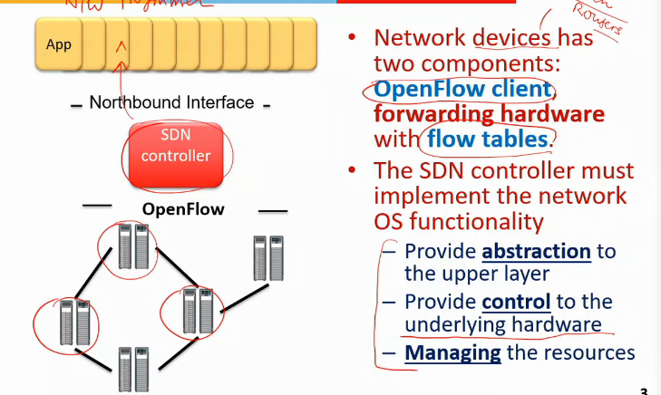

# Lecture 9

- [Lecture 9](#lecture-9)
  - [Video](#video)
  - [Slides](#slides)
  - [Agenda](#agenda)
  - [SDN Controller](#sdn-controller)
  - [Key characteristics of SDN controller](#key-characteristics-of-sdn-controller)
  - [SDN Controller: NOX/POX](#sdn-controller-noxpox)
  - [NOX](#nox)
  - [OpenDayLight](#opendaylight)
  - [Programming SDn with NOX](#programming-sdn-with-nox)
    - [Example: Repeater Application](#example-repeater-application)
  - [Programming SDN](#programming-sdn)
  - [Next Class](#next-class)

## Video

[link](https://web.microsoftstream.com/video/47482f22-d23f-475a-9388-545fc5af6042)

## Slides

[link](https://drive.google.com/file/d/1TVHh4QHAlYanoOHWcUc2A2zio5ZB7QgP/view?usp=sharing)

## Agenda

## SDN Controller

- all devices(switch/router) must have a openflow client, and a f/w h/w(flow table)
- sdn controller must implement n/w os fnality

- all devices must be controllable through os
- resource mgmt as well

- interface b/w controller and appln = northbound
- b/w controller and switch = southbound
- b/w controllers = east and west bound

## Key characteristics of SDN controller

- openflow support must be there
- n/w virtualization
  - internet arch is layered arch
  - we have a layer 2 view(LAN)
    - 2 layer 2 n/w ko kaise connect kia?
      - using router = layer 3 device
      - now I get layer 3 view
    - layer-3 virtualization
      - provides global view
  - VLAN hai = layer 2 virtualization
  - I need layer 3 virtu from sdn

- abhi I have routing decision only on basis of ip
  - sdn should support for multiple fields
- multi tenancy
  - multiple tenant accessing same n/w
  - all want diff QoS
  - support should be there
- new protocols addition should be possible

- Scalability
  - single n/w view provide karna chahiye
  - new functionality should be addable

- performance
  - flows are coming at a fast rate
  - and for every new flow, ctrlr will have to find rule and setup in all switches
  - 2 ways to do so
    - proactively
      - ik that these flows will come, so pehle hi kuch dal diye(kuch traditional flows me)
      - setup time kam
    - reactively
      - as and when needed

- programmability
  - most imp feature
  - Ir provides me programmable interface
  - traditional me I can just configure some parameters

- reliability
  - in traditional n/w, if some link or node fails, protocols are there to find a new way

- single point of attack in traditional is not possible, sdn me hai
- traffic isolation nahi kia agar, other tenants can be affected
- How a DOS attack can be made on the SDN controller?
  - create pkts in such a way ki har baar naya flow banaye yeh
  - so har req controller ke pas jayegi

## SDN Controller: NOX/POX

- event based model
- appln registers for events
- if some event occurs, controller sends a notificn to applns
- say I want ki 1000 se jyada flow na jaye
- I will keep counting and jab bt hui, I will tell controller, and it will change rules in switches

## NOX

- last layer interfaces with h/w of controller
- and top layer with applns

## OpenDayLight

## Programming SDn with NOX

### Example: Repeater Application

- any pkt coming to i/f 1 is f/wed to i/f 2 and so on
- I need to insert flow rule in switch but not manually but through controller

- p1 = pattern1
  - pkt coming through inport 1
- p2 = pattern2
  - pkt coming through inport 2
- install = installing flow rule
  - default = priority
  - none = counter
    - I am not doing any statistics counting
  - then action I am taking
    - output(2) = f/w to 2
- second rule for reverse flow
- output of this program will be that controller will write these 2 rules in the switch
- flow table
  - priority - pattern - action - count
  - default - in_port:1 - output:2 - 0

## Programming SDN

- POX/NOX are like assembly lang
  - not much higher abstraction

## Next Class

- traffic flow monitoring in SDN
  - Flowsense application
