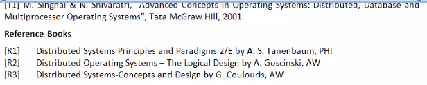

# Lecture 1

## Topics in course

- Distributed computing and os

## Books

## Distributed system

must follow foll props

- there should be more than 1 process, and each must have an independent thread of control
- there is some IPC between them
- disjoint address space
- interaction must be with a common goal in mind