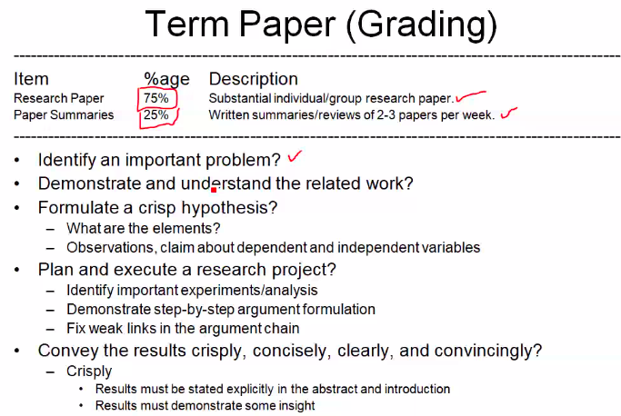

# Lecture 3

- [Lecture 3](#lecture-3)
  - [Video](#video)
  - [Slides](#slides)
  - [OS Design](#os-design)
  - [UNIX Architecture](#unix-architecture)
  - [VM Approach](#vm-approach)
  - [Why Advanced OS](#why-advanced-os)
  - [Distributed OS](#distributed-os)
  - [Multi-processor OS](#multi-processor-os)
  - [Database and Real-time os](#database-and-real-time-os)
  - [Term Paper Topics](#term-paper-topics)
  - [Reading Research Paper](#reading-research-paper)

## Video

[link](https://web.microsoftstream.com/video/6182edbd-6ab8-4c37-a23c-86170b001aa5)

## Slides

[link](https://drive.google.com/file/d/1Kr2H670PCwGQB1NxWEHHzrpcATWjaVAH/view?usp=sharing)

## OS Design

## UNIX Architecture

- kernel talks to h/w
- exposes set of APIs using which, HLL prog lang can write applns to talk to h/w == System call Interface

## VM Approach

## Why Advanced OS

## Distributed OS

- every proc has its own physical clock
- no shared memory

## Multi-processor OS

## Database and Real-time os

## Term Paper Topics

## Reading Research Paper

