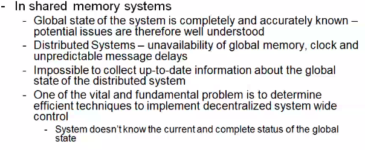
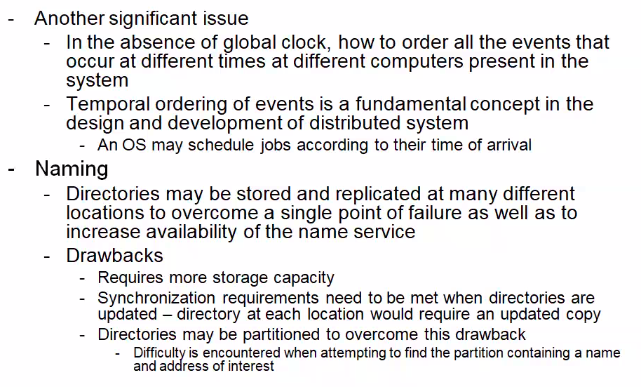
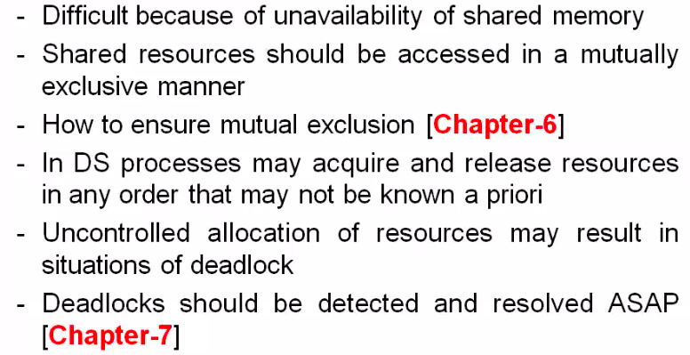
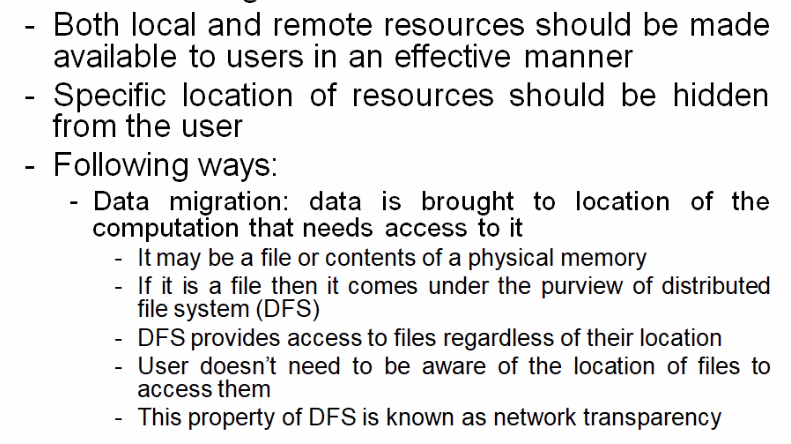
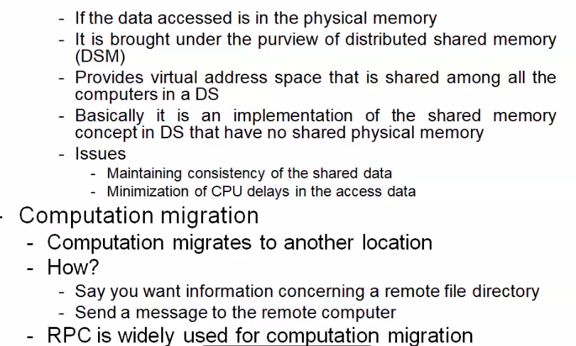
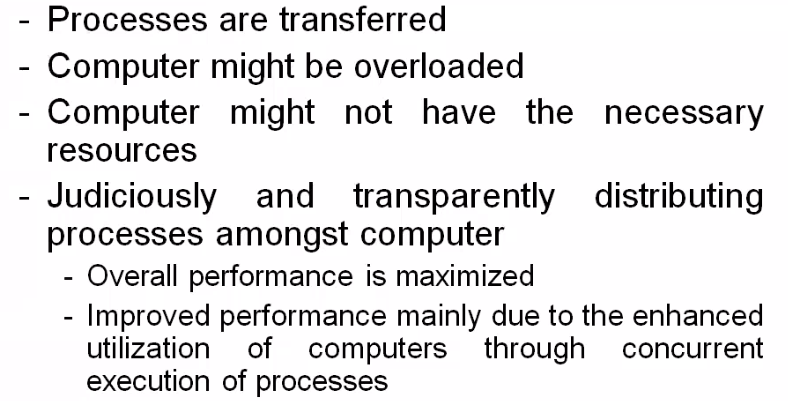
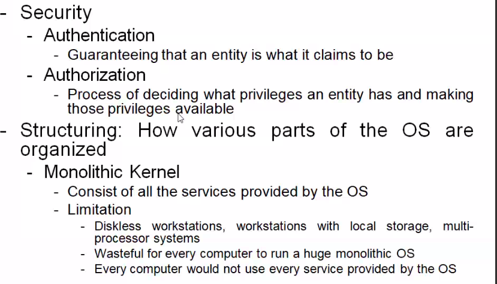
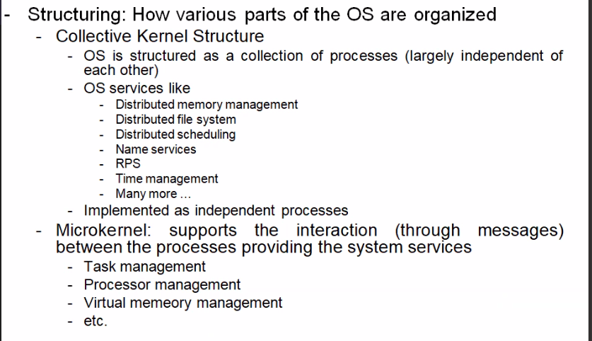

# Lecture 4

- [Lecture 4](#lecture-4)
  - [Video](#video)
  - [Slides](#slides)
  - [Topic](#topic)
  - [Reference](#reference)
  - [What is a distributed system](#what-is-a-distributed-system)
  - [Issues in designing distributed systems](#issues-in-designing-distributed-systems)
    - [global knowledge](#global-knowledge)
    - [Scalability issue](#scalability-issue)
    - [Compatibility](#compatibility)
    - [Process synchronization](#process-synchronization)
    - [Resource management](#resource-management)
    - [Issues contd](#issues-contd)
    - [Distributed Scheduling](#distributed-scheduling)
    - [Security](#security)
    - [Structuring](#structuring)

## Video

[link](https://web.microsoftstream.com/video/905bfa6d-b5ef-4de4-9df1-6e749a734f8f)

## Slides

[link](https://drive.google.com/file/d/1MXN5y1WxUhBUeiiYLfB5NI1RS8Pq0A9k/view?usp=sharing)

## Topic

- introduction to distrubuted systems and design issues

## Reference

- ch5 of singhal and shivratri book
  - clock synchronization

## What is a distributed system

- several computers are there
- do not share memory or clock
- communicate with each other by way of msg passing
  - shared memory system are not distributed systems
- each system has own memory and os
- are autonomous
  - are able to act independently
    - decision they take are based on knowledge they have and they acquire by message passing
  - resources they own and control are local
    - do not own any resource physically unavailable to them
  - resources owned and controlled by other computers are remote
    - to access them, u have to request
  - accessing remote resources is expensive
    - due to communication delays, cpu overhead in processing communicaton protocols

## Issues in designing distributed systems

- how communication is handled b/w computers
- how programs communicate to perform distributed computations

### global knowledge

- global entire state of system is not accurately/completely known at all points of time
- but in order to make any efficient decision, I might need knowledge of whole system (to a good degree of accuracy)

- how to do temporal ordering of events if global clock nahi hai

### Scalability issue

- system availability
- performance
- protocols
  - broadcast based works for small systems
  - gossip protocol
    - works on concepts of epidemic
    - how an epidemic spreads
- If the requirement of scarce resource increase linearly with the number of computers in the system, it is likely to be too costly to implement
  - A design requiring that info regarding system's configuration or directories be stored at every computer

### Compatibility

- interoperability among the reosurces
- three levels
  - binary
    - says all processes execute same binary instructions even tho they may differ in i/o
    - easier system development : code for many functions directly depends on the underlying machine level instructions
    - distributed system cannot include systems with diff architectures from same or diff vendors
  - execution
    - same source code can be compiled and execured properly on any computer in the system
  - protocol level
    - least restrictive

### Process synchronization

### Resource management

### Issues contd

### Distributed Scheduling

### Security

### Structuring

