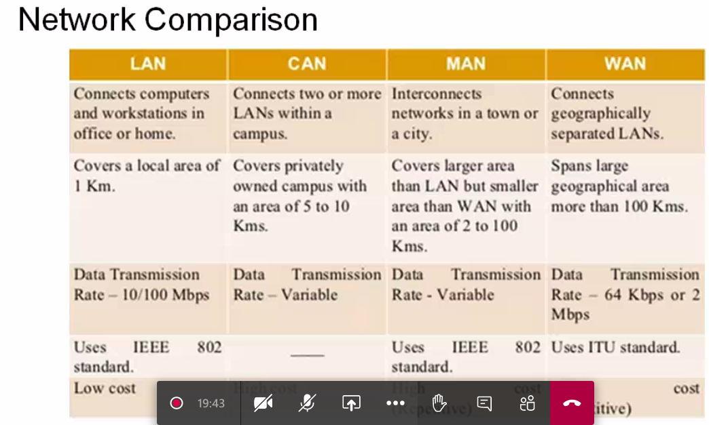

# Lecture 5

- [Lecture 5](#lecture-5)
  - [Video](#video)
  - [Slides](#slides)
  - [Networks for distributed systems](#networks-for-distributed-systems)
    - [Switching technologies](#switching-technologies)
    - [Network types](#network-types)
      - [WAN](#wan)
      - [LAN](#lan)
  - [Campus Network Design](#campus-network-design)
  - [Networks Comparison](#networks-comparison)

## Video

[link](https://web.microsoftstream.com/video/8a4d681e-8562-4255-885c-826fa9c8e38b)

## Slides

[link](https://drive.google.com/file/d/14Eu7epx_Gwv30U8vikVqDv-PWz3q6QL3/view?usp=sharing)

## Networks for distributed systems

- handshaking mechanism in connection-oriented

### Switching technologies

### Network types

#### WAN

#### LAN

## Campus Network Design

- number of router hops from edge to edge = diameter of network
- distribution layer routers are connected to each other throigh FDDI Dual Ring

## Networks Comparison

