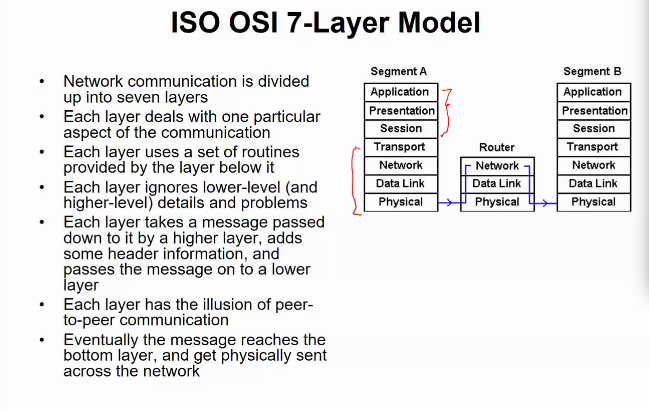
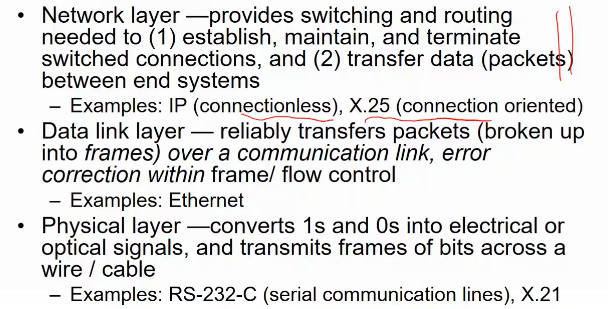
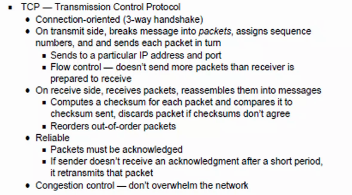
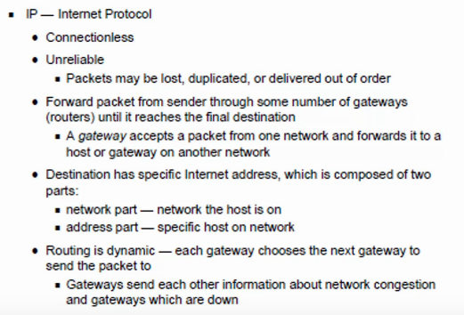
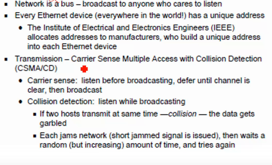
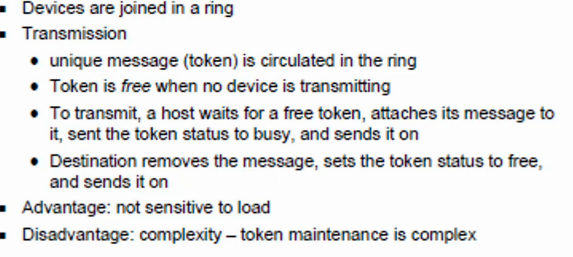
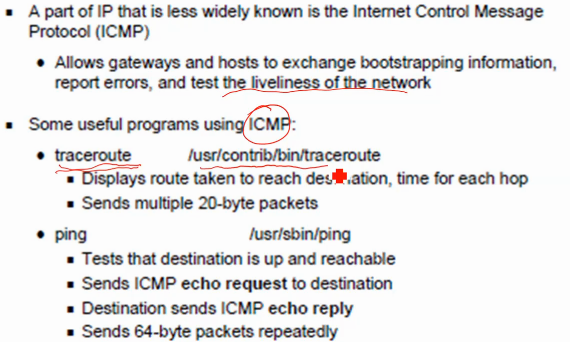
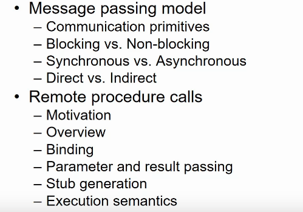
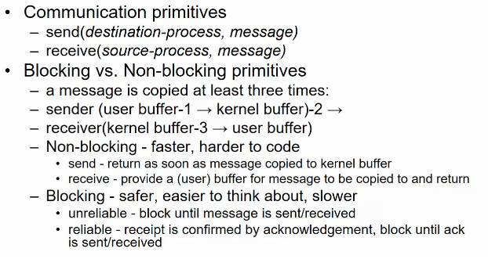
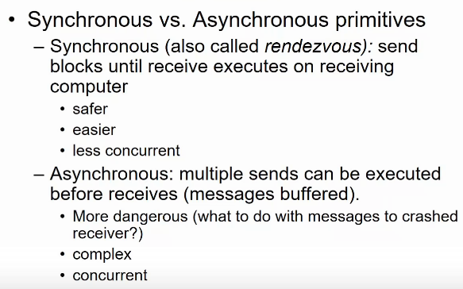

# Lecture 6

- [Lecture 6](#lecture-6)
  - [Video](#video)
  - [Slides](#slides)
  - [OSI Model](#osi-model)
  - [TCP/IP Protocol Suite](#tcpip-protocol-suite)
  - [TCP](#tcp)
  - [IP](#ip)
  - [Ethernet](#ethernet)
  - [Token Ring](#token-ring)
  - [ICMP](#icmp)
  - [Communication primitives](#communication-primitives)
  - [Message Passing](#message-passing)

## Video

[link](https://web.microsoftstream.com/video/b36eda62-1d4a-40ae-99a8-bbe08d98febe)

## Slides

[link](https://drive.google.com/file/d/1cEuKE-9HUQ-2iNvzGXRr6iJONyW10Hje/view?usp=sharing)

## OSI Model

## TCP/IP Protocol Suite

## TCP

## IP

## Ethernet

## Token Ring

## ICMP

## Communication primitives

## Message Passing

