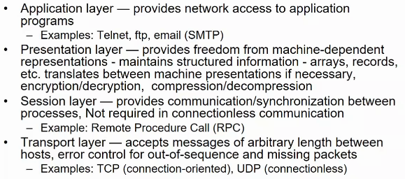
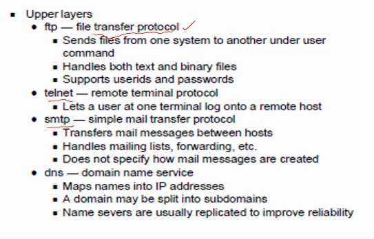

# Lecture 6

## Video

[link](https://web.microsoftstream.com/video/b36eda62-1d4a-40ae-99a8-bbe08d98febe)

## OSI Model

## TCP/IP Protocol Suite

## TCP

## IP

## Ethernet

## Token Ring

## ICMP

## Communication primitives

## Message Passing

