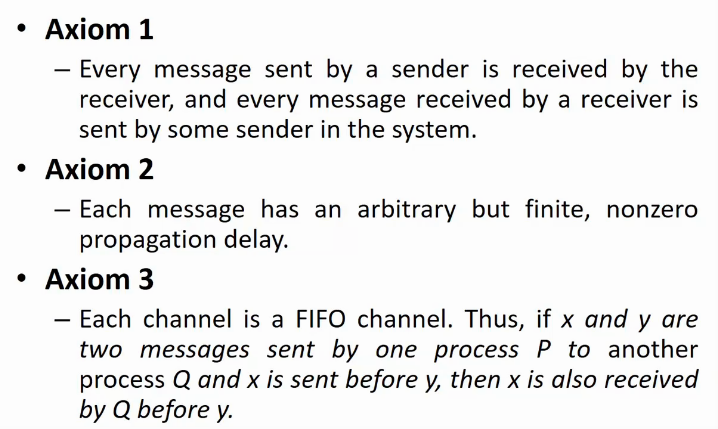

# Lecture 7

- [Lecture 7](#lecture-7)
  - [Video](#video)
  - [Slides](#slides)
  - [Need for a Model](#need-for-a-model)
  - [Message Passing model for IPC](#message-passing-model-for-ipc)
  - [Axioms for reliable channel](#axioms-for-reliable-channel)
  - [Channel](#channel)

## Video

[link](https://web.microsoftstream.com/video/d5ed6f48-3950-46f0-b153-b765024f6f74)

## Slides

[link](https://drive.google.com/file/d/1cEuKE-9HUQ-2iNvzGXRr6iJONyW10Hje/view?usp=sharing)

## Need for a Model

- models are abstractions

## Message Passing model for IPC

- Representation of Distributed System
  - represented as a graph
  - node is a sequential process
  - edge is communication channel
  - graph is directed

- internal
  - proces performs action in its own address space which results in modificn of local variables
  - so no affect on other processes
- communication action
  - when process sends msg to another process or rcv from someone else
- input
  - reads data from sources external to the system
  - eg: sensors hai, and processes are interacting with it
- output
  - again external to system
  - say process is monitoring boiler temperature and raises an alarm when needed
  - part of system which is external = universe

## Axioms for reliable channel

- axiom = a stmt of propisition which is self-evidently true

- why violation of axiom 1 at data link or transport layer
  - could be due to congestion in n/w
  - retransmission hai transport layer pe to correct it
- absence of predifened upper bound
  - it weakens computation model
  - sometimes we might be able to specify an upper bound
  - eg is slot time 
- why not satisfied by datagram service
  - bcz packets can be out of order

- 2 possible ways to abstract channel capacity
  - infinite capacity
    - sender sends as much as it wants
    - and channel won't ever block
    - it is irrespective of speed of processing of rcvr
  - finite
    - blocking is possible
    - so dropping could be there

## Channel

- is kind of sharing data object
- but not like memory
- u cannot write to a location, only append
- cannot un-send
- cannpot read any element, only headers
- no functionality to check if channel is empty or not
