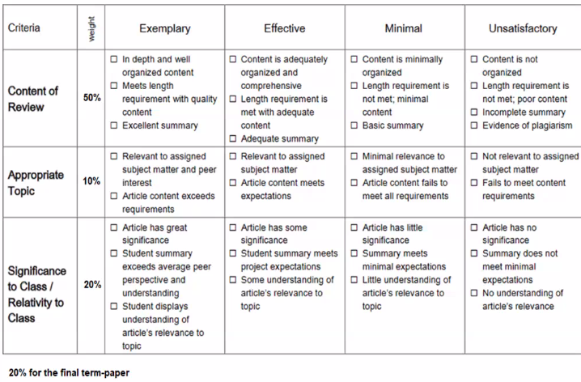

# Advanced OS

- [Meet Link](https://teams.microsoft.com/_#/pre-join-calling/19:6c75356cebbb429bb810c4587287ad0e@thread.tacv2)
- [Handout](https://drive.google.com/file/d/12x1gzINMiTLIx4ZEjrdD1g7tnd7PsuLZ/view?usp=sharing)

## Lecture Breakdown

| LecNo | Date       | Topic                                          | Notes                       |
| ----- | ---------- | ---------------------------------------------- | --------------------------- |
| 1     | 19-08-2020 | Introduction                                   | [link](Lec1Aug19/README.md) |
| 2     | 21-08-2020 | Introduction contd..                           | [link](Lec2Aug21/README.md) |
| 3     | 24-08-2020 | Course Introduction - Continued                | [link](Lec3Aug24/README.md) |
| 4     | 26-08-2020 | Issues in Distributed Systems                  | [link](Lec4Aug26/README.md) |
| 5     | 28-08-2020 | Networks for Distributed Systems               | [link](Lec5Aug28/README.md) |
| 6     | 31-08-2020 | Network Protocols and Communication Primitives | [link](Lec6Aug31/README.md) |

## Term Paper Topics

## Reference Materials

- [Ten Simple Rules for Writing a Literature Review](https://drive.google.com/file/d/1rjm6zl8_mrNVt9DfzNSQi3OUl7KrUNUn/view?usp=sharing)
- [How_to_Read_Engg_Research_Paper](https://drive.google.com/file/d/1GYskYQVajFqpbP8-yjBMj_8MtuAOjcKd/view?usp=sharing)

## Term Paper Evaluation

