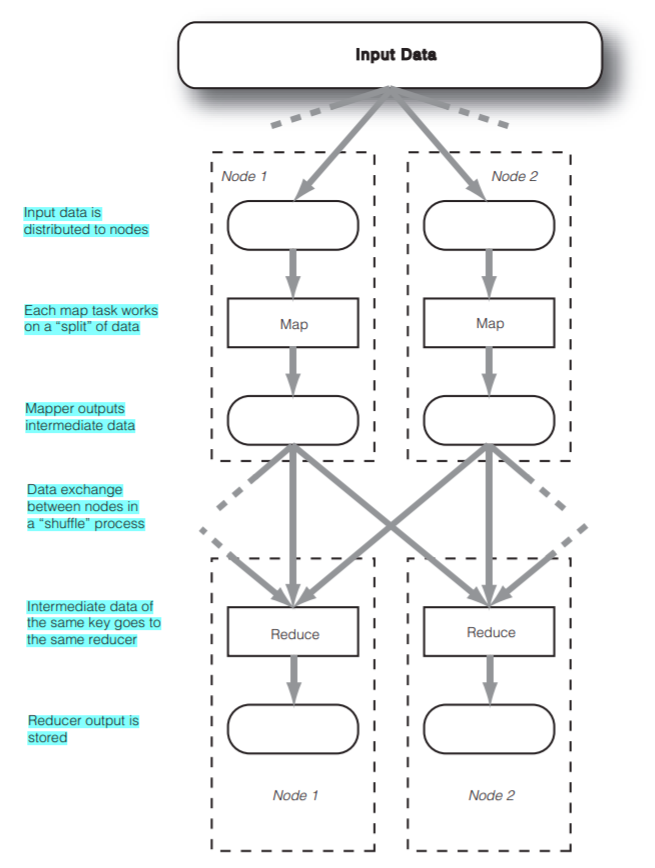
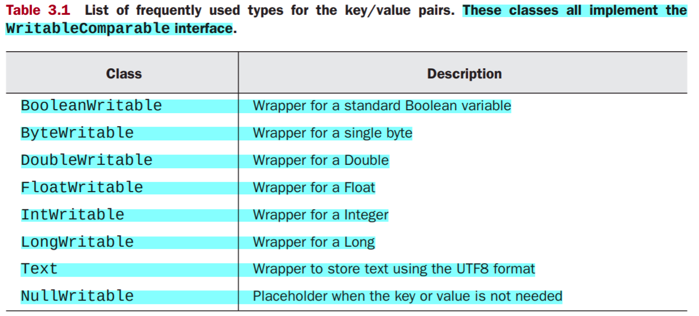
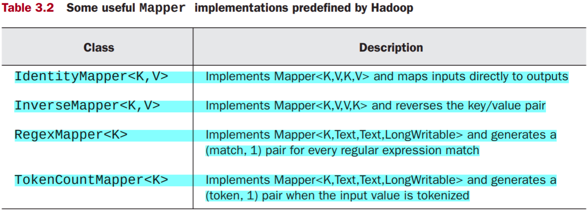
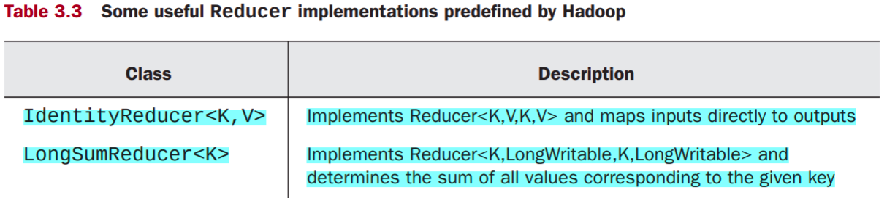
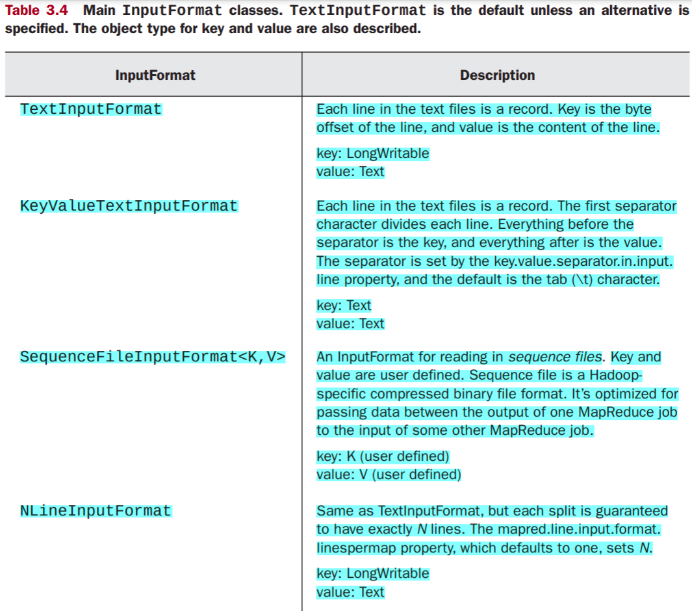
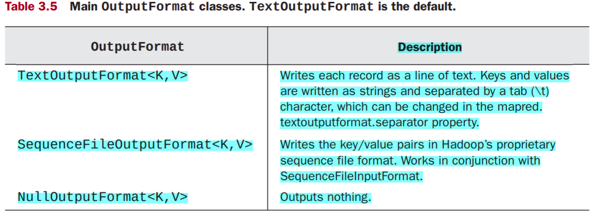
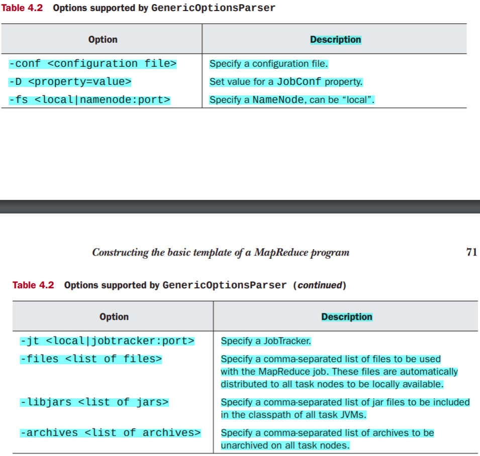

# Hadoop In Action

- To run a Hadoop java program `bin/hadoop jar <jar>`. i.e. Hadoop programs written in Java are packaged in jar files for execution.
- To run some sample programs provided by hadoop `bin/hadoop jar ./share/hadoop/mapreduce/hadoop-mapreduce-examples-3.1.4.jar` will display names of available programs. pass it as arguement name of the program and its i/p and o/p arguements.
- You need to define a master node in your cluster which will host namenode and jobtracker daemons. We need to define a means for the master node to remotely access every node in your cluster.Hadoop uses passphraseless SSH for this purpose.The public key is stored locally on every node in the cluster, and the master node sends the private key when attempting to access a remote machine.

## Running Hadoop

- specify location of java on all nodes. In hadoop-env.sh define the JAVA_HOME environment variable to point to the Java installation directory. `export JAVA_HOME=/usr/share/jdk`. (keep version of java to be <= 8)
- majority of hadoop settings are present in files `core-site.xml` , `mapred-site.xml`, `hdfs-site.xml`

### Different Operational modes

- Local(Standalone) mode
  - default mode
  - all config files r empty
  - hadoop runs completely on local machine
  - since no need to communicate with others, HDFS not used, daemons not launched
  - used for developing and debugging appln logic of mapreduce program

- Pseudo-distributed mode
  - runs hadoop in a "cluster-of-one" with all daemons on single machine
  - allows to examine memory usage, hdfs I/O issues, daemons interactions
  - add foll props inside configuration tag of
  - follow steps at this [link](https://phoenixnap.com/kb/install-hadoop-ubuntu) to get hadoop running.

- Fully Distributed mode
  - full cluster setup

## Web-Based cluster UI

- access Hadoop NameNode UI at `http://localhost:9870`  
  - provides a comprehensive overview of the entire cluster
- The default port 9864 is used to access individual DataNodes directly from your browser. `http://localhost:9864`
- The YARN Resource Manager is accessible on port 8088. `http://localhost:8088`
  - allows you to monitor all running processes in your Hadoop cluster.

## Working with Files in HDFS

- A typical Hadoop workflow creates data files (such as log files) elsewhere and copies them into HDFS using one of the command line utilities.
- MapReduce programs then process this data, but they usually don’t read any HDFS files directly.
- Instead they rely on the MapReduce framework to read and parse the HDFS files into individual records (key/ value pairs ), which are the unit of data MapReduce programs do work on.
- Hadoop file commands can interact with both the HDFS filesystem and the local filesystem.
  - It can also interact with Amazon S3 as a filesystem.
  - A URI pinpoints the location of a specific file or directory.
  - The full URI format is scheme://authority/path.
  - Scheme is similar to a protocol. It can be hdfs or file, to specify the HDFS filesystem or the local filesystem, respectively.
  - For HDFS, authority is the NameNode host and path is the path of the file or directory of interest.
  - For a standard pseudo-distributed configuration running HDFS on the local machine on port 9000, a URI to access the example.txt file under the directory user/chuck will look like hdfs://localhost:9000/user/chuck/example.txt.
  - For copying files between the local filesystem and HDFS, Hadoop commands, such as put and get use the local filesystem as source and destination, respectively, without you specifying the file:// scheme.
  - For other commands, if you leave out the scheme://authority part of the URI, the default from the Hadoop configuration is used.
  - HDFS defaults to a current working directory of /user/$USER, where $USER is your login user name.
  - If you’re logged in as chuck, then shorten the URI hdfs://localhost:9000/user/chuck/example.txt to example.txt
- Some basic file commands

```shellscript
    hadoop fs -cmd <args>
    hadoop fs –ls -- list files
    hadoop fs –mkdir /user/chuck    -- make directory
    hadoop fs -put example.txt .    -- copy file from local system to HDFS, "." signifies putting in default working directory
    hadoop fs -put example.txt /user/chuck  -- above cmd equivalent(user/$USER)
    hadoop fs -lsr /                -- recursive file listing
    hadoop fs -ls                   -- to check what is in working directory (in output column having value 1 denotes replication factor and is only applicable to files)
    hadoop fs -get example.txt .    -- get file from HDFS to local system
    hadoop fs -cat example.txt      -- display contents
    hadoop fs -cat example.txt | head -- can sue hadoop file cmds with unix cmds
    hadoop fs –rm example.txt       -- remove files
    hadoop fs –help ls              -- help specific to a command
```

## MapReduce

- data flow



### Hadoop Data Types

- MapReduce framework has a certain defined way of serializing the key/value pairs to move them across the cluster’s network, and only classes that support this kind of serialization can function as keys or values in the framework.
- classes that implement the `Writable` interface can be values, and classes that implement the `WritableComparable<T>` interface can be either keys or values
- `WritableComparable<T>` interface is a combination of the `Writable` and `java.lang.Comparable<T>` interfaces.
- We need the comparability requirement for keys because they will be sorted at the reduce stage, whereas values are simply passed through.



- can create your own custom type as long as it implements the `Writable` (or `WritableComparable<T>`) interface
- See an example for type representing edge in network [Edge](Assignments/First/hadoop-3.1.4/playground/src/Edge.java)
- `Writable` interface methods
  - `readFields()`
  - `write()`
  - They work with the Java DataInput and DataOutput classes to serialize the class contents
  - Implement the `compareTo()` method for the Comparable interface.

### Mapper

- To serve as the mapper, a class implements from the `Mapper` interface and inherits the `MapReduceBase` class.
- `MapReduceBase` class following methods acts as constructor and destructor for the class.
  - *`void configure( JobConf job)`*
    - extract the parameters set either by the configuration XML files or in the main class of your application.
    - Call this function before any data processing begins.
  - *`void close ()`*
    - As the last action before the map task terminates, this function should wrap up any loose ends—database connections, open files, and so on.
- The `Mapper` interface is responsible for the data processing step. `Mapper<K1,V1,K2,V2>` - key classes and value classes implement the `WritableComparable` and `Writable` interfaces, respectively.
  - single method to process an individual key/value pair
  - `void map(K1 key,V1 value, OutputCollector<K2,V2> output, Reporter reporter) throws IOException`
  - The `OutputCollector` receives the output of the mapping process
  - `Reporter` provides the option to record extra information about the mapper as the task progresses.



### Reducer

- extend the `MapReduceBase` class to allow for configuration and cleanup
- implement the `Reducer` interface which has the following single method
  - `void reduce(K2 key,  Iterator<V2> values,  OutputCollector<K3,V3> output,  Reporter reporter  ) throws IOException`
  - The `OutputCollector` receives the output of the reduce process and writes it to an output file.
  - The `Reporter` provides the option to record extra information about the reducer as the task progresses



### Partitioner

- directing the result of the mappers to the different reducers is the responsibility of the partitioner.
- With multiple reducers, we need some way to determine the appropriate one to send a (key/value) pair outputted by a mapper.
- The default behavior is to hash the key to determine the reducer.
- Hadoop enforces this strategy by use of the `HashPartitioner` class.
- A hash partitioner for our Edge class [EdgePartitioner](Assignments/First/hadoop-3.1.4/playground/src/EdgePartitioner.java)
- A custom partitioner only needs to implement two functions:
  - `configure()`
    - uses the Hadoop job configuration to configure the partitioner
  - `getPartition()`
    - returns an integer between 0 and the number of reduce tasks indexing to which reducer the (key/value) pair will be sent

### Combiner - Local Reduce

- local reduce before we distribute the mapper results is `combining`
- `WordCount` example program using predefined Hadoop classes - [program](Assignments/First/hadoop-3.1.4/playground/src/WordCount.java)

## Reading and Writing to files programmatically

- the Hadoop file API is generic and can be used for working with filesystems other than HDFS.
- `FileSystem` class
  - abstract class for interfacing with the filesystem
  - get desired FileSystem instance using factory method `FileSystem.get(Configuration conf)`
  - Configuration class is a special class for holding key/value configuration parameters
    - Its default instantiation is based on the resource configuration for your HDFS system
  - To get a FileSystem object specifically for the local filesystem, use `FileSystem.getLocal(Configuration cnf)` factory method
  - `Path` objects to encode file and directory names
  - `FileStatus` objects to store metadata for files and directories
    - file length, permissions, modification time, and others
  - FileSystem’s `listStatus()` method to get a list of files in a directory
  - `FSDataInputStream` object for reading in the file.
    - `FSDataInputStream` is a subclass of Java’s standard `java.io.DataInputStream` with additional support for random access.
    - a feature that MapReduce requires because a machine may be assigned to process a split that sits right in the middle of an input file.
    - Without random access, it would be extremely inefficient to have to read the file from the beginning until you reach the location of the split
  - For writing to a HDFS file, there’s the analogous `FSDataOutputStream` object.
- An example program using this API - [PutMerge](Assignments/First/hadoop-3.1.4/playground/src/PutMerge.java)
- The FileSystem class also has methods such as delete() , exists() , mkdirs() , and rename()

### Theory

- Input data is splitted into `chunks` and called `input splits`
- HDFS stores files in blocks spread over multiple machines.
- Roughly speaking, each file block is a split.
- As different machines will likely have different blocks, parallelization is automatic if each split/block is processed by the machine that it’s residing at
- Hadoop by default considers each line in the input file to be a record and the key/value pair is the byte offset (key) and content of the line (value), respectively
- supports a few other data formats and allows you to define your own

### InputFormat

- The way an input file is split up and read by Hadoop is defined by one of the implementations of the `InputFormat` interface . `TextInputFormat` is the default `InputFormat` implementation
  - It has no definite key value, when you want to get the content one line at a time. The key returned by `TextInputFormat` is the byte offset of each line



- `KeyValueTextInputFormat` is used in the more structured input files where a predefined character, usually a tab (\t), separates the key and value of each line (record).
- You can set your JobConf object to use the `KeyValueTextInputFormat` class to read this file.
  - `conf.setInputFormat(KeyValueTextInputFormat.class);`
- `LongWritable` is a reasonable type for the key under `TextInputFormat` because the key is a numerical offset
- When using `KeyValueTextInputFormat`, both the key and the value will be of type `Text`
- The default output format writes the output in the same format that `KeyValueTextInputFormat` can read back in (i.e., each line is a record with key and value separated by a tab character).
- Hadoop provides a much more efficient binary compressed file format called `sequence file`.
  - This sequence file is optimized for Hadoop processing and should be the preferred format when chaining multiple MapReduce jobs.
  - The `InputFormat` class to read sequence files is `SequenceFileInputFormat`.
  - The object type for key and value in a sequence file are definable by the user.
  - The output and the input type have to match, and your `Mapper` implementation and map() method have to take in the right input type

### CREATING A CUSTOM INPUTFORMAT

```java
    public interface InputFormat<K, V> {
        InputSplit[] getSplits(JobConf job, int numSplits) throws IOException;
        RecordReader<K, V> getRecordReader(InputSplit split,
                                            JobConf job,
                                            Reporter reporter) throws IOException;
    }
```

- Functions of `InputFormat` interface
  - Identify all the files used as input data and divide them into input splits. Each map task is assigned one split
  - Provide an object (`RecordReader`) to iterate through records in a given split, and to parse each record into key and value of predefined types
- In creating your own `InputFormat` class you should subclass the `FileInputFormat` class, which takes care of file splitting
  - `FileInputFormat` implements the `getSplits()` method but leaves `getRecordReader()` abstract for the subclass to fill out.
  - `FileInputFormat`’s `getSplits()` implementation tries to divide the input data into roughly the number of splits specified in numSplits, subject to the constraints that each split must have more than `mapred.min.split.size` number of bytes but also be smaller than the block size of the filesystem.
  - In practice, a split usually ends up being the size of a block, which defaults to 64 MB in HDFS
- `RecordReader` is responsible for parsing an input split into records and then parsing each record into a key/value pair

```java
    public interface RecordReader<K, V> {
        boolean next(K key, V value) throws IOException;
        K createKey();
        V createValue();
        long getPos() throws IOException;
        public void close() throws IOException;
        float getProgress() throws IOException;
    }
```

- some predefined Hadoop classes implementing RecordReader
- `LineRecordReader` implements `RecordReader <LongWritable,Text>`.
  - It’s used in TextInputFormat and reads one line at a time, with byte offset as key and line content as value.
- `KeyValueLineRecordReader` uses `KeyValueTextInputFormat`
- One use case for writing your own custom `InputFormat` class is to read records in a specific type rather than the generic Text type

- Say we have to read a tab-separated file of timestamps and urls, if we use `KeyValueTextInputFormat` to read,both will be treated as `Text` type. We will create a `TimeUrlTextInputFormat`, which reads URL as `URLWritable` type
- we create our `InputFormat` class by extending `FileInputFormat` and implementing the factory method to return our `RecordReader`.
- Check code for `TimeUrlTextInputFormat` [here](Assignments/First/hadoop-3.1.4/playground/src/TimeUrlTextInputFormat.java), code for `URLWritable` [here](Assignments/First/hadoop-3.1.4/playground/src/URLWritable.java), for `TimeUrlLineRecordReader` [here](Assignments/First/hadoop-3.1.4/playground/src/TimeUrlLineRecordReader.java)
- Our `TimeUrlLineRecordReader` is mostly a wrapper around `KeyValueTextInputFormat`, but converts the record value from `Text` to type `URLWritable`.

### OutputFormat

- The output has no splits, as each reducer writes its output only to its own file.
- The output files reside in a common directory and are typically named part-nnnnn, where nnnnn is the partition ID of the reducer.
- `RecordWriter` objects format the output and `RecordReaders` parse the format of the input
- You specify the `OutputFormat` by calling `setOutputFormat()` of the `JobConf` object that holds the configuration of your `MapReduce` job.



- default `OutputFormat` is `TextOutputFormat`, which writes each record as a line of text.
- Each record’s key and value are converted to strings through `toString()` , and a tab (\t) character separates them.
- The separator character can be changed in the `mapred.textoutputformat.separator` property.

- `TextOutputFormat` outputs data in a format readable by `KeyValueTextInputFormat`.
- It can also output in a format readable by `TextInputFormat` if you make the key type a `NullWritable`.
- In that case the key in the key/value pair is not written out, and neither is the separator character.
- If you want to suppress the output completely, then you should use the `NullOutputFormat`.
- Suppressing the Hadoop output is useful if your reducer writes its output in its own way and doesn’t need Hadoop to write any additional files.
- `SequenceFileOutputFormat` writes the output in a sequence file format that can be read back in using `SequenceFileInputFormat`.
- It’s useful for writing intermediate data results when chaining MapReduce jobs.

## Template For a typical Hadoop Program

```java
    public class MyJob extends Configured implements Tool {
        public static class MapClass extends MapReduceBase implements Mapper<Text, Text, Text, Text> {
            public void map(Text key, Text value,
                            OutputCollector<Text, Text> output,
                            Reporter reporter) throws IOException {
                output.collect(value, key);
            }
        }

        public static class Reduce extends MapReduceBase implements Reducer<Text, Text, Text, Text> {
            public void reduce(Text key, Iterator<Text> values,
                                OutputCollector<Text, Text> output,
                                Reporter reporter) throws IOException {
                String csv = "";
                while (values.hasNext()) {
                    if (csv.length() > 0) csv += ",";
                    csv += values.next().toString();
                }

                output.collect(key, new Text(csv));
            }
        }

        public int run(String[] args) throws Exception {
            Configuration conf = getConf();
            JobConf job = new JobConf(conf, MyJob.class);

            Path in = new Path(args[0]);
            Path out = new Path(args[1]);

            FileInputFormat.setInputPaths(job, in);
            FileOutputFormat.setOutputPath(job, out);

            job.setJobName("MyJob");
            job.setMapperClass(MapClass.class);
            job.setReducerClass(Reduce.class);
            job.setInputFormat(KeyValueTextInputFormat.class);
            job.setOutputFormat(TextOutputFormat.class);
            job.setOutputKeyClass(Text.class);
            job.setOutputValueClass(Text.class);
            job.set("key.value.separator.in.input.line", ",");

            JobClient.runJob(job);
            return 0;
        }

        public static void main(String[] args) throws Exception {
            int res = ToolRunner.run(new Configuration(), new MyJob(), args);
            System.exit(res);
        }
    }
 ```

- a single class, called `MyJob` in this case, completely defines each MapReduce job
- Hadoop requires the Mapper and the Reducer to be their own static classes
- These classes are quite small, and our template includes them as inner classes to the MyJob class
- Various nodes with different JVMs clone and run the Mapper and the Reducer during job execution , whereas the rest of the job class is executed only at the client machine

- The core of the skeleton is within the `run()` method, also known as the `driver`.
- The `driver` instantiates, configures, and passes a `JobConf` object named job to `JobClient.runJob()` to start the MapReduce job.(The JobClient class, in turn, will communicate with the JobTracker to start the job across the cluster.)
- The `JobConf` object will hold all configuration parameters necessary for the job to run.
- The `driver` needs to specify in job the input paths, the output paths, the `Mapper` class, and the `Reducer` class—the basic parameters for every job.
- In addition, each job can reset the default job properties, such as `InputFormat`, `OutputFormat`, and so on.
- One can also call the `set()` method on the `JobConf` object to set up any configuration parameter.
- Once you pass the JobConf object to `JobClient.runJob()`, it’s treated as the master plan for the job.
- It becomes the blueprint for how the job will be run
- ToolRunner , Tool , and Configured  classes enable our job to understand user-supplied options that are supported by `GenericOptionsParser`
- We executed `MyJob` class without any cmd line options using `bin/hadoop jar playground/MyJob.jar MyJob input/cite75_99.txt output`
- we can specify some cmd line options like to run the job only to see the mapper’s output we could set the number of reducers to zero with the option `-D mapred.reduce.tasks=0`. `bin/hadoop jar playground/MyJob.jar MyJob -D mapred.reduce.tasks=0 input/cite75_99.txt output`



## Sample Programs

- Data being used is Patent data(apat63_99.zip), Pairwise citations data(acite75_99.zip) from [National Bureau of Economic Research (NBER)](http://www.nber.org/patents/)
- [Citation Histogram](Assignments/First/hadoop-3.1.4/playground/src/CitationHistogram.java) - count patents cited once, twice, and so on.